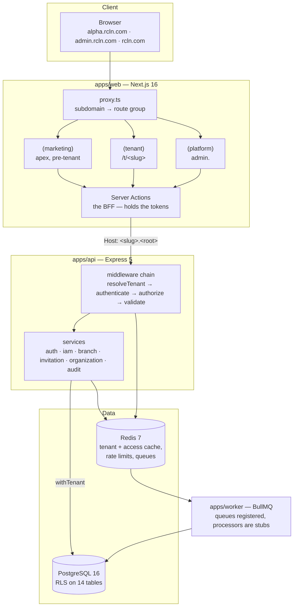

# 00 · Project Overview

**Version:** 1.0 · **Generated:** 2026-07-26 · **Branch:** `feat/phase-1-tenant-management`
**Confidence key:** _Verified_ = read in source · _Inferred_ = derived, reasoning stated · _Assumed_ = plausible, unchecked

---

## Executive summary

**Verified.** rcln is a multi-tenant healthcare management SaaS for the Indian
market. A clinic registers on the apex domain, receives its own subdomain
(`alpha.rcln.com`), and — once the product is complete — runs appointments,
prescriptions, lab, pharmacy, inventory and billing across one or many branches,
paying by subscription.

**Verified.** What exists today is the **foundation and the tenancy layer**:
registration, authentication, branches, invitations, roles and members, with
tenant isolation enforced by Postgres row-level security and proven by 200
passing tests. Everything clinical exists as schema and nothing more.

The defining engineering constraint is that every tenant's protected health
information lives in the same tables, separated by policy rather than by schema.
That single fact drives the architecture, the review process, and the CI gates.

---

## Product purpose

**Verified** from the schema, the marketing copy, and [`STATUS.md`](STATUS.md).

Small and mid-sized Indian clinics run on paper, WhatsApp and a patchwork of
single-purpose desktop software. rcln's proposition is one system covering the
whole clinical and commercial workflow, priced per clinic rather than per
enterprise seat, with the multi-branch case treated as normal rather than as an
upgrade tier.

India-first is a design position, not a market note: GST numbers on
organizations and branches, HSN codes in the pharmacy catalogue, ABHA numbers on
patients, phone-first OTP login, and data residency in `ap-south-1`.

---

## Target users

| Persona                                                   | Where they sign in | What they do                                               | Built?                            |
| --------------------------------------------------------- | ------------------ | ---------------------------------------------------------- | --------------------------------- |
| Clinic owner                                              | `alpha.rcln.com`   | Registers the clinic, manages subscription, opens branches | Partly — no subscription UI       |
| Organization admin                                        | `alpha.rcln.com`   | Runs every branch, invites staff, defines roles            | Yes                               |
| Branch admin                                              | `alpha.rcln.com`   | Runs one or more branches                                  | Yes                               |
| Doctor                                                    | `alpha.rcln.com`   | Consults, prescribes                                       | Role exists; no clinical features |
| Receptionist                                              | `alpha.rcln.com`   | Registers patients, books appointments, takes payment      | Role exists; no features          |
| Nurse, Pharmacist, Lab assistant, Lab manager, Accountant | `alpha.rcln.com`   | Their module                                               | Roles exist; no features          |
| Patient                                                   | `alpha.rcln.com`   | Portal access to own records                               | Role exists; no portal            |
| Platform operator                                         | `admin.rcln.com`   | Reviews demo requests, provisions clinics                  | Partly — no impersonation         |

**Verified:** 12 system roles and 83 permissions are seeded. See
[`09_Roles_and_Permissions.md`](09_Roles_and_Permissions.md) for the full matrix.

---

## Core business value

**Inferred** from the schema, pricing section and role model — no business plan
document exists in the repository.

1. **One system instead of five.** Appointments, clinical notes, pharmacy, lab
   and billing share a patient and a ledger.
2. **Multi-branch as a first-class case.** Roles are granted per branch;
   `NULL` means all branches. A three-branch hospital needs no different product.
3. **India-native compliance.** GST-correct invoicing and DPDP-aware data
   handling out of the box.
4. **Isolation that is demonstrable.** For a clinic buying shared-database SaaS
   for patient records, "our tests prove your data is unreachable" is a sales
   asset, not just engineering hygiene.

---

## Major modules

Generated catalog with live counts: [`06_Module_Catalog.md`](06_Module_Catalog.md).

| Module                                        | Layer        | Status  |
| --------------------------------------------- | ------------ | ------- |
| [Tenancy](Modules/Tenancy.md)                 | api + db     | Shipped |
| [Authentication](Modules/Authentication.md)   | api + web    | Shipped |
| [IAM](Modules/IAM.md)                         | api + web    | Shipped |
| [Branches](Modules/Branches.md)               | api + web    | Shipped |
| [Invitations](Modules/Invitations.md)         | api + web    | Shipped |
| [Audit](Modules/Audit.md)                     | api          | Shipped |
| [PlatformConsole](Modules/PlatformConsole.md) | api + web    | Partial |
| [Marketing](Modules/Marketing.md)             | web          | Shipped |
| [Notifications](Modules/Notifications.md)     | api + worker | Stub    |
| [Worker](Modules/Worker.md)                   | worker       | Stub    |
| [Contracts](Modules/Contracts.md)             | package      | Shipped |

Planned and not started: subscriptions/billing, patients, appointments,
encounters, prescriptions, pharmacy, inventory, lab, reporting.

---

## Technology summary

**Verified.** Node 22 · TypeScript 5.9 strict · Express 5 · Next.js 16 App
Router + React 19 · Prisma 7 · PostgreSQL 16 · Redis 7 · BullMQ · Zod ·
Jest + supertest · pnpm 10 workspaces + Turbo · Docker Compose.

Detail, including what is documented-but-absent:
[`03_Technology_Stack.md`](03_Technology_Stack.md).

---

## High-level architecture

Detail: [`02_System_Architecture.md`](02_System_Architecture.md) and the
narrative tour in [`Architecture/how-it-works.md`](Architecture/how-it-works.md).

---

## Deployment summary

**Verified.** The only environment that exists is local: `docker compose up`
brings up api, web, worker, Postgres, Redis and Mailpit with hot reload, and
Docker is the sole prerequisite. CI runs on GitHub Actions with two jobs — a
static job (lint, typecheck, format) and a database job that applies migrations,
seeds, runs `db:rls:check`, and runs the API test suite against real Postgres
and Redis.

**Verified.** There is no deployed environment. `STATUS.md` records the git
remote as configured but **not yet pushed**. Production Dockerfiles exist for
all three apps and the api image has been smoke-tested.

**Aspirational.** [`Architecture/architecture.md`](Architecture/architecture.md)
specifies AWS `ap-south-1`, ECS Fargate behind an ALB, RDS Multi-AZ, PgBouncer,
ElastiCache, S3 + CloudFront and Cloudflare. None of it is provisioned; there is
no Terraform in the repository despite `infra/` being described as holding it.
Read that document as intent.

Detail: [`10_Deployment_Guide.md`](10_Deployment_Guide.md).

---

## Project status

**Verified**, from [`STATUS.md`](STATUS.md) as of 2026-07-26.

Phase 0 (foundation) complete. Phase 1 (tenancy) substantially complete —
onboarding, auth, branch CRUD, invitations and role/member management shipped;
impersonation, org settings and verification flows still open. Phases 2–7 not
started.

- **32 Prisma models**, 14 tables RLS-protected, `db:rls:check` green
- **200 tests passing** (175 API + 25 permissions)
- **83 permissions, 12 system roles** seeded
- Marketing site, signup, tenant shell and platform console live locally

---

## Known limitations

Ranked. Full analysis with severity in
[`15_Known_Issues_and_Technical_Debt.md`](15_Known_Issues_and_Technical_Debt.md).

1. **Nothing is deployed.** No staging, no production, never pushed. Every
   claim about production behaviour is untested.
2. **No notification delivery.** OTP codes and invitation links only reach the
   application log. Blocked on TRAI DLT registration (1–2 weeks, external).
3. **Privilege-escalation guards are application-only.** The four guards in
   `services/iam/guards.ts` are not enforced by the database; a direct SQL
   write bypasses all four.
4. **PHI reads are not audited.** Mutations are; `data_access_logs` does not
   exist.
5. **Worker queues consume nothing.** A job enqueued today is silently lost.
6. **Impersonation is unimplemented and non-trivial.** A platform admin has no
   membership, so `loadUserAccess` returns null and every branch-scoped write
   would be refused.
7. **Legal pages are unreviewed drafts** with ~30 unfilled placeholders, and the
   DPDP anonymisation routine they promise does not exist in code.
8. **A referenced ADR is missing** — `0012-impersonation-is-full-access-and-audited.md`
   is cited in `PHASE-1-PLAN.md` but was never written.
9. **Browser and assistive-technology behaviour is unverified.** Implemented and
   code-reviewed, never exercised end to end.

---

## Document map

| #   | Document                                                                                                                                                                                                                                                                                                                                             |
| --- | ---------------------------------------------------------------------------------------------------------------------------------------------------------------------------------------------------------------------------------------------------------------------------------------------------------------------------------------------------- |
| 00  | Project Overview _(this file)_                                                                                                                                                                                                                                                                                                                       |
| 01  | [Business Context](01_Business_Context.md)                                                                                                                                                                                                                                                                                                           |
| 02  | [System Architecture](02_System_Architecture.md)                                                                                                                                                                                                                                                                                                     |
| 03  | [Technology Stack](03_Technology_Stack.md)                                                                                                                                                                                                                                                                                                           |
| 04  | [Database Schema](04_Database_Schema.md)                                                                                                                                                                                                                                                                                                             |
| 05  | [API Documentation](05_API_Documentation.md)                                                                                                                                                                                                                                                                                                         |
| 06  | [Module Catalog](06_Module_Catalog.md) _(generated)_                                                                                                                                                                                                                                                                                                 |
| 07  | [Business Rules](07_Business_Rules.md)                                                                                                                                                                                                                                                                                                               |
| 08  | [Security Model](08_Security_Model.md)                                                                                                                                                                                                                                                                                                               |
| 09  | [Roles and Permissions](09_Roles_and_Permissions.md) _(generated)_                                                                                                                                                                                                                                                                                   |
| 10  | [Deployment Guide](10_Deployment_Guide.md)                                                                                                                                                                                                                                                                                                           |
| 11  | [Development Workflow](11_Development_Workflow.md)                                                                                                                                                                                                                                                                                                   |
| 12  | [Testing Strategy](12_Testing_Strategy.md)                                                                                                                                                                                                                                                                                                           |
| 13  | [Integration Guide](13_Integration_Guide.md)                                                                                                                                                                                                                                                                                                         |
| 14  | [Configuration Reference](14_Configuration_Reference.md)                                                                                                                                                                                                                                                                                             |
| 15  | [Known Issues and Technical Debt](15_Known_Issues_and_Technical_Debt.md)                                                                                                                                                                                                                                                                             |
| 16  | [Product Roadmap](16_Product_Roadmap.md)                                                                                                                                                                                                                                                                                                             |
| 17  | [Glossary](17_Glossary.md)                                                                                                                                                                                                                                                                                                                           |
| —   | [AI/](AI/Agent_Instructions.md) · [Architecture/](Architecture/how-it-works.md) · [Database/](Database/_index.md) · [APIs/](APIs/_index.md) · [Modules/](06_Module_Catalog.md) · [BusinessRules/](BusinessRules/README.md) · [Security/](Security/README.md) · [Integrations/](Integrations/README.md) · [Infrastructure/](Infrastructure/README.md) |
| —   | [`INDEX.md`](INDEX.md) — generated symbol index · `pnpm kb:find`                                                                                                                                                                                                                                                                                     |
