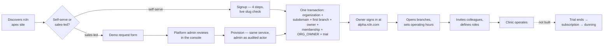
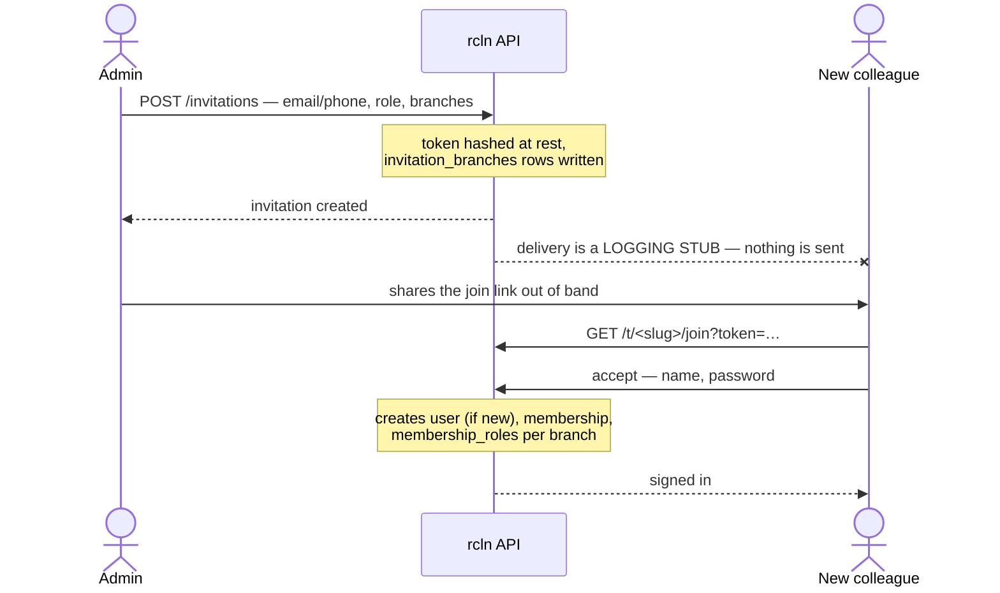

# 01 · Business Context

**Version:** 1.0 · **Confidence key:** _Verified_ · _Inferred_ · _Assumed_

> **Scope note.** No business plan, pricing sheet or market research exists in
> the repository. Everything here is reconstructed from the schema, the
> marketing copy, the role model and [`STATUS.md`](STATUS.md). Statements are
> labelled accordingly. Treat the _Inferred_ and _Assumed_ material as a
> starting point for a conversation with the product owner, not as settled fact.

---

## Business objectives

**Inferred.**

1. **Replace the paper-and-WhatsApp stack** in small and mid-sized Indian
   clinics with one system covering the whole patient journey.
2. **Make multi-branch normal.** Competitors treat multi-location as an
   enterprise upsell; the data model here makes a solo clinic and a hospital
   group the same shape from day one.
   → [ADR-0001](Architecture/decisions/0001-organization-is-the-tenant.md)
3. **Be India-native rather than localised.** GST, HSN, ABHA, phone-first login
   and `ap-south-1` residency are in the schema, not bolted on.
4. **Sell trust in a shared database.** Demonstrable tenant isolation is
   positioned as a product property, backed by 17 tenant-isolation test cases
   and a CI gate that fails the build when a table ships without a policy.

---

## Business workflows

### The clinic lifecycle

**Verified** through step K. Step L (`Subscription`, `SubscriptionInvoice`,
`SubscriptionPayment`, `UsageCounter` models plus a trial created at
registration) exists in the schema with **no payment integration and no
enforcement**.

### The staff onboarding workflow

**Verified.**

The break in that sequence is real and current: see
[Notifications](Modules/Notifications.md).

### The clinical workflow — designed, not built

**Assumed** shape, from the schema in
[`Database/schema-design.md`](Database/schema-design.md) and the six-station
"journey rail" on the marketing page:

`register patient → book appointment → queue → consult (encounter, vitals) →
prescribe → dispense / lab → invoice → pay`

None of it exists in code. Phases 3–6.

---

## User journeys

| Journey                                                     | Persona             | State                                           |
| ----------------------------------------------------------- | ------------------- | ----------------------------------------------- |
| Discover → demo request → provisioned → first login         | Clinic owner        | **Works**, except the demo-request notification |
| Discover → self-serve signup → first login                  | Clinic owner        | **Works**                                       |
| Invited → accept → first login                              | Any staff           | **Works**, delivery is manual                   |
| Sign in → switch branch → work                              | Any staff           | **Works**                                       |
| Sign in with a one-time code                                | Front desk, patient | **Works**, code only appears in logs            |
| Define a custom role → grant per branch → make an exception | Admin               | **Works**                                       |
| Suspend a colleague → restore                               | Admin               | **Works**                                       |
| Review demo requests → provision                            | Platform operator   | **Works**                                       |
| Impersonate a tenant to debug                               | Platform operator   | **Not built**                                   |
| Manage subscription, pay an invoice                         | Clinic owner        | **Not built**                                   |
| Anything involving a patient                                | Everyone            | **Not built**                                   |

---

## User personas

**Inferred** from the 12 seeded system roles and their descriptions.

| Persona                | Scope        | Shape of their day                                      | Notable constraint                                                                    |
| ---------------------- | ------------ | ------------------------------------------------------- | ------------------------------------------------------------------------------------- |
| **Super Admin**        | Platform     | Provisioning, support, incident response                | Seeded directly into the database, never created via the UI. Holds all 83 permissions |
| **Organization Owner** | Organization | Registered the clinic; owns the commercial relationship | All 76 non-platform permissions, including billing                                    |
| **Organization Admin** | Organization | Runs every branch day to day                            | 73 permissions — cannot change the subscription, delete a branch, or delete a patient |
| **Branch Admin**       | Branch       | Runs one or more sites                                  | 48 permissions. _Which_ branches is decided per assignment, not by the role           |
| **Doctor**             | Branch       | Consults, prescribes, orders labs                       | 25 permissions, scoped to the branches they practise at                               |
| **Nurse**              | Branch       | Vitals, queue, assists the encounter                    | 11 permissions                                                                        |
| **Receptionist**       | Branch       | Registration, booking, payment collection               | 14 permissions. **No clinical access** — a deliberate separation                      |
| **Lab Assistant**      | Branch       | Collects samples, enters results                        | 5 permissions. **Cannot verify or release a report**                                  |
| **Lab Manager**        | Branch       | Verifies and releases                                   | 11 permissions. Separation of duty from the assistant is intentional                  |
| **Pharmacist**         | Branch       | Dispenses, manages stock                                | 20 permissions                                                                        |
| **Accountant**         | Organization | Billing and revenue                                     | 15 permissions. Reads patient _identity_ only, never clinical notes                   |
| **Patient**            | Organization | Portal access to their own records                      | 9 permissions. Row filtering is by `patient_id`, not by this role                     |

The lab assistant/manager split and the accountant's identity-only access are
the two places the permission model encodes a genuine clinical governance rule
rather than convenience. Do not collapse them.

---

## Business terminology

Full list: [`17_Glossary.md`](17_Glossary.md). The three that matter most:

- **Organization** — the tenant, and the paying customer. Not "clinic".
- **Branch** — a physical place the organization operates from.
- **Membership** — a person's relationship _to an organization_. Roles hang off
  the membership, per branch. One human can be a member of several
  organizations with different roles in each.

---

## Revenue model

**Verified** from the schema: `Plan`, `PlanPrice` (currency ×
`BillingInterval`), `PlanFeature` (typed feature values),
`Subscription`, `SubscriptionFeatureOverride`, `SubscriptionInvoice`,
`SubscriptionPayment`, `UsageCounter`. Three plans are seeded.

**Verified** from `STATUS.md`: registration creates a **trial** subscription.

**Inferred.** Per-organization subscription, tiered by plan, billed monthly or
annually in INR, with entitlements gated by `plan_features` and usage limits
(`max_branches`, `max_users`) enforced by `usage_counters` at write time.
Per-subscription overrides exist for negotiated deals.

**Verified as not built:** payment collection, entitlement enforcement, usage
enforcement, dunning. The intended dunning ladder is recorded in
`STATUS.md` and `Architecture/architecture.md` §10: retry d1/d3/d7 → `PAST_DUE`
→ 7-day grace → `SUSPENDED` (read-only, **never delete**).

**Open commercial decision, unresolved** (`STATUS.md`, "Blocked / needs a
human"): whether rcln becomes merchant of record for _patient_ payments.
Razorpay Route would make rcln a payment aggregator with RBI implications. The
v1 escape hatch is each clinic connecting their own gateway.

---

## Operational model

**Inferred.** Single-region shared-database SaaS. One deployment serves every
tenant; a tenant is a row, not an environment. Consequences the team has already
accepted:

- **Noisy neighbours are real.** One tenant's load affects everyone. Per-tenant
  row counts are listed in `architecture.md` as an early-warning metric.
- **Every migration is a fleet migration.** Expand → deploy → contract; never
  rename a column in one step.
- **Support requires impersonation**, which is why it is on the Phase 1 list —
  and why it must be audited and banner-visible.
- **Schema-per-tenant was considered and rejected.** Shared schema plus RLS
  scales without migration fan-out, and `organization_id` keeps a future
  extraction possible. Recorded under "Deliberately deferred" in `STATUS.md`.

---

## Compliance requirements

**Verified** as a design position in `Architecture/architecture.md` §13 and
partially implemented.

| Requirement                                                                             | Status                                                                                                                                                                                                                       |
| --------------------------------------------------------------------------------------- | ---------------------------------------------------------------------------------------------------------------------------------------------------------------------------------------------------------------------------- |
| **DPDP Act 2023** — health data is sensitive personal data                              | Partly. Consent capture is modelled for patients (not built); the privacy policy and DPA are **unreviewed drafts**                                                                                                           |
| Data Fiduciary / Data Processor split — the clinic is the Fiduciary, rcln the Processor | Written into the draft DPA                                                                                                                                                                                                   |
| **Erasure vs medical retention**                                                        | **Decided**, not implemented. Resolved as irreversible anonymisation rather than deletion; documented in privacy clause 7 and DPA clause 5. **No anonymisation routine exists in code, and those documents now promise one** |
| Data residency in `ap-south-1`                                                          | Design intent; nothing is deployed                                                                                                                                                                                           |
| Named Data Protection Officer, grievance contact, breach-notification window            | **Placeholders** in the legal pages                                                                                                                                                                                          |
| Audit trail of mutations                                                                | **Built** — `audit_logs`, ids and permission codes only, never names                                                                                                                                                         |
| Audit trail of PHI _reads_                                                              | **Not built** — `data_access_logs` is planned                                                                                                                                                                                |
| PII redaction in logs                                                                   | **Built** — pino redact paths in `apps/api/src/utils/logger.ts`                                                                                                                                                              |
| No PHI in Redis, `localStorage`, cookies or query params                                | **Enforced by convention**, not by tooling                                                                                                                                                                                   |
| Medical record retention (3 years minimum, outpatient)                                  | Design intent; no lifecycle policy exists                                                                                                                                                                                    |
| **ABDM / ABHA** M1–M3 certification                                                     | Schema hooks only (`patients.abha_number`); explicitly a later phase                                                                                                                                                         |
| HIPAA                                                                                   | **Explicitly out of scope** — irrelevant unless selling to US customers                                                                                                                                                      |

The gap worth flagging to a human: the legal pages promise an anonymisation
capability that does not exist. That is a commitment made to data principals
without an implementation behind it.

---

## Domain assumptions

**Assumed** unless noted. These are the beliefs the design rests on; if one is
wrong, something structural changes.

1. **A person may work at several clinics.** Hence `users` is global and
   identity is separate from membership. _Verified in schema._
2. **A person's role varies by branch.** Hence roles live on
   `membership_roles` with a nullable `branch_id`. _Verified —
   [ADR-0002](Architecture/decisions/0002-roles-live-on-membership.md)._
3. **Patients belong to an organization, not to the platform.** A patient
   visiting two clinics is two records. _Verified —
   [ADR-0007](Architecture/decisions/0007-patients-are-org-scoped.md)._
4. **Phone is the primary identifier in Indian healthcare**, not email. Hence
   OTP login is a first-class path and `emailVerifiedAt` is currently never set.
5. **Clinics accept cash and counter UPI**, so payments must support offline
   modes with staff attribution.
6. **One billing spine serves every module** — consultations, pharmacy and lab
   all bill through the same invoice.
   _Verified — [ADR-0008](Architecture/decisions/0008-one-billing-spine.md)._
7. **Per-specialty variation is a document, not a schema change.** Versioned
   form templates in JSONB; never JSON arrays of foreign keys.
   _Verified — [ADR-0006](Architecture/decisions/0006-no-json-id-arrays.md)._
8. **Clinics will accept a shared database** if isolation is demonstrable.
   Unvalidated with any real customer.
9. **Self-serve signup converts.** The 4-step signup and the demo-request
   pipeline both exist, implying the sales motion is undecided.
