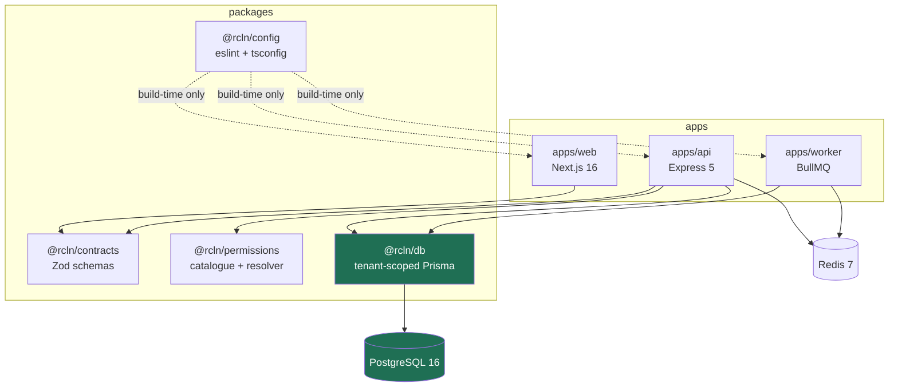
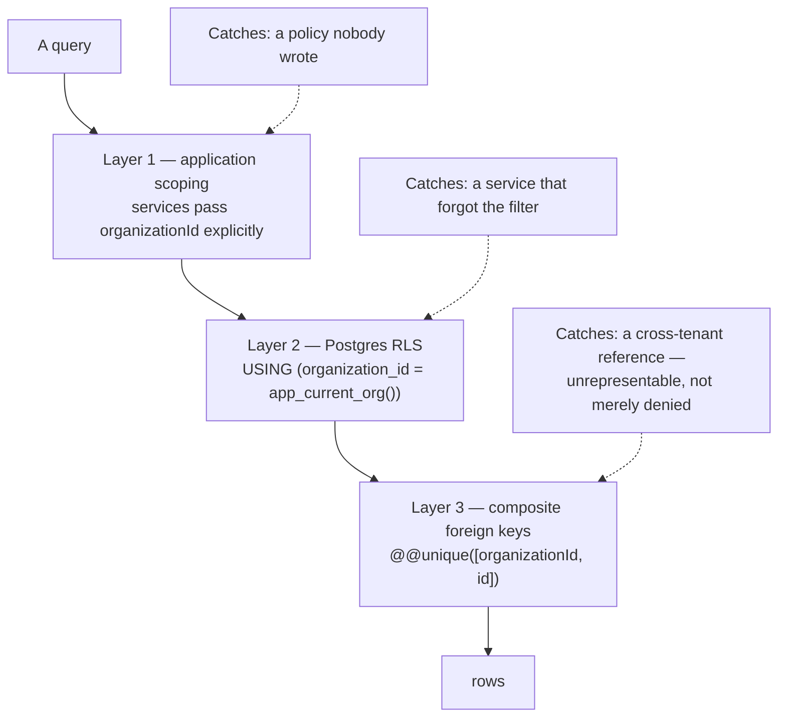
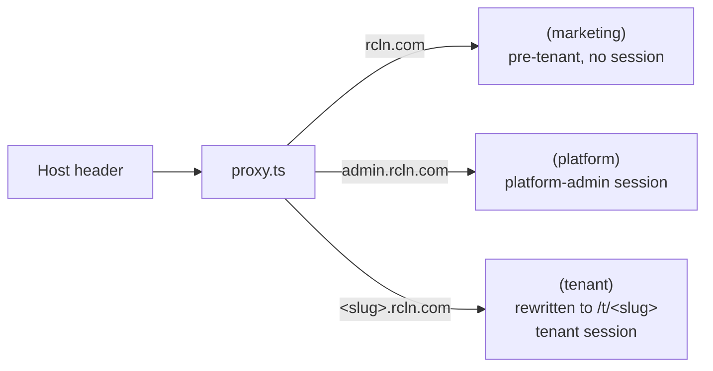

# 02 · System Architecture

**Version:** 1.0 · **Confidence key:** _Verified_ · _Inferred_ · _Assumed_

> The narrative tour is [`Architecture/how-it-works.md`](Architecture/how-it-works.md).
> The **target** production design — mostly unbuilt — is
> [`Architecture/architecture.md`](Architecture/architecture.md).
> This file describes what the code actually does today.

---

## Architecture pattern

**Verified.** A **layered modular monolith in a pnpm monorepo**, deployed as
three processes that share four packages:

- **Shared-database multi-tenancy.** One schema, one set of tables, tenant
  discrimination by `organization_id` and enforced by Postgres RLS.
  Schema-per-tenant was considered and rejected.
- **Backend-for-frontend.** `apps/web` holds the session cookie and calls the
  API server-side; browser JavaScript never sees a token.
- **Contract-first.** Zod schemas in `@rcln/contracts` are the single
  declaration of every request and response shape; the API validates with them
  and the web infers types from them.
- **Layered API.** route → middleware chain → service → tenant-scoped Prisma.
  Routes hold no business logic; services never see an Express object.

**Not** microservices, not event-sourced, not CQRS. The worker is a separate
process for isolation of slow work, not a separate service with its own data.

---

## Layer responsibilities

**Verified.**

| Layer                       | Location                      | Owns                                                | Must never                                              |
| --------------------------- | ----------------------------- | --------------------------------------------------- | ------------------------------------------------------- |
| Proxy                       | `apps/web/src/proxy.ts`       | Subdomain → route group rewriting                   | Touch the database                                      |
| Server Components / Actions | `apps/web/src/app/**`         | Rendering, form handling, the session cookie        | Import Prisma; call the API without a slug-derived Host |
| API client                  | `apps/web/src/lib/api.ts`     | The single seam between web and api                 | Be imported into a Client Component                     |
| Middleware                  | `apps/api/src/middleware/**`  | Tenant resolution, authn, authz, validation, errors | Be reordered                                            |
| Routes                      | `apps/api/src/routes/**`      | Wiring: path, permission gate, contract, handler    | Contain business logic                                  |
| Services                    | `apps/api/src/services/**`    | Business rules, transactions, audit writes          | Import the raw Prisma client                            |
| Data                        | `packages/db/src/**`          | Tenant-scoped client, session vars, RLS assertions  | Leak a client without tenant context                    |
| Contracts                   | `packages/contracts/src/**`   | Request/response shapes                             | Depend on api or web                                    |
| Permissions                 | `packages/permissions/src/**` | Catalogue, system roles, resolver                   | Query the database                                      |
| Worker                      | `apps/worker/src/**`          | Background jobs                                     | Serve HTTP                                              |

---

## Component and dependency map

**Verified** from the import graph.



Two properties worth preserving:

- **`apps/web` does not depend on `@rcln/db`.** The web tier has no database
  access at all. That is what makes the BFF boundary real rather than
  aspirational.
- **`@rcln/permissions` is pure.** It computes effective permissions from data
  handed to it and never queries. That is why 25 unit tests can pin the whole
  multi-branch matrix without a database.

---

## Request lifecycle

**Verified** from `apps/api/src/app.ts` and the route files.

```mermaid
sequenceDiagram
    autonumber
    participant B as Browser
    participant P as proxy.ts
    participant SA as Server Action
    participant AP as Express
    participant RD as Redis
    participant PG as Postgres

    B->>P: GET alpha.rcln.com/branches
    P->>P: host → slug; rewrite to /t/alpha/branches
    P-->>SA: render (tenant route group)
    SA->>SA: read httpOnly host-only cookie
    SA->>AP: fetch, Host: alpha.rcln.com, Bearer <access>

    rect rgb(240,240,240)
    Note over AP: the chain — order IS the security model
    AP->>AP: helmet · cors · json · compression · pino · request-id
    AP->>AP: generalLimiter (Redis-backed)
    AP->>RD: resolveTenant(host)
    alt cache hit
        RD-->>AP: organizationId
    else miss
        AP->>PG: organization_domains lookup
        PG-->>AP: org or none
        AP->>RD: cache result (negative too)
    end
    Note over AP: unknown tenant → 404, never 403
    AP->>AP: authenticate — verify JWT signature, no DB hit
    AP->>AP: requireAuth
    AP->>RD: authorize — resolved access for (user, org)
    RD-->>AP: roles · branches · effective permissions
    Note over AP: DENY > GRANT > role grants
    AP->>AP: validate — Zod contract
    end

    AP->>PG: withTenant → BEGIN
    PG->>PG: set_config('app.current_org', …, true)
    PG->>PG: query — RLS predicate applies
    PG-->>AP: only this tenant's rows
    AP->>PG: audit_logs insert (same transaction)
    AP->>PG: COMMIT
    AP-->>SA: { success, data }
    SA-->>B: HTML / action result
```

### Why each step sits where it does

| Step                                      | Placement rationale                                                                                                  |
| ----------------------------------------- | -------------------------------------------------------------------------------------------------------------------- |
| Rate limit **before** tenant resolution   | An unknown-host flood must not reach Postgres                                                                        |
| `resolveTenant` **before** `authenticate` | An unknown host is answered 404 before any credential is examined, so the response cannot confirm a subdomain exists |
| `authenticate` **before** `authorize`     | Authorization resolves against the caller's active branch, which comes from the token                                |
| `validate` **last**                       | A malformed body from someone not allowed here anyway never reaches Zod                                              |
| `set_config(…, true)`                     | Transaction-local. The **only** reason a pooled connection cannot carry tenant context into the next request         |
| Audit inside the transaction              | A change and its audit row commit together or not at all                                                             |

---

## Data flow: tenant isolation, three independent layers

**Verified.** Defence in depth by design —
[ADR-0003](Architecture/decisions/0003-rls-enable-not-force.md),
[ADR-0004](Architecture/decisions/0004-composite-foreign-keys.md),
[ADR-0005](Architecture/decisions/0005-tenant-scoped-prisma-client.md).



Supporting mechanisms, all **verified**:

- **Role split.** The app connects as `rcln_app` (`NOBYPASSRLS`); migrations and
  seeds use `rcln_owner`. Policies are `ENABLE`, deliberately **not** `FORCE`,
  because the owner must keep bypassing for migrations to work at all.
- **`assertRlsActive()`** refuses to boot the app on an owner connection —
  the guard against the most common way teams ship RLS that does nothing.
- **`db:rls:check`** fails CI if any table with `organization_id` lacks a
  policy, unless it is on an `EXEMPT` list with a written reason.
- **Branch-scoped RESTRICTIVE policies** on `membership_roles` and
  `membership_permission_overrides` — RESTRICTIVE so they AND with the org
  policy rather than widening it.
- **Parent-scoped policies** for tables with no `organization_id` of their own
  (`branch_operating_hours`, `branch_closures`, `invitation_branches`,
  `staff_profiles`), via an EXISTS against the scoped parent.

Full table-by-table coverage: [`Database/_index.md`](Database/_index.md).

---

## Frontend architecture

**Verified.** Next.js 16 App Router, three route groups, each with a different
auth model:



- **The cookie is host-only.** No `domain` attribute, so a session at `alpha` is
  useless at `beta`. This is isolation, not an oversight.
- **`middleware.ts` is `proxy.ts`** in Next 16. Behaviour unchanged.
- **`allowedDevOrigins`** must list the dev hostnames or nothing hydrates on any
  host off the root domain — silently. Recorded in
  [`Architecture/PITFALLS.md`](Architecture/PITFALLS.md).
- **The design system is one file**, `apps/web/src/app/globals.css`. Do not
  start a second one.

---

## Scalability considerations

**Verified constraints, inferred limits.**

| Dimension             | Today                                   | Limit / mitigation                                                                                                                 |
| --------------------- | --------------------------------------- | ---------------------------------------------------------------------------------------------------------------------------------- |
| Tenant resolution     | Redis cache, negative-cached            | Would otherwise be a Postgres round-trip on **every** request                                                                      |
| Permission resolution | Redis cache per (user, org)             | The hottest read in the system. Must be invalidated on every role write                                                            |
| Query cost            | **Every tenant query is a transaction** | ~2 extra round-trips per query. Mitigate by batching related reads into one `withTenant` call, not one per query                   |
| Connections           | Direct Prisma pool                      | **No PgBouncer.** `architecture.md` specifies transaction-mode pooling; it does not exist. Node + Prisma open connections greedily |
| Rate limiting         | Redis-backed                            | Correct across replicas. An in-memory store would not be                                                                           |
| Worker                | Separate process                        | Slow work cannot eat an API request thread — the isolation is real even though no processors exist                                 |
| Horizontal scale      | Stateless api and web                   | **Untested.** Nothing has run on more than one instance                                                                            |

**Inferred bottleneck order** as load grows: permission cache invalidation
storms on large orgs → connection saturation without PgBouncer → per-query
transaction overhead → Postgres CPU.

---

## Performance considerations

**Verified.**

- Access tokens are **stateless** by design: verifying one costs no database
  round-trip, which matters because it happens on every request. The cost is
  that they cannot be revoked before expiry, hence 15 minutes.
- Health-check requests are excluded from request logging, or they dominate.
- `.dockerignore` reduced the build context from 996 MB to 1.4 MB (58,347 files
  → 110).
- Packages build to `dist/` and are consumed from there; a consumer needs the
  package built. The dev entrypoint does this on boot.

**Not measured.** There is no load test, no p95 baseline, no query plan review,
and no production traffic. Every performance statement above is structural
reasoning, not measurement.

---

## Where this diverges from `Architecture/architecture.md`

**Verified.** That document is a target. These parts of it do **not** exist:

| Specified                             | Reality                                                                  |
| ------------------------------------- | ------------------------------------------------------------------------ |
| ECS Fargate, ALB, Route53, Cloudflare | Nothing deployed                                                         |
| RDS Multi-AZ + read replica           | Local Postgres container                                                 |
| PgBouncer                             | Absent                                                                   |
| ElastiCache                           | Local Redis container                                                    |
| S3 + CloudFront, presigned uploads    | `StoredFile` model only                                                  |
| Terraform in `infra/`                 | `infra/` holds Dockerfiles and one SQL init script                       |
| Sentry, OpenTelemetry, Grafana        | Absent                                                                   |
| `apps/admin` as a separate app        | The platform console is a route group inside `apps/web`                  |
| `packages/ui`                         | Deliberately not created — "an empty shadcn package is noise"            |
| MFA/TOTP for platform admins          | `otplib` is installed; no MFA flow exists                                |
| shadcn/ui                             | Not used. `apps/web/src/components/ui/` is three hand-written components |

Specified **and present**: Argon2id (`@node-rs/argon2`), `rate-limit-redis`,
pino over Winston, TanStack Query and Table, Recharts. The scaffold cleanup
listed in `architecture.md` §1 was carried out.

When an agent cites `architecture.md`, it must say "the target design specifies"
rather than "the system does".
