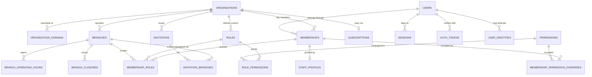
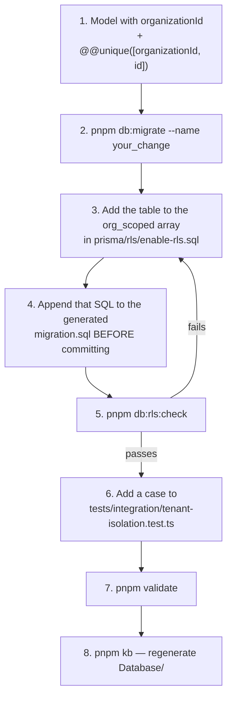

# 04 · Database Schema

**Version:** 1.0 · **Verified** from `packages/db/prisma/schema.prisma`,
`packages/db/prisma/rls/enable-rls.sql` and `packages/db/scripts/check-rls.ts`.

| Where to look                                            | For                                                                                 |
| -------------------------------------------------------- | ----------------------------------------------------------------------------------- |
| [`Database/_index.md`](Database/_index.md)               | **Generated.** Every model, its columns, and its RLS status. Refreshed by `pnpm kb` |
| `Database/<Model>.md`                                    | **Generated.** One file per model — columns, relations, indexes, neighbourhood ERD  |
| [`Database/schema-design.md`](Database/schema-design.md) | The full design document, including domains not yet built                           |
| This file                                                | The conventions, the isolation model, and how to change the schema safely           |

---

## Shape

**Verified.** 32 models · 18 enums · 14 RLS-protected tables.

| Domain        | Models                                                                                                                                                                     | Built?                                      |
| ------------- | -------------------------------------------------------------------------------------------------------------------------------------------------------------------------- | ------------------------------------------- |
| Tenancy       | `Organization`, `OrganizationDomain`, `Branch`, `BranchOperatingHour`, `BranchClosure`                                                                                     | Yes                                         |
| Subscriptions | `Plan`, `PlanPrice`, `PlanFeature`, `Subscription`, `SubscriptionFeatureOverride`, `SubscriptionInvoice`, `SubscriptionInvoiceLine`, `SubscriptionPayment`, `UsageCounter` | Schema only                                 |
| Identity      | `User`, `UserIdentity`, `Session`, `AuthToken`                                                                                                                             | Yes (SSO schema only)                       |
| RBAC          | `Membership`, `Role`, `Permission`, `RolePermission`, `MembershipRole`, `MembershipPermissionOverride`, `StaffProfile`                                                     | Yes                                         |
| Onboarding    | `Invitation`, `InvitationBranch`, `DemoRequest`                                                                                                                            | Yes                                         |
| Platform      | `SettingDefinition`, `SettingValue`, `StoredFile`, `AuditLog`                                                                                                              | Partly — settings and files are schema only |

Everything clinical — patients, appointments, encounters, prescriptions,
pharmacy, inventory, lab, billing — is **designed in
[`Database/schema-design.md`](Database/schema-design.md) and does not exist in
`schema.prisma`.**

---

## Conventions

**Verified** from `Architecture/CONVENTIONS.md` and the schema itself.

| Concern             | Rule                                                                                 | Rationale                                                                                           |
| ------------------- | ------------------------------------------------------------------------------------ | --------------------------------------------------------------------------------------------------- |
| Primary key         | `uuid`, `@default(uuid())`                                                           | Ids appear in URLs and logs; sequential integers leak volume                                        |
| Tenant column       | `organizationId` on every tenant table                                               | The RLS predicate needs it                                                                          |
| Composite FK target | `@@unique([organizationId, id])`                                                     | Lets children reference `(organizationId, parentId)`, making a cross-tenant row **unrepresentable** |
| Soft delete         | `deletedAt DateTime?`                                                                | A boolean loses _when_; partial indexes on NULL are cheap                                           |
| Audit columns       | `createdAt`, `updatedAt`, plus `createdBy`/`updatedBy` where the actor matters       |                                                                                                     |
| Money               | `Decimal @db.Decimal(14, 2)` + explicit currency                                     | Never float — rounding compounds                                                                    |
| Quantities          | `Decimal @db.Decimal(14, 3)`                                                         | Half a tablet is real                                                                               |
| Time                | `DateTime @db.Timestamptz(6)`, stored UTC                                            | `branches.timezone` for display                                                                     |
| Enums               | Prisma enums for closed sets; lookup tables for anything a tenant may extend         |                                                                                                     |
| Naming              | `snake_case` columns via `@map`, plural tables via `@@map`, `<singular>Id` relations | Matches what people read in psql                                                                    |
| Uniqueness          | **Always tenant-qualified** — `@@unique([organizationId, code])`, never bare `code`  | A bare unique makes one tenant's code block another's                                               |
| Nullable unique     | Needs `NULLS NOT DISTINCT`, added as raw SQL                                         | Plain unique indexes do not constrain NULLs                                                         |

---

## Tenant isolation

Three independent layers —
[ADR-0003](Architecture/decisions/0003-rls-enable-not-force.md),
[ADR-0004](Architecture/decisions/0004-composite-foreign-keys.md),
[ADR-0005](Architecture/decisions/0005-tenant-scoped-prisma-client.md).

### Layer 1 — application scoping

Services pass `organizationId` explicitly even though RLS also enforces it.
This is what catches a policy nobody wrote.

### Layer 2 — row-level security

**Verified.** Four policy flavours in `packages/db/prisma/rls/enable-rls.sql`:

| Flavour                | Tables                                                                                                                                                                    | Predicate                                                                                |
| ---------------------- | ------------------------------------------------------------------------------------------------------------------------------------------------------------------------- | ---------------------------------------------------------------------------------------- |
| `org`                  | `branches`, `memberships`, `membership_roles`, `membership_permission_overrides`, `invitations`, `subscriptions`, `subscription_invoices`, `usage_counters`, `audit_logs` | `organization_id = app_current_org()`                                                    |
| `explicit`             | `files`                                                                                                                                                                   | Same, written out rather than looped                                                     |
| `branch` (RESTRICTIVE) | `membership_roles`, `membership_permission_overrides`                                                                                                                     | ANDs with the org policy to narrow to the caller's branch scope                          |
| `parent`               | `branch_operating_hours`, `branch_closures`, `invitation_branches`, `staff_profiles`                                                                                      | `EXISTS` against the scoped parent — these tables have no `organization_id` of their own |

Plus one deliberate widening: **`own_membership`** on `memberships`, a
`SELECT`-only policy allowing `user_id = app_current_user() AND
app_current_org() IS NULL`. The second condition switches it off the moment a
tenant context exists, so it cannot widen an ordinary request. Without it,
`authSession.memberships` is silently always empty —
[ADR-0011](Architecture/decisions/0011-own-membership-identity-bootstrap.md).

**`ENABLE`, deliberately not `FORCE`.** `FORCE` sounds safer and is wrong here:
it would apply policies to the table owner too, and the owner role exists
precisely to run migrations and seeds, which have no tenant context. Isolation
comes from the role split instead.

### Layer 3 — composite foreign keys

A child references `(organizationId, parentId)` against the parent's
`@@unique([organizationId, id])`. A row pointing at another tenant's parent
cannot be inserted at all — this is stronger than a denial, and it catches the
case where both other layers were misconfigured.

### RLS exemptions

**Verified.** Tables outside RLS, each with a written reason in
`packages/db/scripts/check-rls.ts`. `db:rls:check` fails if a table with
`organization_id` is neither covered nor exempt, **and** warns about stale
exemptions.

| Table                  | Why it is exempt                                                                                                                                                                      |
| ---------------------- | ------------------------------------------------------------------------------------------------------------------------------------------------------------------------------------- |
| `organizations`        | Resolved by hostname _before_ a tenant context exists                                                                                                                                 |
| `organization_domains` | The host→tenant lookup itself. Requiring `app.current_org` would be circular. Reads are by exact domain only                                                                          |
| `users`                | Global identity — one login spans organizations                                                                                                                                       |
| `sessions`             | Looked up by refresh-token hash pre-context                                                                                                                                           |
| `auth_tokens`          | OTP verification happens pre-context                                                                                                                                                  |
| `user_identities`      | SSO callback happens pre-context                                                                                                                                                      |
| `roles`                | System roles have `organization_id NULL` by design                                                                                                                                    |
| `permissions`          | Static catalogue                                                                                                                                                                      |
| `role_permissions`     | Joins two non-tenant tables                                                                                                                                                           |
| `plans`, `plan_*`      | Platform-wide product catalogue                                                                                                                                                       |
| `setting_*`            | Scoped by `(scope_type, scope_id)`, not `organization_id`                                                                                                                             |
| `demo_requests`        | Submitted from the public marketing site by someone with no organization. Gated in the application layer: one public, rate-limited, write-only route. Contact details only, never PHI |

Live coverage, always current: [`Database/_index.md`](Database/_index.md).
Authoritative live check: `pnpm db:rls:check`.

---

## Core relationships

**Verified.** The identity and access spine — the part every other domain will
hang off.

The load-bearing shape: **`membership_roles (membership × role × branch_id
NULLABLE)`**. A NULL `branch_id` means every branch in the organization. This is
what makes "doctor at branch A, receptionist at branch C" representable, and it
is why there is no `role` column on `users` —
[ADR-0002](Architecture/decisions/0002-roles-live-on-membership.md).

---

## Changing the schema

**Verified sequence.** Every step is load-bearing; `db:rls:check` fails until
step 3 is done, and that is deliberate — a missing policy produces no error and
breaks no single-tenant test.

Prisma Migrate does **not** manage policies, triggers, partitions or exclusion
constraints. They live in hand-edited SQL blocks inside the migration.

**Never edit an already-applied migration in place** — Prisma checksums it and
every environment breaks. Write a new one.

There is a `/db-migration` skill that walks this sequence. Use it.

---

## Seed data

**Verified.** `packages/db/prisma/seed.ts` runs as `rcln_owner` and creates:

- 83 permissions
- 12 system roles with `organizationId = null`, and their `role_permissions`
- 12 setting definitions
- 3 plans
- one super admin, from `SUPERADMIN_EMAIL` / `SUPERADMIN_PASSWORD`

A database trigger prevents a tenant creating a role whose `code` shadows a
system role code.

---

## Known schema-level risks

| Risk                                                | Severity | Note                                                                                          |
| --------------------------------------------------- | -------- | --------------------------------------------------------------------------------------------- |
| The four IAM escalation guards are application-only | **High** | A direct SQL write bypasses all four. They belong in RESTRICTIVE policies or triggers         |
| `data_access_logs` does not exist                   | **High** | PHI reads are unaudited. Mutations are audited                                                |
| `audit_logs` append-only is a convention            | Medium   | Nothing at the database level prevents an update or delete                                    |
| No column-level encryption                          | Medium   | The target design specifies it for `abha_number` and `national_id`; neither column exists yet |
| No PgBouncer                                        | Medium   | Prisma opens connections greedily                                                             |
| No lifecycle or retention policy                    | Medium   | Indian outpatient retention is 3 years minimum                                                |

Full list with priorities:
[`15_Known_Issues_and_Technical_Debt.md`](15_Known_Issues_and_Technical_Debt.md).
