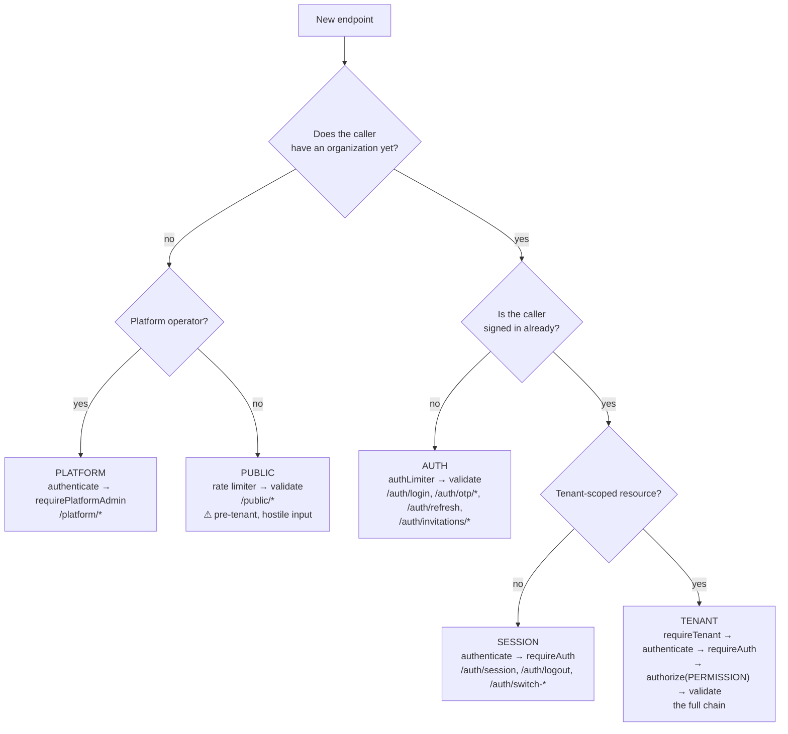

# 05 · API Documentation

**Version:** 1.0 · **Verified** from `apps/api/src/**`.

| Where to look                                              | For                                                                                                                |
| ---------------------------------------------------------- | ------------------------------------------------------------------------------------------------------------------ |
| [`APIs/_index.md`](APIs/_index.md)                         | **Generated.** Every route, its middleware chain and its permission gate, with `file:line`. Refreshed by `pnpm kb` |
| `APIs/<group>.md`                                          | **Generated.** One file per route group, with the group's own design notes and its contracts                       |
| This file                                                  | The conventions every endpoint obeys — auth, envelope, errors, rate limits                                         |
| [`packages/contracts/src/`](Symbols/packages.contracts.md) | The request and response schemas themselves                                                                        |
| `GET /docs`                                                | **Generated.** The interactive OpenAPI 3.1 reference, with try-it-out                                              |
| `GET /docs/openapi.json`                                   | **Generated.** The document itself, for Postman/Bruno/Insomnia or client generation                                |

## The OpenAPI document

**Verified.** `apps/api/src/openapi/` builds an OpenAPI 3.1 document by walking
the Express routers at runtime and converting the Zod contracts with Zod 4's own
`z.toJSONSchema`. 425 endpoints, 311 paths, 335 component schemas.

Nothing in it is transcribed, which is the point: `authorize()` stamps its
permission codes onto the handler and `validate()` stamps its schemas, so method,
path, gate and every request shape are read off the running routers and cannot
drift. Only the prose — what an endpoint is FOR, what comes back, worked examples
— is hand-written, in `openapi/registry/`, one file per domain.

- `mounts.ts` is the one hand-maintained list, because Express 5 compiles a mount
  path into a matcher and keeps no copy of the string. It is checked against the
  app by **object identity**, so a router mounted and not declared fails a test
  rather than vanishing from the documentation.
- `tests/unit/openapi.test.ts` asserts the structural invariants: every reachable
  route documented, no orphan registry keys, no dangling `$ref`, every path
  variable declared, every gated operation naming its permission code.
- `pnpm --filter @rcln/api docs:validate` checks conformance against the 3.1
  specification. It is a script rather than a test case because
  `@scalar/openapi-parser` misreports validity under Jest's experimental VM
  modules.

Served at `/docs`, mounted on the app ahead of `resolveTenant` so it answers on
the apex host too. **Off in production unless `DOCS_ENABLED=true`** — the
document names every endpoint, payload and permission code, which is exactly the
reconnaissance an attacker would otherwise do by hand.

---

## Base path and mounting

**Verified.** Everything is under `/api/v1`.

| Prefix                | Router             | Chain applied to the whole group                 |
| --------------------- | ------------------ | ------------------------------------------------ |
| `/api/v1/health`      | `healthRoutes`     | none                                             |
| `/api/v1/auth`        | `authRoutes`       | per-route                                        |
| `/api/v1/public`      | `publicRoutes`     | per-route, rate-limited                          |
| `/api/v1/platform`    | `platformRoutes`   | `authenticate` → `requirePlatformAdmin`          |
| `/api/v1/branches`    | `branchRoutes`     | `requireTenant` → `authenticate` → `requireAuth` |
| `/api/v1/invitations` | `invitationRoutes` | `requireTenant` → `authenticate` → `requireAuth` |
| `/api/v1/roles`       | `roleRoutes`       | `requireTenant` → `authenticate` → `requireAuth` |
| `/api/v1/members`     | `memberRoutes`     | `requireTenant` → `authenticate` → `requireAuth` |

**Verified:** 41 endpoints across 8 route files.

---

## The four authentication postures

**Verified.** Every endpoint is exactly one of these. Knowing which one you are
adding is the first decision.



**The tenant posture is the default.** If you are adding a normal feature
endpoint, it belongs in a router mounted with the full chain and gated by an
`authorize(PERMISSIONS.X)` call.

---

## The middleware chain

**Verified** order, from `apps/api/src/app.ts` and the route files. **The order
is the security model — do not reorder it.**

```
helmet · cors · express.json · urlencoded · compression · pino-http (request-id)
  → generalLimiter          Redis-backed, per IP
  → resolveTenant           Host → organization, Redis-cached (app-level)
  → /api → v1 router
      → requireTenant       404 if the host resolved to nothing
      → authenticate        verify JWT signature; no database round-trip
      → requireAuth         401 if there is no principal
      → authorize(CODE)     resolved permissions for (user, org, active branch)
      → validate(schema)    Zod, from @rcln/contracts
      → handler             service via withTenant
  → notFoundHandler
  → errorHandler
```

Why the order is what it is:

| Placement                           | Reason                                                                                                           |
| ----------------------------------- | ---------------------------------------------------------------------------------------------------------------- |
| Rate limit before tenant resolution | An unknown-host flood must not reach Postgres                                                                    |
| `requireTenant` **first**           | An unknown host is answered **404, never 403** — a 403 confirms the subdomain exists and leaks the customer list |
| `authenticate` before `authorize`   | Authorization resolves against the caller's _active branch_, which comes from the token                          |
| `validate` **last**                 | A malformed body from someone who is not allowed here anyway never reaches Zod                                   |

---

## Response envelope

**Verified** from `apps/api/src/utils/response.ts`. Every route answers in this
shape, including errors.

```jsonc
{
  "success": true,
  "message": "optional human string",
  "data": {}, // present on success
  "errors": { "field": ["why"] }, // present on validation failure
}
```

Helpers: `sendSuccess`, `sendCreated`, `sendNoContent`, `sendError`,
`sendPaginated`. Use them rather than calling `res.json` directly, so the
envelope cannot drift.

The web side types this as `ApiEnvelope<T>` / `ApiResult<T>` in
`apps/web/src/lib/api.ts`. **Note:** the web infers the type but does not
runtime-validate the response — see
[`15_Known_Issues_and_Technical_Debt.md`](15_Known_Issues_and_Technical_Debt.md).

---

## Errors

**Verified** from `apps/api/src/utils/errors.ts`. Throw a typed error; the error
middleware maps it.

| Class                 | Status | Use for                                     |
| --------------------- | ------ | ------------------------------------------- |
| `ValidationError`     | 400    | Bad input that Zod did not catch            |
| `AuthenticationError` | 401    | No or invalid credentials                   |
| `AuthorizationError`  | 403    | Authenticated, not permitted                |
| `NotFoundError`       | 404    | Absent resource — **and unknown tenant**    |
| `ConflictError`       | 409    | Uniqueness or state conflict                |
| `RateLimitError`      | 429    | Limit exceeded                              |
| `AppError`            | any    | Base class, carries `statusCode` and `code` |

**Prisma errors are narrowed structurally** (by `err.name`), never with
`instanceof` — pnpm's symlinked layout can give the generated client and the app
separate class identities, so `instanceof` silently returns false. This shipped
as a bug once; see [`Architecture/PITFALLS.md`](Architecture/PITFALLS.md).

### Deliberately uninformative responses

Do not "improve" these. Each one is resisting an attack:

| Endpoint                               | Behaviour                                                                                                                                             | Resists                                      |
| -------------------------------------- | ----------------------------------------------------------------------------------------------------------------------------------------------------- | -------------------------------------------- |
| Unknown tenant, any route              | 404                                                                                                                                                   | Customer-list enumeration                    |
| `POST /auth/login`                     | One message for every cause — wrong password, no such user, **and "not a member here"** — in constant time, with a dummy hash burned for absent users | User enumeration, timing attacks             |
| `POST /public/demo-requests`           | Honeypot + timing check, **silent discard**, deduplicated                                                                                             | Bot spam, without telling the bot            |
| `GET /public/organizations/check-slug` | Boolean only, rate-limited hard                                                                                                                       | It is a customer-list oracle by construction |
| Cross-tenant token                     | 404, not 403                                                                                                                                          | Confirming another tenant exists             |

---

## Rate limiting

**Verified.** All Redis-backed (`rate-limit-redis`) so limits hold across
replicas. Declared in `apps/api/src/middleware/rateLimiter.middleware.ts`.

| Limiter               | Applied to                                                             |
| --------------------- | ---------------------------------------------------------------------- |
| `generalLimiter`      | Everything                                                             |
| `authLimiter`         | Every `/auth/*` credential endpoint                                    |
| `identityLimiter`     | `POST /auth/login`, per identifier                                     |
| `otpLimiter`          | `POST /auth/otp/request`, per phone                                    |
| `inviteLimiter`       | Invitation create and resend                                           |
| `publicFormLimiter`   | `POST /public/demo-requests`                                           |
| `slugCheckLimiter`    | `GET /public/organizations/check-slug` — hard, because it is an oracle |
| `registrationLimiter` | `POST /public/organizations/register`                                  |

---

## Endpoint summary

Generated, with `file:line` and full chains: [`APIs/_index.md`](APIs/_index.md).

### `/api/v1/auth` — [APIs/auth.md](APIs/auth.md)

| Method | Path                   | Gate                                            |
| ------ | ---------------------- | ----------------------------------------------- |
| POST   | `/login`               | public + `authLimiter` + `identityLimiter`      |
| POST   | `/otp/request`         | public + `authLimiter` + `otpLimiter`           |
| POST   | `/otp/verify`          | public + `authLimiter`                          |
| POST   | `/refresh`             | public + `authLimiter` — rotates, detects reuse |
| POST   | `/invitations/preview` | public + `authLimiter`                          |
| POST   | `/invitations/accept`  | public + `authLimiter`                          |
| POST   | `/logout`              | session                                         |
| GET    | `/session`             | session                                         |
| POST   | `/switch-branch`       | session                                         |
| POST   | `/switch-organization` | session                                         |

### `/api/v1/public` — [APIs/public.md](APIs/public.md)

| Method | Path                        | Gate                  |
| ------ | --------------------------- | --------------------- |
| POST   | `/demo-requests`            | `publicFormLimiter`   |
| GET    | `/organizations/check-slug` | `slugCheckLimiter`    |
| POST   | `/organizations/register`   | `registrationLimiter` |

### `/api/v1/platform` — [APIs/platform.md](APIs/platform.md)

| Method | Path             | Gate                   |
| ------ | ---------------- | ---------------------- |
| POST   | `/organizations` | `requirePlatformAdmin` |
| GET    | `/demo-requests` | `requirePlatformAdmin` |

### `/api/v1/branches` — [APIs/branches.md](APIs/branches.md)

| Method | Path                         | Permission      |
| ------ | ---------------------------- | --------------- |
| GET    | `/`                          | `BRANCH_READ`   |
| GET    | `/:branchId`                 | `BRANCH_READ`   |
| POST   | `/`                          | `BRANCH_CREATE` |
| PATCH  | `/:branchId`                 | `BRANCH_UPDATE` |
| PUT    | `/:branchId/operating-hours` | `BRANCH_UPDATE` |
| DELETE | `/:branchId`                 | `BRANCH_DELETE` |

### `/api/v1/invitations` — [APIs/invitations.md](APIs/invitations.md)

| Method | Path                    | Permission                          |
| ------ | ----------------------- | ----------------------------------- |
| GET    | `/`                     | `IAM_USER_READ`                     |
| POST   | `/`                     | `IAM_USER_INVITE` + `inviteLimiter` |
| POST   | `/:invitationId/resend` | `IAM_USER_INVITE` + `inviteLimiter` |
| DELETE | `/:invitationId`        | `IAM_USER_INVITE`                   |

### `/api/v1/roles` — [APIs/roles.md](APIs/roles.md)

| Method | Path       | Permission        |
| ------ | ---------- | ----------------- |
| GET    | `/`        | `IAM_ROLE_READ`   |
| POST   | `/`        | `IAM_ROLE_MANAGE` |
| PATCH  | `/:roleId` | `IAM_ROLE_MANAGE` |
| DELETE | `/:roleId` | `IAM_ROLE_MANAGE` |

### `/api/v1/members` — [APIs/members.md](APIs/members.md)

| Method | Path                                   | Permission              |
| ------ | -------------------------------------- | ----------------------- |
| GET    | `/`                                    | `IAM_USER_READ`         |
| GET    | `/:membershipId`                       | `IAM_USER_READ`         |
| PATCH  | `/:membershipId`                       | `IAM_USER_UPDATE`       |
| POST   | `/:membershipId/roles`                 | `IAM_PERMISSION_ASSIGN` |
| DELETE | `/:membershipId/roles/:assignmentId`   | `IAM_PERMISSION_ASSIGN` |
| POST   | `/:membershipId/overrides`             | `IAM_PERMISSION_ASSIGN` |
| DELETE | `/:membershipId/overrides/:overrideId` | `IAM_PERMISSION_ASSIGN` |
| POST   | `/:membershipId/suspend`               | `IAM_USER_SUSPEND`      |
| POST   | `/:membershipId/reactivate`            | `IAM_USER_SUSPEND`      |

### `/api/v1/health` — [APIs/health.md](APIs/health.md)

`GET /` and `GET /ready`. Unauthenticated, and excluded from request logging or
they dominate the logs.

---

## Adding an endpoint

There is an `/api-integration` skill that walks this. The sequence:

1. **Contract** in `packages/contracts/src/<domain>.ts` — request and response
   Zod schemas, exported with their inferred types.
2. **Permission code** in `packages/permissions/src/codes.ts`, and add it to the
   relevant system roles in `roles.ts`. It must be seeded to exist in the
   database.
3. **Service** in `apps/api/src/services/<domain>/`, taking a `TenantContext`
   and using `withTenant`. Write the audit row in the same transaction.
4. **Route** in the correct router, with the full chain and the right
   `authorize(...)` gate.
5. **Web consumer** — a Server Action calling `apps/web/src/lib/api.ts` with the
   slug.
6. **Tests** — an integration case over real HTTP, and a cross-tenant case
   asserting 404.
7. `pnpm kb` — the generated `APIs/` tree picks it up automatically.
