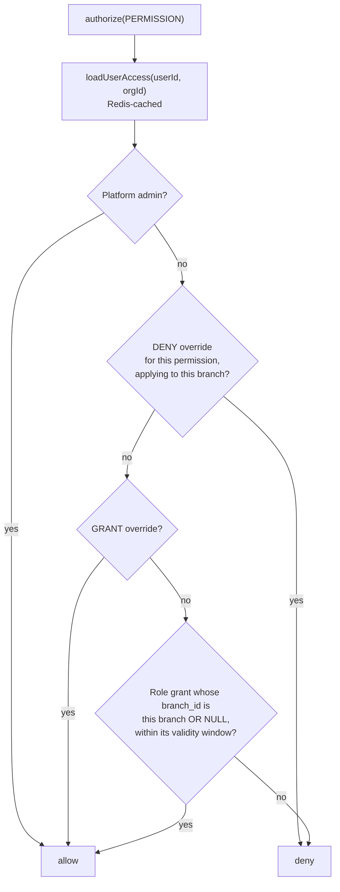

# 08 · Security Model

**Version:** 1.0 · **Verified** from source unless marked.
Deeper per-topic notes: [`Security/`](Security/README.md).

> **Threat model in one line.** Every tenant's protected health information
> lives in the same Postgres tables. The realistic worst case is not downtime —
> it is one clinic reading another clinic's patient records, which is a
> reportable breach under the DPDP Act 2023 and a company-ending event.

---

## Authentication

**Verified.** See [BR-AUTH-001 … 006](07_Business_Rules.md#authentication).

| Concern                    | Implementation                                                                                       | File                                                   |
| -------------------------- | ---------------------------------------------------------------------------------------------------- | ------------------------------------------------------ |
| Password hashing           | **Argon2id** via `@node-rs/argon2`                                                                   | `services/auth/password.service.ts`                    |
| Absent-user timing         | A dummy hash is verified so a missing user costs the same as a present one                           | `password.service.ts:54,63`                            |
| Lockout                    | 5 failed attempts → `users.locked_until`                                                             | `password.service.ts:75`                               |
| Access token               | JWT, 15 min, short claim keys (`sub sid pa mid oid bid imp`)                                         | `services/auth/token.service.ts`                       |
| Refresh token              | Opaque 256-bit random, stored **only** as SHA-256                                                    | `token.service.ts:111,122`                             |
| Rotation + reuse detection | Replaying a rotated token revokes the whole family                                                   | `services/auth/session.service.ts`                     |
| OTP                        | Hashed at rest (password treatment — codes are short and guessable), single-use, attempt-capped, TTL | `services/auth/otp.service.ts`, `token.service.ts:163` |
| Invitation token           | Hashed like a refresh token — 256 bits need no stretching                                            | `token.service.ts:144,149`                             |
| Constant-time comparison   | `hashesMatch`                                                                                        | `token.service.ts:127`                                 |
| Session transport          | httpOnly, **host-only** cookie. No `domain` attribute                                                | `apps/web/src/lib/session-cookie.ts`                   |

**Not built:** MFA (`otplib` is installed, no flow exists), SSO
(`user_identities` exists, no provider), email verification
(`emailVerifiedAt` is never set).

### Why the token pair is asymmetric

The access token is **stateless on purpose**: verifying it costs no database
round-trip, and that happens on every request. The price is that it cannot be
revoked before it expires — hence 15 minutes, not a day. The refresh token is
**stateful on purpose**, precisely so it _can_ be revoked, which is what makes
reuse detection possible.

---

## Authorization

**Verified.** Resolution is per request, never from the token.

**Verified** in `packages/permissions/src/resolver.ts:4-16`. 25 unit tests pin
this matrix, and the package has **zero runtime dependencies** so they run
without a database.

Key properties:

- **DENY always wins**, and is applied last in the flattening path.
- **`branch_id = NULL` means every branch** — the nullable is what makes
  multi-branch admin expressible without a second table.
- **Validity windows** (`validFrom` / `validUntil`) are honoured.
- **The permission list is never in the JWT.** It goes stale on a role change
  and is too large for a header.

### Privilege-escalation guards

**Verified** in `apps/api/src/services/iam/guards.ts`. Three guards, none
enforced by the database, and two of which _cannot_ be — the database has no
idea what its caller is allowed to do.

| Guard                    | Prevents                                                                                                                                                                                                      |
| ------------------------ | ------------------------------------------------------------------------------------------------------------------------------------------------------------------------------------------------------------- |
| `assertGrantable`        | Granting a permission you do not hold. Without it, an `ORG_ADMIN` mints a custom role carrying `billing.manage`, `branch.delete` and `patient.delete` — the three permissions deliberately withheld from them |
| `coversEveryBranch`      | An org-wide grant (`branch_id = NULL`) from a caller whose reach is partial. Escalation dressed up as an omission. Measured: without it the request returns 201 and the grant is real                         |
| `assertBranchAssignable` | Naming a branch outside the caller's scope, which the RESTRICTIVE policy's `WITH CHECK` would otherwise surface as a 500 rather than a 404                                                                    |

Plus a rule rather than a function: **every mutation reads its row first.** The
`USING` half of the branch policy makes an out-of-scope row invisible, so an
`updateMany` matches nothing and **commits successfully**. Reading first turns a
silent no-op into a clean 404.

> **Risk, High.** These are the only defence and they live in application code.
> A direct SQL write, a future service that forgets to call them, or a bug in
> `authorize()` bypasses all three. Moving what can be moved into RESTRICTIVE
> policies or triggers is the highest-value security work available.

---

## Tenant isolation

Three independent layers, described in full in
[`04_Database_Schema.md`](04_Database_Schema.md#tenant-isolation).

| Layer | Mechanism                                            | Catches                                                       |
| ----- | ---------------------------------------------------- | ------------------------------------------------------------- |
| 1     | Services pass `organizationId` explicitly            | A policy nobody wrote                                         |
| 2     | Postgres RLS — `organization_id = app_current_org()` | A service that forgot the filter                              |
| 3     | Composite FKs on `(organization_id, id)`             | A cross-tenant reference — unrepresentable, not merely denied |

Supporting controls, all **verified**:

- **Role split.** App connects as `rcln_app` (`NOBYPASSRLS`); migrations use
  `rcln_owner`. Policies are `ENABLE`, not `FORCE`, because the owner must keep
  bypassing for migrations to run at all.
- **`assertRlsActive()`** refuses to boot on an owner connection. This is the
  guard against the single most common way teams ship RLS that does nothing.
- **`db:rls:check`** fails CI when a table with `organization_id` has no policy
  and no written exemption, and warns on stale exemptions.
- **17 tenant-isolation test cases**, including six pinning the `own_membership`
  boundaries.
- **Unknown tenant → 404, never 403.**

---

## Session management

**Verified.**

| Property         | Value                                                                              |
| ---------------- | ---------------------------------------------------------------------------------- |
| Storage          | `sessions` table; refresh token as SHA-256 hash only                               |
| Cookie           | httpOnly, host-only, set by Next — the BFF holds it, browser JS never sees a token |
| Access lifetime  | 15 min (`JWT_ACCESS_TOKEN_EXPIRES_IN`)                                             |
| Refresh lifetime | 30 days (`JWT_REFRESH_TOKEN_EXPIRES_IN`)                                           |
| Rotation         | On every use                                                                       |
| Reuse            | Revokes the whole family                                                           |
| Revocation       | `findLiveSession` returns null for revoked, expired or absent                      |
| Branch switch    | `POST /auth/switch-branch` — new token, no re-authentication                       |
| Org switch       | `POST /auth/switch-organization`                                                   |

**Host-only is the isolation.** Adding a `domain` attribute would create
cross-tenant SSO. That is not wanted and would be a security regression.

---

## Secrets management

**Verified.**

- `.env` is gitignored; `.env.example` is the committed template with **no real
  values**.
- A `PreToolUse` hook blocks agent edits to any `.env` file.
- `.claude/settings.json` denies `Read` on every `.env` path.
- `JWT_SECRET` must be ≥32 characters; the example value is an obvious
  placeholder.
- CI injects secrets as workflow env, and the CI JWT secret is labelled
  CI-only.

**Gap.** The target design specifies AWS Secrets Manager with rotation. Nothing
is deployed, so in practice secrets live in a local `.env`. There is no rotation
mechanism and no secret scanning in CI.

---

## Audit logging

**Verified.** `audit_logs`, written **inside the same transaction** as the
mutation it records. Carries actor, organization, branch, action, target and a
before/after diff of changed fields — **ids and permission codes only, never
names**. 8 unit cases cover the diff logic.

| Gap                                                              | Severity                                                                               |
| ---------------------------------------------------------------- | -------------------------------------------------------------------------------------- |
| **PHI reads are not audited.** `data_access_logs` does not exist | **High** — "who looked at this patient's file" is the question asked after an incident |
| No audit viewer. Rows are readable only via psql                 | Medium                                                                                 |
| Append-only is a convention, not a constraint                    | Medium                                                                                 |

---

## Input handling and injection

**Verified.**

- **Zod at the boundary**, using schemas from `@rcln/contracts` so the web
  infers the same types. `validate` runs last in the chain.
- **Prisma parameterises** by default. `$queryRaw` must be used with tagged
  templates, never string interpolation.
- **The RLS SQL uses `format('… %I …')`** with identifier quoting, and the table
  names are literals in the file rather than user input.
- **Helmet** for security headers; CSP is disabled in dev only.
- **CORS** validates the origin dynamically: any subdomain of `ROOT_DOMAIN` is
  allowed, and the tenant's actual existence is settled by `resolveTenant`. A
  custom domain must additionally be verified in `organization_domains`.

---

## PHI handling

**Verified rules**, enforced by convention and review rather than tooling:

- Never log a patient name — pino redaction paths are configured in
  `apps/api/src/utils/logger.ts`, and any new PII-bearing field must be added in
  the same change that introduces it.
- Never cache PHI in Redis. Ids and permission metadata only.
- Never store PHI in `localStorage`, cookies or URL query params.
- Audit rows carry ids, never names.

**Not yet applicable in practice** — no patient data exists. These rules are
being established before the data arrives, which is the right order.

---

## Rate limiting and abuse resistance

**Verified.** All Redis-backed, so limits hold across replicas.

| Surface      | Limiter                           | Additional resistance                          |
| ------------ | --------------------------------- | ---------------------------------------------- |
| Everything   | `generalLimiter`                  |                                                |
| Login        | `authLimiter` + `identityLimiter` | Uniform message, constant time, dummy hash     |
| OTP request  | `otpLimiter` (per phone)          | Attempt cap, single use, TTL                   |
| Slug check   | `slugCheckLimiter` (hard)         | Boolean response only                          |
| Registration | `registrationLimiter`             |                                                |
| Demo form    | `publicFormLimiter`               | Honeypot, timing check, silent discard, dedupe |
| Invitations  | `inviteLimiter`                   |                                                |

---

## Known vulnerabilities and weaknesses

Ranked. Full remediation context in
[`15_Known_Issues_and_Technical_Debt.md`](15_Known_Issues_and_Technical_Debt.md).

| #   | Finding                                               | Severity              | Note                                                                                                                                        |
| --- | ----------------------------------------------------- | --------------------- | ------------------------------------------------------------------------------------------------------------------------------------------- |
| 1   | Privilege-escalation guards are application-only      | **High**              | Three guards, no database enforcement. Direct SQL bypasses all                                                                              |
| 2   | PHI reads unaudited                                   | **High**              | `data_access_logs` missing; a compliance obligation, not just a nice-to-have                                                                |
| 3   | No MFA for platform admins                            | **High**              | A super admin holds all 83 permissions across every tenant. `otplib` is installed and unused                                                |
| 4   | Legal pages promise anonymisation that does not exist | **High**              | A commitment made to data principals with no implementation                                                                                 |
| 5   | No secret rotation, no secret scanning in CI          | Medium                | Nothing deployed yet, so the window is still open to fix it cheaply                                                                         |
| 6   | Audit log is not tamper-evident                       | Medium                | No append-only constraint, no hash chain                                                                                                    |
| 7   | No column-level encryption                            | Medium                | Specified for `abha_number` / `national_id`; neither column exists yet                                                                      |
| 8   | No dependency scanning                                | Medium                | No Dependabot, no `pnpm audit` in CI, no image scanning                                                                                     |
| 9   | No response validation on the web side                | Low                   | Contracts type the response; nothing parses it at runtime                                                                                   |
| 10  | Impersonation unbuilt but referenced                  | Low → High when built | Must carry a real branch scope, a persistent banner, and full audit. The ADR describing it (`0012`) is cited in code and **does not exist** |

**No penetration test, no threat-modelling workshop and no dependency audit has
been performed.** This list is derived from reading the code, not from testing
it.

---

## Security review checklist

Run the `security-reviewer` subagent whenever a diff touches the schema,
tenancy, auth, permissions, patient data, billing, or raw SQL. Manually confirm:

- [ ] Any new tenant table has `organizationId`, `@@unique([organizationId, id])`,
      an RLS policy in `enable-rls.sql`, that SQL appended to the migration, and
      a case in the tenant-isolation suite
- [ ] `pnpm db:rls:check` passes
- [ ] No raw Prisma import; everything goes through `withTenant`
- [ ] Any new permission code is seeded and gated at the route
- [ ] Any role write is followed by an access-cache invalidation
- [ ] No new PII in logs, Redis, cookies or query params
- [ ] No new `any`, no `!` silencing `noUncheckedIndexedAccess`
- [ ] Error responses do not distinguish "does not exist" from "not yours"
