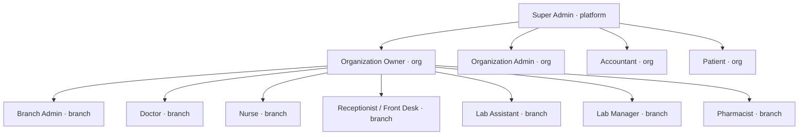

# Roles and permissions

<!-- generated by .kb/generate.mjs — do not edit by hand -->

12 system roles · 109 permissions.

Source of truth: `packages/permissions/src/roles.ts` and `packages/permissions/src/codes.ts`,
seeded into `roles` / `permissions` / `role_permissions` by `packages/db/prisma/seed.ts`.
System roles have `organizationId = null` and are never mutated by a tenant —
a tenant clones one into an org-scoped role instead.

## Roles

| code | name | scope | permissions | description |
| --- | --- | --- | --- | --- |
| `SUPER_ADMIN` | Super Admin | PLATFORM | 109 / 109 | Platform operator. Seeded directly into the database, never created via the UI. |
| `ORG_OWNER` | Organization Owner | ORGANIZATION | 97 / 109 | Registered the clinic. Full control including subscription and billing. |
| `ORG_ADMIN` | Organization Admin | ORGANIZATION | 93 / 109 | Manages every branch, but cannot change the subscription or delete the org. |
| `BRANCH_ADMIN` | Branch Admin | BRANCH | 67 / 109 | Runs one or more branches. Which branches is decided per assignment in membership_roles, not here. |
| `DOCTOR` | Doctor | BRANCH | 31 / 109 | Consults patients. Scoped to the branches they practise at. |
| `NURSE` | Nurse | BRANCH | 17 / 109 | Records vitals, assists the encounter, manages the queue. |
| `RECEPTIONIST` | Receptionist / Front Desk | BRANCH | 22 / 109 | Registers patients, books appointments, collects payment. No clinical access. |
| `LAB_ASSISTANT` | Lab Assistant | BRANCH | 6 / 109 | Collects samples and enters results. Cannot verify or release a report. |
| `LAB_MANAGER` | Lab Manager | BRANCH | 15 / 109 | Verifies results and releases reports. Separation of duty from the assistant. |
| `PHARMACIST` | Pharmacist | BRANCH | 24 / 109 | Dispenses against prescriptions and manages stock. |
| `ACCOUNTANT` | Accountant | ORGANIZATION | 22 / 109 | Billing and revenue. Reads patient identity only, never clinical notes. |
| `PATIENT` | Patient | ORGANIZATION | 11 / 109 | Portal access to their own records only. Row filtering is by patient_id, not by this role. |

## Access matrix

`Y` = granted by the system role definition. Blank = not granted.

### appointment

| permission | SUPER ADMIN | ORG OWNER | ORG ADMIN | BRANCH ADMIN | DOCTOR | NURSE | RECEPTIONIST | LAB ASSISTANT | LAB MANAGER | PHARMACIST | ACCOUNTANT | PATIENT |
| --- | --- | --- | --- | --- | --- | --- | --- | --- | --- | --- | --- | --- |
| `appointment.availability.read` | Y | Y | Y | Y | Y | Y | Y |  |  |  |  | Y |
| `appointment.cancel` | Y | Y | Y | Y | Y |  | Y |  |  |  |  | Y |
| `appointment.checkin` | Y | Y | Y | Y |  | Y | Y |  |  |  |  |  |
| `appointment.create` | Y | Y | Y | Y | Y |  | Y |  |  |  |  | Y |
| `appointment.delete` | Y | Y | Y | Y |  |  | Y |  |  |  |  |  |
| `appointment.queue.manage` | Y | Y | Y | Y |  | Y | Y |  |  |  |  |  |
| `appointment.read` | Y | Y | Y | Y | Y | Y | Y |  |  |  | Y | Y |
| `appointment.update` | Y | Y | Y | Y | Y |  | Y |  |  |  |  |  |

### audit

| permission | SUPER ADMIN | ORG OWNER | ORG ADMIN | BRANCH ADMIN | DOCTOR | NURSE | RECEPTIONIST | LAB ASSISTANT | LAB MANAGER | PHARMACIST | ACCOUNTANT | PATIENT |
| --- | --- | --- | --- | --- | --- | --- | --- | --- | --- | --- | --- | --- |
| `audit.record.read` | Y | Y | Y | Y |  |  |  |  |  |  |  |  |

### billing

| permission | SUPER ADMIN | ORG OWNER | ORG ADMIN | BRANCH ADMIN | DOCTOR | NURSE | RECEPTIONIST | LAB ASSISTANT | LAB MANAGER | PHARMACIST | ACCOUNTANT | PATIENT |
| --- | --- | --- | --- | --- | --- | --- | --- | --- | --- | --- | --- | --- |
| `billing.credit_note.issue` | Y | Y | Y | Y |  |  |  |  |  |  | Y |  |
| `billing.doctor_payout.manage` | Y | Y | Y | Y |  |  |  |  |  |  | Y |  |
| `billing.fee_schedule.manage` | Y | Y | Y |  |  |  |  |  |  |  |  |  |
| `billing.fee_schedule.read` | Y | Y | Y | Y | Y |  | Y |  |  |  | Y |  |
| `billing.invoice.cancel` | Y | Y | Y | Y |  |  |  |  |  |  | Y |  |
| `billing.invoice.create` | Y | Y | Y | Y |  |  | Y |  |  | Y | Y |  |
| `billing.invoice.read` | Y | Y | Y | Y | Y |  | Y |  | Y | Y | Y | Y |
| `billing.invoice.read_all` | Y | Y | Y | Y |  |  |  |  |  |  | Y |  |
| `billing.invoice.update` | Y | Y | Y | Y |  |  |  |  |  |  | Y |  |
| `billing.payment.collect` | Y | Y | Y | Y |  |  | Y |  |  | Y | Y |  |
| `billing.refund.process` | Y | Y | Y | Y |  |  |  |  |  |  | Y |  |
| `billing.tax.manage` | Y | Y | Y |  |  |  |  |  |  |  | Y |  |
| `billing.tax.read` | Y | Y | Y | Y |  |  |  |  |  |  | Y |  |

### branch

| permission | SUPER ADMIN | ORG OWNER | ORG ADMIN | BRANCH ADMIN | DOCTOR | NURSE | RECEPTIONIST | LAB ASSISTANT | LAB MANAGER | PHARMACIST | ACCOUNTANT | PATIENT |
| --- | --- | --- | --- | --- | --- | --- | --- | --- | --- | --- | --- | --- |
| `branch.create` | Y | Y | Y |  |  |  |  |  |  |  |  |  |
| `branch.delete` | Y | Y |  |  |  |  |  |  |  |  |  |  |
| `branch.read` | Y | Y | Y | Y |  |  |  |  |  |  |  |  |
| `branch.update` | Y | Y | Y | Y |  |  |  |  |  |  |  |  |

### clinical

| permission | SUPER ADMIN | ORG OWNER | ORG ADMIN | BRANCH ADMIN | DOCTOR | NURSE | RECEPTIONIST | LAB ASSISTANT | LAB MANAGER | PHARMACIST | ACCOUNTANT | PATIENT |
| --- | --- | --- | --- | --- | --- | --- | --- | --- | --- | --- | --- | --- |
| `clinical.encounter.close` | Y |  |  |  | Y |  |  |  |  |  |  |  |
| `clinical.encounter.create` | Y |  |  |  | Y |  |  |  |  |  |  |  |
| `clinical.encounter.read` | Y | Y | Y | Y | Y | Y |  |  |  |  |  |  |
| `clinical.master.manage` | Y | Y | Y |  |  |  |  |  |  |  |  |  |
| `clinical.prescription.create` | Y |  |  |  | Y |  |  |  |  |  |  |  |
| `clinical.prescription.read` | Y | Y | Y | Y | Y | Y |  |  |  | Y |  | Y |
| `clinical.prescription.sign` | Y |  |  |  | Y |  |  |  |  |  |  |  |
| `clinical.vitals.read` | Y | Y | Y | Y | Y | Y | Y |  |  |  |  |  |
| `clinical.vitals.record` | Y | Y | Y |  |  | Y | Y |  |  |  |  |  |

### doctor

| permission | SUPER ADMIN | ORG OWNER | ORG ADMIN | BRANCH ADMIN | DOCTOR | NURSE | RECEPTIONIST | LAB ASSISTANT | LAB MANAGER | PHARMACIST | ACCOUNTANT | PATIENT |
| --- | --- | --- | --- | --- | --- | --- | --- | --- | --- | --- | --- | --- |
| `doctor.archive` | Y | Y |  |  |  |  |  |  |  |  |  |  |
| `doctor.compensation.manage` | Y | Y | Y |  |  |  |  |  |  |  |  |  |
| `doctor.compensation.read` | Y | Y | Y |  |  |  |  |  |  |  | Y |  |
| `doctor.create` | Y | Y | Y | Y |  |  |  |  |  |  |  |  |
| `doctor.directory.read` | Y | Y | Y | Y |  | Y | Y |  |  |  |  |  |
| `doctor.master.manage` | Y | Y | Y | Y |  |  |  |  |  |  |  |  |
| `doctor.read` | Y | Y | Y | Y | Y | Y | Y | Y | Y | Y | Y | Y |
| `doctor.schedule.approve` | Y | Y | Y | Y |  |  |  |  |  |  |  |  |
| `doctor.schedule.manage` | Y | Y | Y | Y |  |  |  |  |  |  |  |  |
| `doctor.schedule.read` | Y | Y | Y | Y | Y | Y | Y |  |  |  |  |  |
| `doctor.schedule.request` | Y | Y | Y |  | Y |  |  |  |  |  |  |  |
| `doctor.update` | Y | Y | Y | Y |  |  |  |  |  |  |  |  |

### iam

| permission | SUPER ADMIN | ORG OWNER | ORG ADMIN | BRANCH ADMIN | DOCTOR | NURSE | RECEPTIONIST | LAB ASSISTANT | LAB MANAGER | PHARMACIST | ACCOUNTANT | PATIENT |
| --- | --- | --- | --- | --- | --- | --- | --- | --- | --- | --- | --- | --- |
| `iam.designation.manage` | Y | Y | Y | Y |  |  |  |  |  |  |  |  |
| `iam.permission.assign` | Y | Y | Y |  |  |  |  |  |  |  |  |  |
| `iam.role.manage` | Y | Y | Y |  |  |  |  |  |  |  |  |  |
| `iam.role.read` | Y | Y | Y | Y |  |  |  |  |  |  |  |  |
| `iam.user.invite` | Y | Y | Y | Y |  |  |  |  |  |  |  |  |
| `iam.user.read` | Y | Y | Y | Y |  |  |  |  |  |  |  |  |
| `iam.user.suspend` | Y | Y | Y |  |  |  |  |  |  |  |  |  |
| `iam.user.update` | Y | Y | Y | Y |  |  |  |  |  |  |  |  |

### inventory

| permission | SUPER ADMIN | ORG OWNER | ORG ADMIN | BRANCH ADMIN | DOCTOR | NURSE | RECEPTIONIST | LAB ASSISTANT | LAB MANAGER | PHARMACIST | ACCOUNTANT | PATIENT |
| --- | --- | --- | --- | --- | --- | --- | --- | --- | --- | --- | --- | --- |
| `inventory.batch.manage` | Y | Y | Y | Y |  |  |  |  |  | Y |  |  |
| `inventory.stock.adjust` | Y | Y | Y | Y |  |  |  |  |  | Y |  |  |
| `inventory.stock.read` | Y | Y | Y | Y |  |  |  |  |  | Y |  |  |
| `inventory.stock.transfer` | Y | Y | Y | Y |  |  |  |  |  | Y |  |  |

### lab

| permission | SUPER ADMIN | ORG OWNER | ORG ADMIN | BRANCH ADMIN | DOCTOR | NURSE | RECEPTIONIST | LAB ASSISTANT | LAB MANAGER | PHARMACIST | ACCOUNTANT | PATIENT |
| --- | --- | --- | --- | --- | --- | --- | --- | --- | --- | --- | --- | --- |
| `lab.master.manage` | Y | Y | Y | Y |  |  |  |  | Y |  |  |  |
| `lab.order.create` | Y | Y | Y |  | Y |  |  |  | Y |  |  |  |
| `lab.order.read` | Y | Y | Y | Y | Y | Y |  | Y | Y |  |  | Y |
| `lab.report.release` | Y | Y | Y |  |  |  |  |  | Y |  |  |  |
| `lab.result.enter` | Y | Y | Y |  |  |  |  | Y | Y |  |  |  |
| `lab.result.verify` | Y | Y | Y |  |  |  |  |  | Y |  |  |  |
| `lab.sample.collect` | Y | Y | Y |  |  |  |  | Y | Y |  |  |  |

### organization

| permission | SUPER ADMIN | ORG OWNER | ORG ADMIN | BRANCH ADMIN | DOCTOR | NURSE | RECEPTIONIST | LAB ASSISTANT | LAB MANAGER | PHARMACIST | ACCOUNTANT | PATIENT |
| --- | --- | --- | --- | --- | --- | --- | --- | --- | --- | --- | --- | --- |
| `organization.billing.manage` | Y | Y |  |  |  |  |  |  |  |  |  |  |
| `organization.billing.read` | Y | Y | Y |  |  |  |  |  |  |  | Y |  |
| `organization.read` | Y | Y | Y |  |  |  |  |  |  |  |  |  |
| `organization.update` | Y | Y | Y |  |  |  |  |  |  |  |  |  |

### patient

| permission | SUPER ADMIN | ORG OWNER | ORG ADMIN | BRANCH ADMIN | DOCTOR | NURSE | RECEPTIONIST | LAB ASSISTANT | LAB MANAGER | PHARMACIST | ACCOUNTANT | PATIENT |
| --- | --- | --- | --- | --- | --- | --- | --- | --- | --- | --- | --- | --- |
| `patient.create` | Y | Y | Y | Y | Y |  | Y |  |  |  |  |  |
| `patient.delete` | Y | Y |  |  |  |  |  |  |  |  |  |  |
| `patient.document.read` | Y | Y | Y | Y | Y |  |  |  |  |  |  | Y |
| `patient.document.upload` | Y | Y | Y |  | Y |  |  |  |  |  |  |  |
| `patient.export` | Y | Y | Y |  |  |  |  |  |  |  |  |  |
| `patient.medical_history.read` | Y | Y | Y | Y | Y | Y |  |  |  |  |  |  |
| `patient.medical_history.write` | Y | Y | Y |  | Y |  |  |  |  |  |  |  |
| `patient.read` | Y | Y | Y | Y | Y | Y | Y | Y | Y | Y | Y | Y |
| `patient.update` | Y | Y | Y | Y | Y | Y | Y |  |  |  |  |  |

### pharmacy

| permission | SUPER ADMIN | ORG OWNER | ORG ADMIN | BRANCH ADMIN | DOCTOR | NURSE | RECEPTIONIST | LAB ASSISTANT | LAB MANAGER | PHARMACIST | ACCOUNTANT | PATIENT |
| --- | --- | --- | --- | --- | --- | --- | --- | --- | --- | --- | --- | --- |
| `pharmacy.dispense.create` | Y | Y | Y |  |  |  |  |  |  | Y |  |  |
| `pharmacy.dispense.read` | Y | Y | Y | Y |  |  |  |  |  | Y |  |  |
| `pharmacy.dispense.return` | Y | Y | Y |  |  |  |  |  |  | Y |  |  |
| `pharmacy.goods_receipt.manage` | Y | Y | Y | Y |  |  |  |  |  | Y |  |  |
| `pharmacy.medicine.manage` | Y | Y | Y | Y |  |  |  |  |  | Y |  |  |
| `pharmacy.medicine.read` | Y | Y | Y | Y | Y |  |  |  |  | Y |  |  |
| `pharmacy.purchase_order.manage` | Y | Y | Y | Y |  |  |  |  |  | Y |  |  |
| `pharmacy.purchase_order.read` | Y | Y | Y | Y |  |  |  |  |  | Y |  |  |
| `pharmacy.supplier.manage` | Y | Y | Y | Y |  |  |  |  |  | Y |  |  |

### platform

| permission | SUPER ADMIN | ORG OWNER | ORG ADMIN | BRANCH ADMIN | DOCTOR | NURSE | RECEPTIONIST | LAB ASSISTANT | LAB MANAGER | PHARMACIST | ACCOUNTANT | PATIENT |
| --- | --- | --- | --- | --- | --- | --- | --- | --- | --- | --- | --- | --- |
| `platform.audit.read` | Y |  |  |  |  |  |  |  |  |  |  |  |
| `platform.impersonate` | Y |  |  |  |  |  |  |  |  |  |  |  |
| `platform.organization.manage` | Y |  |  |  |  |  |  |  |  |  |  |  |
| `platform.organization.read` | Y |  |  |  |  |  |  |  |  |  |  |  |
| `platform.organization.suspend` | Y |  |  |  |  |  |  |  |  |  |  |  |
| `platform.plan.manage` | Y |  |  |  |  |  |  |  |  |  |  |  |
| `platform.subscription.manage` | Y |  |  |  |  |  |  |  |  |  |  |  |
| `platform.tax.manage` | Y |  |  |  |  |  |  |  |  |  |  |  |

### product

| permission | SUPER ADMIN | ORG OWNER | ORG ADMIN | BRANCH ADMIN | DOCTOR | NURSE | RECEPTIONIST | LAB ASSISTANT | LAB MANAGER | PHARMACIST | ACCOUNTANT | PATIENT |
| --- | --- | --- | --- | --- | --- | --- | --- | --- | --- | --- | --- | --- |
| `product.definition.manage` | Y | Y | Y | Y |  |  |  |  | Y | Y |  |  |
| `product.definition.read` | Y | Y | Y | Y | Y | Y |  |  | Y | Y | Y |  |
| `product.identifier.manage` | Y | Y | Y | Y |  |  |  |  | Y | Y |  |  |

### report

| permission | SUPER ADMIN | ORG OWNER | ORG ADMIN | BRANCH ADMIN | DOCTOR | NURSE | RECEPTIONIST | LAB ASSISTANT | LAB MANAGER | PHARMACIST | ACCOUNTANT | PATIENT |
| --- | --- | --- | --- | --- | --- | --- | --- | --- | --- | --- | --- | --- |
| `report.clinical.read` | Y | Y | Y | Y | Y |  |  |  |  |  |  |  |
| `report.dashboard.read` | Y | Y | Y | Y | Y |  | Y |  | Y |  | Y |  |
| `report.export` | Y | Y | Y | Y |  |  |  |  |  |  | Y |  |
| `report.inventory.read` | Y | Y | Y | Y |  |  |  |  |  | Y |  |  |
| `report.revenue.read` | Y | Y | Y | Y |  |  |  |  |  |  | Y |  |

### settings

| permission | SUPER ADMIN | ORG OWNER | ORG ADMIN | BRANCH ADMIN | DOCTOR | NURSE | RECEPTIONIST | LAB ASSISTANT | LAB MANAGER | PHARMACIST | ACCOUNTANT | PATIENT |
| --- | --- | --- | --- | --- | --- | --- | --- | --- | --- | --- | --- | --- |
| `settings.branch.read` | Y | Y | Y | Y |  |  |  |  |  |  |  |  |
| `settings.branch.write` | Y | Y | Y | Y |  |  |  |  |  |  |  |  |
| `settings.organization.read` | Y | Y | Y |  |  |  |  |  |  |  |  |  |
| `settings.organization.write` | Y | Y | Y |  |  |  |  |  |  |  |  |  |
| `settings.user.write` | Y | Y | Y | Y | Y | Y | Y | Y | Y | Y | Y | Y |

## Privilege hierarchy

Scope is not inheritance. A `BRANCH` role grants its permissions only inside the
branches named on that `membership_roles` row; a NULL `branch_id` means every branch
in the organization. The arrows above show privilege breadth, not a delegation chain.
