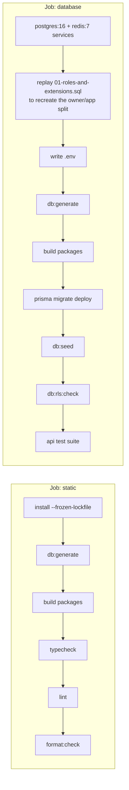

# 10 · Deployment Guide

**Version:** 1.0

> **Read this first.** Nothing is deployed. There is no staging, no production,
> and `STATUS.md` records the git remote as configured but **never pushed**.
> Everything below is split into _what exists_ and _what is designed_. Do not
> cite the designed half as if it were operational.

---

## Environments

| Environment       | Exists? | How                                                |
| ----------------- | ------- | -------------------------------------------------- |
| Local development | **Yes** | `docker compose up`                                |
| CI                | **Yes** | GitHub Actions, two jobs                           |
| Staging           | **No**  | Designed: single-task AWS with seeded demo tenants |
| Production        | **No**  | Designed: AWS `ap-south-1`, ECS Fargate            |

The design note worth keeping: **staging must be a real environment with real
RLS and at least two real tenants.** RLS bugs do not show up in single-tenant
local testing.

---

## Local development — Verified

Docker is the only prerequisite.

```bash
docker compose up            # api · web · worker · postgres · redis · mailpit
```

The dev entrypoint (`infra/docker/dev-entrypoint.sh`) reconciles dependencies,
generates the Prisma client, and waits for Postgres before starting. Hot reload
is on for all three apps.

| Service | Local address                                                     |
| ------- | ----------------------------------------------------------------- |
| web     | `http://lvh.me:3000` — and `http://<slug>.lvh.me:3000` per tenant |
| api     | `http://localhost:5000`                                           |
| Mailpit | see `docker-compose.yml`                                          |

`lvh.me` and any subdomain resolve to `127.0.0.1` publicly, so multi-tenant
routing works with no `/etc/hosts` edit.

Common commands, all inside the container:

```bash
docker compose exec api pnpm validate       # typecheck + lint + test
docker compose exec api pnpm db:rls:check
docker compose exec api pnpm db:migrate
docker compose exec api pnpm db:seed
docker compose exec api pnpm kb             # refresh this KnowledgeBase
```

Infrastructure only, for running apps natively:

```bash
pnpm infra        # postgres + redis + mailpit
pnpm infra:stop
```

---

## Build process — Verified

Turbo orchestrates; packages build to `dist/` and are consumed from there, so a
consumer needs the package built.

```bash
pnpm build                  # turbo run build across the workspace
pnpm --filter "./packages/*" run build
pnpm db:generate            # the generated Prisma client is gitignored
```

**The generated Prisma client is gitignored, so nothing typechecks without
`pnpm db:generate` first.** CI runs it before anything else, for this reason.

Production images exist for all three apps:

```bash
pnpm docker:build:api       # 476 MB, smoke-tested
pnpm docker:build:web
pnpm docker:build:worker
```

`.dockerignore` reduced the build context from 996 MB to 1.4 MB
(58,347 files → 110).

Next.js uses **standalone output for the build only** —
[ADR-0010](Architecture/decisions/0010-next-standalone-build-only.md).

---

## CI/CD — Verified

`.github/workflows/ci.yml`, on push and PR to `main` and `develop`.
Node 22, pnpm 10.18.2.



**The database job must never be made optional.** The comment in the workflow
says why, and it is correct: RLS fails silently. A missing policy produces no
error and breaks no single-tenant test. It simply starts returning other
clinics' patient records.

**There is no CD.** No deploy job, no registry push, no environment promotion.

### Local gates

| Hook         | Runs                                                                                                        |
| ------------ | ----------------------------------------------------------------------------------------------------------- |
| `commit-msg` | commitlint — conventional commits, lowercase subject                                                        |
| `pre-commit` | lint-staged → prettier                                                                                      |
| `pre-push`   | protected-branch guard · typecheck · lint · `db:rls:check` (soft, if the DB is up) · `.kb` freshness (hard) |

Protected branches — `main`, `master`, `stage`, `staging`, `dev`, `develop` —
reject direct pushes.

---

## Target production topology — Designed, not built

From [`Architecture/architecture.md`](Architecture/architecture.md) §12.
**None of this is provisioned. There is no Terraform in the repository.**

```
Route53 (*.rcln.com)
  → Cloudflare (proxy, WAF, DDoS)
    → ALB (ACM wildcard cert)
      → ECS Fargate: web     2 tasks, 0.5 vCPU / 1 GB,  autoscale 2–10
      → ECS Fargate: api     2 tasks, 1 vCPU   / 2 GB,  autoscale 2–20
      → ECS Fargate: worker  2 tasks, 1 vCPU   / 2 GB,  autoscale on queue depth
  → RDS Postgres 16, Multi-AZ + 1 read replica
  → ElastiCache Redis 7 with replica
  → S3 + CloudFront
  → Secrets Manager · Parameter Store · ECR
```

Region is `ap-south-1` (Mumbai) for **data residency**, which is a DPDP
constraint rather than a latency preference. It limits provider choice; verify
the region before signing anything.

Rejected alternatives, with reasons recorded: Kubernetes (three services do not
need a control plane), Vercel for the frontend (wildcard subdomains need a Pro
plan, and a cross-region SSR hop), Render (no Mumbai region), self-hosted VPS
(you become the DBA and the on-call for healthcare data).

**Estimated cost** at 50 tenants / ~2000 DAU: $400–600/month, plus ~$300/month
of SaaS tooling. At 500 tenants: $2000–3000/month.

---

## Scaling strategy — Designed

| Tier     | Signal                            | Note                                                                                                               |
| -------- | --------------------------------- | ------------------------------------------------------------------------------------------------------------------ |
| web      | CPU / request count               | Stateless                                                                                                          |
| api      | CPU / request count               | Stateless. **Never verified on more than one instance**                                                            |
| worker   | Queue depth                       | No processors exist yet                                                                                            |
| Postgres | Vertical first, then read replica | Shared-database multi-tenancy means one instance serves every tenant                                               |
| Redis    | Single node + replica             | Separate logical DBs: `allkeys-lru` for cache, **`noeviction` for BullMQ** — evicting a job is a lost notification |

**Missing and specified:** PgBouncer in transaction mode. Node and Prisma open
connections greedily and RDS tops out around 500. This is the first thing that
will break under real concurrency.

**Noisy neighbours are structural.** Per-tenant row counts are listed as an
early-warning metric.

---

## Database migrations

**Verified locally.**

```bash
pnpm db:migrate           # dev: create + apply
pnpm db:migrate:prod      # prisma migrate deploy
```

**Rules, non-negotiable:**

- **Never edit an applied migration.** Prisma checksums it; every environment
  breaks.
- **RLS policies, triggers, partitions and exclusion constraints are hand-edited
  SQL blocks** inside the migration. Prisma Migrate does not manage them.
- **Expand → deploy → contract.** Never rename a column in one migration.
- **Designed:** migrations run as a one-off ECS task before the service update,
  gated on success.

---

## Rollback

**Designed, untested.**

| Failure                | Response                                                                                                                          |
| ---------------------- | --------------------------------------------------------------------------------------------------------------------------------- |
| Bad application deploy | ECS rolling deploy — revert the task definition to the previous image                                                             |
| Bad migration          | **There is no down-migration path.** Expand/contract exists precisely so a rollback of code does not require a rollback of schema |
| Data corruption        | Point-in-time recovery from RDS                                                                                                   |

The absence of a schema rollback story is deliberate and standard, but it means
**a destructive migration is effectively irreversible**. Review schema changes
accordingly.

---

## Disaster recovery — Designed

**None of this is set up.** Recorded from `architecture.md` §13 so it is not
re-derived:

- RDS automated backups, 30-day retention, PITR enabled
- A monthly logical dump to a **separate account and region**
- **Test the restore quarterly** — an untested backup is a rumour
- S3 versioning on, Glacier transition after 1 year, and **never auto-delete**:
  Indian outpatient medical record retention is 3 years minimum, longer for
  medico-legal

No RTO or RPO has been agreed.

---

## Observability — Designed

**Nothing is integrated.** `SENTRY_DSN` and `OTEL_EXPORTER_OTLP_ENDPOINT` exist
as environment variables and are blank.

What exists today: pino structured logs with PII redaction, `GET /health` and
`GET /ready`, and request-id propagation via `X-Request-Id`.

Designed: Sentry for errors (tagged with `org_id` / `branch_id` / `user_id`),
OpenTelemetry traces, Prometheus metrics, Loki logs correlated by request id,
and uptime checks against a real tenant subdomain.

Alerts that should page someone: API 5xx > 1%, p95 > 2s, queue depth > 1000,
DB CPU > 80%, replication lag > 30s, failed payments > 5/hour, **any RLS policy
violation**.

---

## Before the first real deployment

A checklist derived from the gaps above, not from a completed exercise:

- [ ] Rotate every credential in `.env.example` — `JWT_SECRET`,
      `SUPERADMIN_PASSWORD`, both database passwords
- [ ] Move secrets to a managed store with rotation
- [ ] Provision the `rcln_owner` / `rcln_app` split, and prove `rcln_app` cannot
      bypass RLS in that environment
- [ ] Verify `assertRlsActive()` actually fires on a misconfigured connection
- [ ] Stand up staging with **two** real tenants and re-run the isolation suite
      against it
- [ ] Add PgBouncer before any concurrency testing means anything
- [ ] Wire error tracking before, not after, the first incident
- [ ] Set up backups **and test a restore**
- [ ] Add MFA for platform admins — one compromise is every tenant
- [ ] Fill the legal placeholders and get counsel sign-off
- [ ] Add dependency and image scanning to CI
