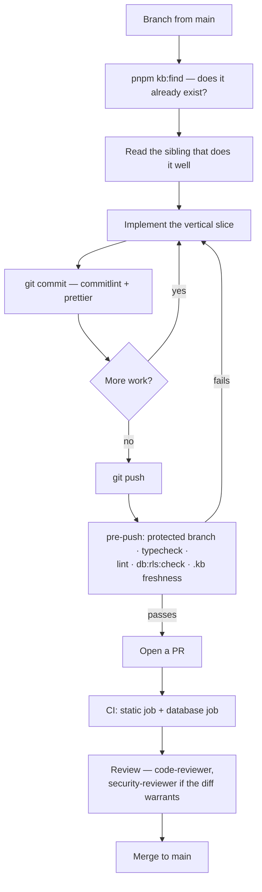

# 11 · Development Workflow

**Version:** 1.0 · **Verified** from `.husky/`, `package.json`,
`commitlint.config.js`, `.github/workflows/ci.yml` and
[`Architecture/CONVENTIONS.md`](Architecture/CONVENTIONS.md).

---

## Getting started

```bash
git clone <remote> && cd rcln
cp .env.example .env          # fill in; never commit it
docker compose up             # Docker is the only prerequisite
```

Everything runs in containers with hot reload. Workspace commands go through the
api container:

```bash
docker compose exec api pnpm <script>
```

Native paths are documented in [`../README.md`](../README.md).

---

## Branch strategy

**Verified** from the pre-push hook and the CI triggers.

| Branch                                            | Role                                 |
| ------------------------------------------------- | ------------------------------------ |
| `main`                                            | Default and PR target. **Protected** |
| `develop`                                         | Also a CI target. **Protected**      |
| `main` `master` `stage` `staging` `dev` `develop` | All reject direct pushes             |

Feature branches use a type prefix. The hook's own message lists them:

```
feature/  fix/  hotfix/  docs/  refactor/  test/  chore/
```

The current branch is `feat/phase-1-tenant-management`, so `feat/` is used in
practice alongside `feature/`.

```bash
git checkout -b feature/your-feature-name
```

---

## The change lifecycle



---

## Git hooks

**Verified** in `.husky/`.

| Hook         | Runs                                                         | Blocking                                 |
| ------------ | ------------------------------------------------------------ | ---------------------------------------- |
| `commit-msg` | `commitlint --edit`                                          | Yes                                      |
| `pre-commit` | `lint-staged` → prettier on `ts,tsx,js,mjs,json,md,yml,yaml` | Yes                                      |
| `pre-push`   | Protected-branch guard                                       | Yes                                      |
|              | `pnpm typecheck`                                             | Yes                                      |
|              | `pnpm lint`                                                  | Yes                                      |
|              | `pnpm db:rls:check`                                          | **No** — warns if the database is not up |
|              | `pnpm kb` + a staleness check                                | Yes                                      |

Linting is on pre-push rather than pre-commit because ESLint 9's flat config
must run per package, which is too slow for every commit.

The `.kb` gate regenerates the index and **rejects the push if it changed**,
with instructions to review and commit it. A stale index cannot reach the
remote.

---

## Commits

Conventional commits, enforced.

```
<type>: <lowercase subject>

feat: add branch operating hours
fix: narrow prisma errors structurally, not with instanceof
docs: record the RLS exemption reasoning
```

Types: `feat fix docs style refactor perf test build ci chore revert`.
The subject **must be lowercase**. `pnpm commit` runs commitizen if you prefer
the prompt.

---

## Pull requests

**Inferred** — no PR template exists in the repository.

CI runs on PRs to `main` and `develop`. Both jobs must pass:

- **static** — install, `db:generate`, build packages, typecheck, lint,
  format:check
- **database** — real Postgres 16 and Redis 7, the role split replayed,
  migrations, seed, `db:rls:check`, the full api test suite

A PR that touches the schema, tenancy, auth, permissions, patient data, billing
or raw SQL should carry evidence that `db:rls:check` passed and that a
tenant-isolation case was added.

---

## Code review

**Verified** — three subagents and a slash command are configured in
`.claude/`.

| Tool                         | Use                                                                                                        |
| ---------------------------- | ---------------------------------------------------------------------------------------------------------- |
| `/code-review [path]`        | `pnpm validate` + `db:rls:check` + both reviewer subagents, consolidated                                   |
| `code-reviewer` subagent     | Invariants, conventions, correctness                                                                       |
| `security-reviewer` subagent | **Use whenever the diff touches the schema, tenancy, auth, permissions, patient data, billing or raw SQL** |
| `architect` subagent         | Designing a vertical slice before writing it                                                               |

What a reviewer is checking for, beyond correctness:

- Does it match the nearest sibling, or invent a second way to do something?
- Is the middleware chain intact and in order?
- Does a new tenant table have its policy, its migration SQL, and its isolation
  test?
- Is anything cached that should not be? Logged that should not be?
- Is the diff the smallest correct change?

---

## Scaffolding skills

Configured in `.claude/skills/`. Prefer them over improvising the equivalent.

| Skill                         | For                                                                 |
| ----------------------------- | ------------------------------------------------------------------- |
| `/new-feature <name>`         | A complete vertical slice, ending at the tenant-isolation test      |
| `/db-migration <change>`      | **Any `schema.prisma` change.** Walks the RLS gauntlet              |
| `/api-integration <endpoint>` | Contract → permission → service → route → web consumer              |
| `/code-review [path]`         | The consolidated review                                             |
| `frontend-design`             | **Load before writing any new screen or CSS**, not as a polish pass |
| `vercel-react-best-practices` | 68 React/Next performance rules                                     |

---

## Keeping the KnowledgeBase current

| Change                                               | Action                                                                                                          |
| ---------------------------------------------------- | --------------------------------------------------------------------------------------------------------------- |
| Any `.ts`/`.tsx`/`.prisma` in `apps/` or `packages/` | Nothing by hand. `pnpm kb` regenerates; a Stop hook runs it automatically, and pre-push enforces it             |
| A module's purpose, features, limitations            | Edit [`modules.json`](modules.json), then `pnpm kb`                                                             |
| A business rule                                      | [`07_Business_Rules.md`](07_Business_Rules.md) + the module file in [`BusinessRules/`](BusinessRules/README.md) |
| Something structural                                 | A new ADR in [`Architecture/decisions/`](Architecture/decisions/README.md)                                      |
| Surprising behaviour                                 | An entry in [`Architecture/PITFALLS.md`](Architecture/PITFALLS.md)                                              |
| A finished phase or a change of direction            | [`STATUS.md`](STATUS.md)                                                                                        |

**Never hand-edit a file carrying the generated banner.**

---

## Release process

**Does not exist.** No version tags, no changelog, no release workflow, and
nothing has been deployed. `package.json` says `0.1.0` and `private: true`.

**Inferred** as the natural fit when it is needed: conventional commits are
already enforced, so `changesets` or `semantic-release` would work without
changing developer habits.

---

## Versioning strategy

| Thing              | Today                        | Note                                                              |
| ------------------ | ---------------------------- | ----------------------------------------------------------------- |
| Repository         | `0.1.0`, private             | Never bumped                                                      |
| Workspace packages | `workspace:*`                | Internal; no external consumers                                   |
| API                | `/api/v1`                    | v1 is in the path from the start, so a v2 is additive             |
| Database           | Prisma migration history     | Forward-only. Expand → deploy → contract                          |
| KnowledgeBase      | Header on each numbered file | Bump when the document's substance changes, not on a regeneration |

---

## Definition of done

A change is done when **all** of these hold:

- [ ] `pnpm validate` passes — typecheck, lint, tests
- [ ] `pnpm db:rls:check` passes, if the schema moved
- [ ] A new tenant table has its policy, migration SQL and isolation test
- [ ] The behaviour was actually exercised — endpoint curled, screen loaded,
      container still up. **Typechecking is not verification**
- [ ] The `.kb` index is current
- [ ] Anything surprising is written into PITFALLS, and anything structural into
      an ADR
- [ ] `STATUS.md` reflects reality if a phase moved

Do not commit or push unless asked.
