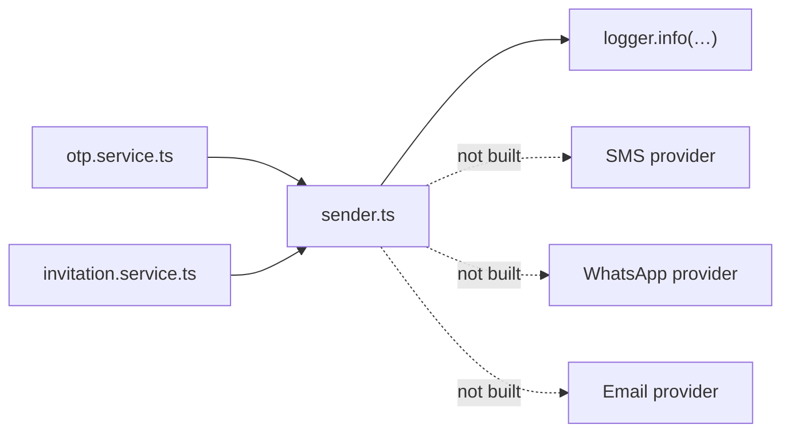

# 13 · Integration Guide

**Version:** 1.0

> **Every external integration is a stub.** Each adapter falls back to a console
> implementation when its key is blank, and every key is blank. Nothing in this
> system currently talks to a third party.
>
> Per-integration files will appear in [`Integrations/`](Integrations/README.md)
> as each is actually built.

---

## Status at a glance

| Integration                     | Purpose                          | Env prefix                    | State             | Blocked by                             |
| ------------------------------- | -------------------------------- | ----------------------------- | ----------------- | -------------------------------------- |
| **SMS — MSG91**                 | OTP codes, appointment reminders | `SMS_*`                       | `console`         | **TRAI DLT registration**, 1–2 weeks   |
| **WhatsApp — Meta Cloud / BSP** | Primary patient channel in India | `WHATSAPP_*`                  | `console`         | Meta template approval, ~2–3 days each |
| **Email — AWS SES**             | Invitations, receipts, reports   | `EMAIL_*`, `SES_*`            | `console`         | Domain verification, DKIM/SPF/DMARC    |
| **Payments — Razorpay**         | Platform subscriptions           | `RAZORPAY_*`                  | Not integrated    | No account yet                         |
| **Object storage — S3**         | Lab reports, scans, PDFs         | `S3_*`                        | Not integrated    | Nothing uploads yet                    |
| **Errors — Sentry**             | Error tracking                   | `SENTRY_DSN`                  | Not integrated    | Nothing deployed                       |
| **Traces — OpenTelemetry**      | Distributed tracing              | `OTEL_EXPORTER_OTLP_ENDPOINT` | Not integrated    | Nothing deployed                       |
| **ABDM / ABHA**                 | National health ID               | —                             | Schema hooks only | M1/M2/M3 certification, a later phase  |

Local development substitutes **Mailpit** for email; it runs in
`docker compose` and catches everything.

---

## The one seam that exists

**Verified.** `apps/api/src/services/notification/sender.ts`.

Every outbound message — OTP codes today, invitation links today, everything
later — goes through this one file. It currently logs instead of sending.



**This matters more than it looks.** All the surrounding logic is real and
tested — generation, hashing, single-use, expiry, attempt caps, rate limits.
Only delivery is missing, so wiring a provider is a one-file change rather than
a feature. That is the payoff of having built the seam first.

**The designed shape**, from `architecture.md` §9 — not yet built:

```
NotificationService.send(eventCode, recipient, payload)
  → notification_templates      (table does not exist)
  → notification_preferences    (table does not exist)
  → provider adapter            (does not exist)
```

with a `notifications` row written **before** dispatch and updated from the
provider webhook — so that when a doctor says "the patient never got the
reminder", the answer is one query.

---

## SMS — MSG91

**Blocked externally, and this is the long pole.**

TRAI DLT registration is mandatory in India and takes **1–2 weeks**. It has
three stages, each separately approved:

1. Register the **entity** (the company)
2. Register the **header** (sender ID)
3. Register **each template** individually

`SMS_DLT_ENTITY_ID` exists in `.env.example` for this reason.

**Start it early.** It hard-blocks OTP delivery, which hard-blocks phone login
for real users. `STATUS.md` lists it under "Blocked / needs a human".

**Alternative provider:** Kaleyra. The seam should make the swap one file.

---

## WhatsApp — Meta Cloud API or a BSP

**The primary channel in Indian healthcare**, not a nice-to-have.

- Templates need **pre-approval by Meta** — budget 2–3 days per template.
- Session windows are **24 hours**; outside that, only approved templates may be
  sent.
- Options: Meta Cloud API directly, or a BSP (AiSensy, Gupshup, Interakt) which
  trades margin for less integration work.

`WHATSAPP_PROVIDER` defaults to `console`.

---

## Email — AWS SES

`ap-south-1`, for data residency. Needs domain verification plus DKIM, SPF and
DMARC before anything delivers, and SES starts in a **sandbox** until the
sending domain is verified — noted in `sender.ts` itself.

Locally, Mailpit catches everything with no configuration.

---

## Payments — Razorpay

**Two completely separate flows. Do not share code between them.**

### A · Platform subscriptions — the clinic pays rcln

Razorpay Subscriptions, chosen for **UPI Autopay and e-mandate**, which is what
Indian B2B recurring collection actually uses. Stripe has weak support for
Indian domestic recurring.

- **Webhooks drive `subscriptions.status`. Never trust the client redirect.**
- Handle `subscription.charged`, `subscription.halted`, `payment.failed`.
- Dunning: retry d1/d3/d7 → `PAST_DUE` → 7-day grace with a banner →
  `SUSPENDED` (read-only, **never delete data**).
- **Idempotency keys are mandatory.** Check a processed-events table before
  acting on any webhook.

### B · Patient payments — the patient pays the clinic

**Unresolved commercial decision**, recorded in `STATUS.md`. Acting as merchant
of record via Razorpay Route makes rcln a **payment aggregator with RBI
implications**. The v1 escape hatch is each clinic connecting their own gateway,
so money never touches rcln.

Either way, `payments.method` must support **cash and counter UPI** with a
`received_by` staff attribution, because that is how clinics actually take
money.

Gateway keys go in a managed secret store, per organization, encrypted —
**never in `setting_values`**.

---

## Object storage — S3

Designed and unbuilt. The `StoredFile` model exists; nothing writes to it.

The design that matters when it is built:

- Bucket in `ap-south-1`, keys prefixed
  `org/{org_id}/branch/{branch_id}/{entity}/{uuid}`, **all public access
  blocked**
- **Uploads go browser → S3 directly** via presigned POST, never through the
  API, with content-type and size constrained in the policy
- **Downloads via signed URLs with a 5-minute expiry.** A lab report URL that
  works forever is a breach
- Virus scanning on upload — clinics upload whatever the patient handed them
- Versioning on, Glacier after a year, and **never auto-delete**

---

## ABDM / ABHA

Schema hooks only (`patients.abha_number`, plus consent tables in the design).
Full NHA integration needs M1/M2/M3 milestone certification and is explicitly a
later phase. Session state belongs in Redis, not Postgres — recorded under
"Deliberately deferred".

---

## Adding an integration

1. **Put it behind the existing seam** if it is outbound messaging. Do not add a
   second dispatch path.
2. **Config through `.env.example`** with a `console` default, so a blank key
   degrades to a stub rather than a crash. Every current adapter does this.
3. **Secrets in a managed store**, never in the database, never in a settings
   table.
4. **Webhooks are the source of truth** for anything asynchronous. Verify the
   signature; never trust a client redirect.
5. **Idempotency is not optional.** Deterministic job ids
   (`reminder:${appointmentId}:24h`) so a retry cannot double-send; a
   processed-events check on every webhook handler.
6. **Failure handling** — exponential backoff, a retry cap, and a dead-letter
   path. A failed notification must be visible, not silent.
7. **Never log the payload** if it contains PHI or contact details.
8. **Justify the dependency** — new packages need calling out.
9. **Write the file** in [`Integrations/`](Integrations/README.md) as part of
   the same change.

---

## Failure-handling expectations

**Designed** in `architecture.md` §8; no processors exist to implement it yet.

| Concern              | Expectation                                                                            |
| -------------------- | -------------------------------------------------------------------------------------- |
| Retries              | Exponential backoff, 5 attempts                                                        |
| Idempotency          | Deterministic `jobId`; a retry must not double-send                                    |
| Dead letter          | Required for `integrations`; a lost job must be discoverable                           |
| Redis eviction       | The BullMQ logical DB must be **`noeviction`** — evicting a job is a lost notification |
| Provider rate limits | Per-provider limiting inside the queue                                                 |
| Observability        | Every send writes a row **before** dispatch and updates on the provider webhook        |
