# 16 · Product Roadmap

**Version:** 1.0

Phase content and estimates are **Verified** from
[`STATUS.md`](STATUS.md) and `Architecture/architecture.md` §17 — they are the
team's own plan, not a recommendation invented here. The prioritisation
commentary is **Inferred**.

`STATUS.md` remains the living document. Update it, not this file, when a phase
moves.

---

## Where we are

```mermaid
gantt
    title Build order (durations from architecture.md §17)
    dateFormat X
    axisFormat %s
    section Done
    Phase 0 · Foundation           :done, p0, 0, 3
    Phase 1 · Tenancy              :active, p1, 3, 2
    section Next
    Phase 2 · Subscriptions        :p2, 5, 2
    Phase 3 · Core clinical        :p3, 7, 6
    Phase 4 · Billing              :p4, 13, 3
    Phase 5 · Pharmacy + inventory :p5, 16, 5
    Phase 6 · Lab                  :p6, 21, 3
    Phase 7 · Cross-cutting        :p7, 24, 3
```

_Units are weeks. Roughly 5–6 months to a sellable v1 with 2–3 engineers._

**Phase 0 complete. Phase 1 substantially complete** — onboarding, auth, branch
CRUD, invitations and role/member management shipped. Impersonation, org
settings and verification flows remain open.

---

## Existing gaps

### Phase 1 remainder

| Item                                         | Note                                                                                                                                                                                                                                                                          |
| -------------------------------------------- | ----------------------------------------------------------------------------------------------------------------------------------------------------------------------------------------------------------------------------------------------------------------------------- |
| **Super-admin impersonation**                | Non-trivial. The session must carry a real branch scope — a platform admin has no membership, so `loadUserAccess` returns null and every branch-scoped write would be refused. Needs a persistent UI banner and full audit. Its ADR (`0012`) is cited in code and **missing** |
| Web: organization settings                   | The `SettingDefinition`/`SettingValue` mechanism exists and nothing reads it                                                                                                                                                                                                  |
| Email / phone verification                   | `emailVerifiedAt` stays null at signup; `phoneVerifiedAt` is set only by a successful OTP login                                                                                                                                                                               |
| Fill the legal placeholders and get sign-off | See [C2/C3](15_Known_Issues_and_Technical_Debt.md#critical)                                                                                                                                                                                                                   |

### Cross-cutting, owed regardless of phase

The full list is in
[`15_Known_Issues_and_Technical_Debt.md`](15_Known_Issues_and_Technical_Debt.md).
The ones that get _more expensive_ the longer they wait:

- **`data_access_logs`** — retrofitting PHI-read auditing after patient data
  exists is far harder than adding it before
- **MFA for platform admins** — before there is any real tenant data to lose
- **Guards in the database** — before more services depend on the application
  ones
- **Staging with two real tenants** — RLS bugs do not appear locally
- **One E2E test** — before there are twenty screens to retrofit coverage onto

---

## Phase 2 · Subscriptions — 1–2 weeks

**Verified** scope from `STATUS.md`.

- Razorpay integration — UPI Autopay / e-mandate. Stripe is weak for Indian
  domestic recurring
- Entitlement gate: `subscription_feature_overrides` → `plan_features` → default
- Usage counters enforcing `max_branches` / `max_users` **at write time**
- Dunning: retry d1/d3/d7 → `PAST_DUE` → 7-day grace → `SUSPENDED`
  (**read-only, never delete**)

**Blocked on:** a Razorpay account and webhook secret.
**Schema:** already exists. This phase is integration and enforcement, not
modelling.

---

## Phase 3 · Core clinical — 4–6 weeks

**The first phase that creates PHI.** Everything in
[`08_Security_Model.md`](08_Security_Model.md) stops being theoretical here.

- Patients, `patient_registrations` (branch-local MRN), allergies, conditions,
  medications
- Appointments, status history, queue tokens
- Encounters, vitals
- Prescriptions and their masters — symptoms, diagnoses, procedures
- `clinical_form_templates` — the extension point for per-specialty forms

**Do before starting:** `data_access_logs`, and the anonymisation routine the
legal pages already promise.

**Get one design-partner clinic using Phase 3 in production before building
Phase 5.**

---

## Phase 4 · Billing — 2–3 weeks

- `billable_items`, `invoices`, `invoice_items`, GST tax lines
- `payments` + `payment_allocations` — one payment across several invoices
- `number_sequences` with financial-year reset
- Credit notes, refunds, patient ledger

One billing spine serves every module —
[ADR-0008](Architecture/decisions/0008-one-billing-spine.md). Money is
`Decimal(14,2)`, never float, and the maths deserves property-based tests
because rounding compounds.

---

## Phase 5 · Pharmacy and inventory — 4–5 weeks

**Strictly in this order.** Dispensing depends on batches existing.

1. Catalogue — generics, medicines, manufacturers, HSN + versioned tax rates
2. Suppliers → purchase orders → goods receipts → returns
3. Batches, `stock_ledger` (append-only), `stock_balances` (trigger-maintained)
4. Stock transfers between branches, adjustments, reorder rules
5. Dispensing with FEFO batch selection

---

## Phase 6 · Lab — 2–3 weeks

- Labs, tests, `lab_test_parameters` — a CBC has 20+ measured values
- Orders → samples → results → verification → release

The **separation of duty is already encoded in the permission model**: a lab
assistant enters results and cannot verify or release; a lab manager can. Build
the workflow to match rather than re-deciding it.

---

## Phase 7 · Cross-cutting — 3 weeks

- Notification templates + providers — WhatsApp via BSP, MSG91 SMS, SES email
- **Worker processors.** Every queue is registered and only stubs exist
- `daily_branch_metrics` rollup + dashboards
- Settings UI over `setting_definitions` / `setting_values`
- Audit log viewer, `data_access_logs` on PHI reads

Seed `setting_definitions` from Phase 0 — already done.

---

## Blocked on a human

**Verified** from `STATUS.md`. These have external lead times; starting them
late delays the phase that needs them.

| Blocker                                                  | Lead time              | Blocks                                                                                                                                                                |
| -------------------------------------------------------- | ---------------------- | --------------------------------------------------------------------------------------------------------------------------------------------------------------------- |
| **TRAI DLT registration** — entity, header, per-template | 1–2 weeks              | All SMS, therefore real OTP login                                                                                                                                     |
| **Meta WhatsApp template approval**                      | ~2–3 days per template | The primary patient channel                                                                                                                                           |
| **Razorpay account** + webhook secret                    | —                      | Phase 2                                                                                                                                                               |
| **Decision: patient payments**                           | —                      | Phase 4. Merchant-of-record via Razorpay Route makes rcln a payment aggregator with RBI implications. The v1 escape hatch is each clinic connecting their own gateway |
| **Decision: DPDP erasure**                               | **Resolved**           | Anonymisation, not deletion. Documented. **Not implemented**                                                                                                          |

---

## Scalability roadmap

**Inferred** ordering, from the constraints in
[`02_System_Architecture.md`](02_System_Architecture.md#scalability-considerations).

| Trigger                                     | Work                                                                                            |
| ------------------------------------------- | ----------------------------------------------------------------------------------------------- |
| Before any meaningful load test             | **PgBouncer** in transaction mode. Node + Prisma open connections greedily                      |
| First multi-instance deploy                 | Verify the Redis-backed rate limiters and caches actually behave across replicas — never tested |
| Permission-cache pressure on large orgs     | Narrow invalidation. `invalidateOrganizationAccess` currently clears broadly                    |
| Read-heavy reporting                        | The read replica the target design already assumes                                              |
| Noisy neighbours                            | Per-tenant row counts as an early-warning metric; per-org API rate limits                       |
| Table growth — `audit_logs`, `stock_ledger` | Partitioning. Postgres 16 supports it; the schema anticipates it                                |
| ~15 services                                | Only then reconsider Kubernetes. Three services do not need a control plane                     |

---

## Recommended improvements

**Inferred.** Beyond the phase plan, ordered by value per unit of effort.

1. **One E2E test** — register → login → invite → accept. Not a suite. One test
   that would catch a broken screen the API suite cannot see.
2. **MFA for platform admins.** `otplib` is installed.
3. **Dependency and image scanning in CI.** A day of work; currently absent.
4. ~~**An OpenAPI document generated from the Zod contracts.**~~ **Done** —
   `apps/api/src/openapi/`, served at `/docs`. What remains is prose coverage:
   43 of 425 endpoints carry hand-written summaries, descriptions, response
   schemas and worked examples; the rest are generated-only.
5. **Runtime response parsing on the web side**, so a backend shape change is a
   clear error rather than an undefined-property crash.
6. **A tamper-evident audit log** — an append-only constraint, at minimum.
7. **A release process.** Conventional commits are already enforced, so
   `changesets` or `semantic-release` would fit without changing habits.

---

## What would change this plan

- **A design-partner clinic** wanting one module out of order. The phase order
  is a dependency order for Phase 5 only; Phases 3, 4 and 6 could reorder.
- **An enterprise hospital chain** demanding SAML/SCIM. `user_identities`
  exists; the plan is to add WorkOS purely for the SSO handshake and keep the
  membership model behind it.
- **The patient-payments decision** landing on merchant-of-record, which pulls
  RBI compliance work forward into Phase 4.
- **A real breach or near-miss anywhere in the market**, which would move the
  Critical and High items in
  [`15_Known_Issues_and_Technical_Debt.md`](15_Known_Issues_and_Technical_Debt.md)
  ahead of any feature phase.
