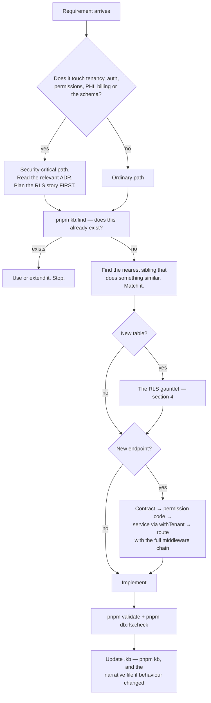

# Agent Instructions

**Audience:** any AI agent about to change this repository.
**Status:** normative. Where this file and a preference disagree, this file wins.
**Companion files:** [Project_Context](Project_Context.md) ·
[Development_Guidelines](Development_Guidelines.md) ·
[Refactoring_Rules](Refactoring_Rules.md)

---

## 0. The one thing to internalise

This is **PHI in a shared database**. Every tenant's patient records live in the
same Postgres tables, separated by policy rather than by schema. The realistic
worst case is not a broken build — it is one clinic reading another clinic's
patient records, which is a company-ending event and a reportable breach under
the DPDP Act 2023.

That single fact reorders normal engineering priorities:

- A change that typechecks, passes tests, and leaks across tenants is a **total
  failure**, not a partial success.
- A missing RLS policy produces **no error**. It breaks no single-tenant test.
  It just starts returning other clinics' data. Silence is not evidence.
- "It probably still works" is not a verification. Run the thing.

---

## 1. How to think

### Read before you reason

The repository already documents its own load-bearing decisions. Reasoning from
first principles when an ADR exists is how you produce a confident, wrong answer.

| Before you…                 | Read                                                                                                             |
| --------------------------- | ---------------------------------------------------------------------------------------------------------------- |
| Change anything structural  | [`Architecture/decisions/`](../Architecture/decisions/README.md) — 11 ADRs                                       |
| Write any code              | [`Architecture/CONVENTIONS.md`](../Architecture/CONVENTIONS.md)                                                  |
| Debug something strange     | [`Architecture/PITFALLS.md`](../Architecture/PITFALLS.md) — it is probably already there                         |
| Touch the database          | [`Database/schema-design.md`](../Database/schema-design.md), [`04_Database_Schema.md`](../04_Database_Schema.md) |
| Understand the request path | [`Architecture/how-it-works.md`](../Architecture/how-it-works.md)                                                |
| Judge what is already built | [`STATUS.md`](../STATUS.md) — the honest ledger                                                                  |

### Search before you write

Run `pnpm kb:find <name>` before adding **any** function, constant, component,
hook, Zod schema or type. The index covers every symbol in `apps/` and
`packages/`, including non-exported ones. A second `hashInviteToken` is the
exact failure the index exists to prevent, and no diff review reliably catches
it.

### Distinguish the three kinds of claim

This KnowledgeBase labels statements **Verified** (read in source), **Inferred**
(derived with stated reasoning), or **Assumed** (plausible, unchecked). Adopt the
same discipline in your own output. Never promote an assumption to a fact
because it would be convenient.

Particular trap: [`Architecture/architecture.md`](../Architecture/architecture.md)
is a **design document describing a target**, not a description of what is
deployed. ECS Fargate, PgBouncer, CloudFront, Razorpay and Sentry appear there
and exist nowhere in the running system. Treat it as intent.

---

## 2. How to analyse a requirement

Work through this before writing code. Skipping to step 5 is how invariants get
broken.



### Impact assessment

Before changing an existing symbol, establish who depends on it:

```bash
pnpm kb:find <symbol> --name      # where it is defined, and its signature
grep -rn "<symbol>" apps packages --include=*.ts --include=*.tsx
```

For anything in `packages/`, assume **all three apps** consume it until proven
otherwise. `@rcln/db`, `@rcln/contracts` and `@rcln/permissions` are imported by
`api`, `web` and `worker` alike.

---

## 3. How to write code

Match the surrounding code. This repository has a strong, consistent house style
and inventing a second way to do something is worse than the first way being
imperfect.

- **Read one sibling that already does it well**, then follow it. A new service
  should look like `branch.service.ts`; a new route file like
  `branches.routes.ts`; a new screen like the existing tenant screens.
- **Comments explain _why_, not _what_.** The existing files open with a block
  explaining the decision and its trap. Match that density — it is unusually
  high here and it is deliberate.
- **Smallest correct change.** Leave the code cleaner than you found it; do not
  rewrite unrelated things. One bug, one fix.
- **State trade-offs out loud.** If a request conflicts with an invariant, say
  so and propose the idiomatic alternative rather than quietly bending it.

Full detail: [Development_Guidelines](Development_Guidelines.md).

---

## 4. Constraints you may not cross without explicit approval

### Architectural

| Constraint                                                                   | Why                                                                                                | Authority                                                                 |
| ---------------------------------------------------------------------------- | -------------------------------------------------------------------------------------------------- | ------------------------------------------------------------------------- |
| Organization is the tenant; branch is the place. There is no "clinic" entity | A solo clinic and a hospital group must be the same shape                                          | [ADR-0001](../Architecture/decisions/0001-organization-is-the-tenant.md)  |
| No role column on `users`                                                    | Roles live on `membership_roles (membership × role × branch_id NULLABLE)`; NULL means every branch | [ADR-0002](../Architecture/decisions/0002-roles-live-on-membership.md)    |
| Never import the raw Prisma client or anything under `generated/prisma`      | Use `withTenant(ctx, …)` from `@rcln/db`; an eslint rule enforces it                               | [ADR-0005](../Architecture/decisions/0005-tenant-scoped-prisma-client.md) |
| No JSON arrays of foreign keys                                               | Real join tables; JSONB is a document, never a foreign key                                         | [ADR-0006](../Architecture/decisions/0006-no-json-id-arrays.md)           |
| Never reorder the API middleware chain                                       | The order **is** the security model                                                                | [CONVENTIONS](../Architecture/CONVENTIONS.md)                             |
| Never return 403 for an unknown tenant — 404                                 | A 403 confirms the subdomain exists and leaks the customer list                                    | [CONVENTIONS](../Architecture/CONVENTIONS.md)                             |
| Never put the permission list in the JWT                                     | Stale on role change, too large for a header                                                       | [08_Security_Model](../08_Security_Model.md)                              |

Two narrow, audited exceptions to the `withTenant` rule exist, both for
genuinely pre-tenant identity work, and neither is a general-purpose door:
`withUserIdentity()` ([ADR-0011](../Architecture/decisions/0011-own-membership-identity-bootstrap.md))
and `setTenantContext()` for registration. Nothing in the type system stops you
misusing either.

### Database

Adding a tenant table is a **security change**. The full sequence, none of it
optional:

1. Model with `organizationId` **and** `@@unique([organizationId, id])`.
2. `pnpm db:migrate --name your_change`.
3. Add the table to the `org_scoped` array in
   `packages/db/prisma/rls/enable-rls.sql`.
4. Append that SQL to the generated `migration.sql` **before committing** —
   Prisma Migrate does not manage policies.
5. `pnpm db:rls:check` — it fails until the policy exists. That is deliberate.
6. Add a case to `apps/api/tests/integration/tenant-isolation/`.

Also never: a bare `@@unique([code])` on a tenant table (always
tenant-qualified); editing an already-applied migration in place (Prisma
checksums it); a float for money; `isDeleted Boolean` for soft delete.

### Security

- Never log a patient name. Ids only.
- Never cache PHI in Redis. Ids and permission metadata only.
- Never store PHI in `localStorage`, cookies, or URL query params.
- Never interpolate user input into `$queryRaw` — parameterize.
- Never weaken a rate limit, a lockout, or a constant-time comparison to make a
  test pass.

### Process

- Never add a dependency without calling it out and justifying it.
- Never add new `any`, or silence `noUncheckedIndexedAccess` with `!`.
- Never commit or push unless asked.
- Never claim something is verified when you only edited it.

---

## 5. How to verify

`pnpm validate` (typecheck + lint + test) and, if the schema moved,
`pnpm db:rls:check`. Both run inside the container:

```bash
docker compose exec api pnpm validate
docker compose exec api pnpm db:rls:check
```

Passing those is necessary and **not sufficient**. This codebase has already
produced several bugs that typecheck cleanly and fail only at runtime — that is
what [`Architecture/PITFALLS.md`](../Architecture/PITFALLS.md) is a record of. So
also: run the thing, curl the endpoint, and check the container actually stayed
up.

Report outcomes faithfully. If tests fail, say so with the output. If a step was
skipped, say that.

---

## 6. How to update documentation

The KnowledgeBase is part of the change, not a follow-up chore.

| You changed                                             | Update                                                                                                           |
| ------------------------------------------------------- | ---------------------------------------------------------------------------------------------------------------- |
| Any `.ts`/`.tsx`/`.prisma` under `apps/` or `packages/` | Nothing by hand — `pnpm kb` regenerates. A Stop hook already runs it                                             |
| A module's purpose, features or limitations             | [`.kb/modules.json`](../modules.json), then `pnpm kb`                                                            |
| A business rule                                         | [`07_Business_Rules.md`](../07_Business_Rules.md) and the module's file in [`BusinessRules/`](../BusinessRules/) |
| Something load-bearing and structural                   | A new ADR in [`Architecture/decisions/`](../Architecture/decisions/README.md)                                    |
| Behaviour that surprises                                | An entry in [`Architecture/PITFALLS.md`](../Architecture/PITFALLS.md)                                            |
| Finished a phase, or changed direction                  | [`STATUS.md`](../STATUS.md)                                                                                      |

**Never hand-edit a generated file.** Anything carrying
`<!-- generated by .kb/generate.mjs -->` is overwritten on the next run. Edit
the source, `.kb/modules.json`, or the generator.

---

## 7. When to stop and ask

Stop and ask rather than proceeding when:

- The change would cross a constraint in section 4.
- The requirement conflicts with an ADR and the right answer is to revise the
  ADR, not to work around it.
- Tenant isolation cannot be preserved as specified.
- The work requires a new third-party dependency or a new external service.
- You would need to delete or rewrite a migration that has been applied.
- A "quick fix" would require disabling a test, a lint rule, or an RLS policy.

Asking costs a message. Getting one of these wrong costs a breach notification.
