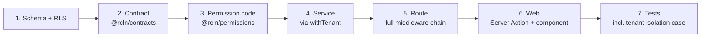

# Development Guidelines

How to write code that looks like it belongs here. The authoritative short form
is [`Architecture/CONVENTIONS.md`](../Architecture/CONVENTIONS.md); this file is
the agent-facing expansion with the reasoning attached.

---

## The vertical slice

**Verified** pattern, followed by every shipped feature. Build in this order —
each step constrains the next, and doing them out of order produces a contract
that does not match the service.



Skipping step 7 is not "finishing early". The tenant-isolation case is the
deliverable; a 200 response is not.

---

## Database

| Concern             | Rule                                                            | Why                                                                                                                                |
| ------------------- | --------------------------------------------------------------- | ---------------------------------------------------------------------------------------------------------------------------------- |
| Primary key         | `uuid`, `@default(uuid())`                                      | Ids appear in URLs and logs; sequential ints leak volume                                                                           |
| Tenant column       | `organizationId` on every tenant table                          | The RLS predicate needs it                                                                                                         |
| Composite FK target | `@@unique([organizationId, id])` on anything children reference | Makes a cross-tenant row unrepresentable, not merely denied — [ADR-0004](../Architecture/decisions/0004-composite-foreign-keys.md) |
| Soft delete         | `deletedAt DateTime?`                                           | A boolean loses _when_, and partial indexes on NULL are cheap                                                                      |
| Money               | `Decimal @db.Decimal(14, 2)` + explicit currency                | Never float. Rounding compounds                                                                                                    |
| Quantities          | `Decimal @db.Decimal(14, 3)`                                    | Half a tablet is real                                                                                                              |
| Time                | `DateTime @db.Timestamptz(6)`, UTC                              | `branches.timezone` for display                                                                                                    |
| Uniqueness          | Always tenant-qualified                                         | A bare `@@unique([code])` makes one tenant's code block another's                                                                  |
| Nullable unique     | Needs `NULLS NOT DISTINCT`, as raw SQL                          | Plain unique indexes do not constrain NULLs                                                                                        |
| Naming              | `snake_case` columns via `@map`, plural tables via `@@map`      | Matches the SQL people read in psql                                                                                                |

**Prisma Migrate does not manage policies, triggers, partitions or exclusion
constraints.** They live in hand-edited SQL blocks inside the migration. This is
the single most common way a change here goes wrong.

---

## API

The middleware chain, in order. **The order is the security model.**

```
helmet / cors → body parsing → request id + logging → rate limit
  → resolveTenant   host → organization, Redis-cached
  → authenticate    JWT → users.id
  → requireAuth
  → authorize       membership + membership_roles → permissions
  → validate        Zod, from @rcln/contracts
  → handler         service via withTenant
```

Why this order and not another:

- `resolveTenant` **first**, so an unknown host is answered 404 before any
  credential is examined.
- `authorize` **after** `authenticate`, because it resolves permissions against
  the caller's active branch, which comes from the token.
- `validate` **last**, so a malformed body from someone who is not allowed here
  anyway never reaches Zod.

Further rules:

- **Unknown tenant returns 404, never 403.** A 403 confirms the subdomain
  exists and leaks the customer list.
- **Never put the permission list in the JWT.** It goes stale the moment a role
  changes, and it is too large for a header.
- **Audit every mutation**, and eventually every PHI read.
- Every route answers in the same envelope: `{ success, message?, data?, errors? }`.

---

## Services and data access

- Always `withTenant(ctx, …)` from `@rcln/db`. Group related queries into **one**
  call — the session round-trip is per transaction, not per query.
- Pass `organizationId` explicitly in service signatures even though RLS also
  enforces it. Defence in depth; the explicit filter is what catches a policy
  that was never written.
- `@rcln/db/unsafe` only for genuinely pre-tenant work, and expect review.
- **Invalidate the access cache** after any write to `membership_roles` or
  `membership_permission_overrides`. `invalidateUserAccess(userId, orgId)` or
  `invalidateOrganizationAccess(orgId)`. Forget it and a revoked role keeps
  working for the cache TTL.

---

## TypeScript

`tsconfig.base.json` is strict, including `noUncheckedIndexedAccess` and
`exactOptionalPropertyTypes`. Two consequences that will bite:

```ts
// Array and record access yields T | undefined.
const [row] = rows;
if (!row) throw new NotFoundError();

// You cannot pass { key: undefined } where the property is optional.
// Wrong:   { name, code: maybeCode }
// Right:
const data = { name, ...(maybeCode ? { code: maybeCode } : {}) };
```

Never add `any`. Never silence `noUncheckedIndexedAccess` with `!`.

ESM throughout: relative imports need the `.js` extension even from `.ts`
source.

---

## Errors

Throw typed errors from `apps/api/src/utils/errors.ts`. The error middleware
maps them to status codes.

Prisma errors are narrowed **structurally** (by `err.name`), never with
`instanceof` — pnpm's symlinked layout can give the generated client and the app
separate class identities, so `instanceof` silently returns false. This is a
real bug that shipped once.

---

## Frontend

`apps/web` is **Next.js 16**, which renamed `middleware.ts` → `proxy.ts` and
removed the `eslint` config key. Read `node_modules/next/dist/docs/` before
writing Next code.

- **`apps/web/src/lib/api.ts` is the only place the web talks to the API.**
  Server-side only. Pass `slug` so the Host header resolves the right tenant.
- **Server Actions** for mutations; the tokens never reach client JS.
- **Read the design system first.** `apps/web/src/app/globals.css` holds the
  palette, type scale and spacing. `apps/web/AGENTS.md` records the
  accessibility rules every screen inherits — measured contrast, 24×24 targets,
  `aria-describedby` on every field, focus moved to the first error. Load the
  `frontend-design` skill before writing new UI, not as a polish pass.
- Never store PHI in `localStorage`, cookies, or URL query params.

---

## Redis

Cache **ids and permission metadata only**. No PHI, ever. Keys carry TTLs;
negative results are cached too, so an unknown host cannot hammer Postgres.

---

## Logging

pino, with redaction configured in `apps/api/src/utils/logger.ts`. Log the
patient _id_, never the name. Any new PII-bearing field must be added to the
redact paths in the same change that introduces it.

---

## Tests

- **Unit** — services, permission resolution, billing maths. Billing deserves
  property-based tests; rounding compounds.
- **Integration** — real Postgres, real migrations, real RLS, over real HTTP via
  supertest. **Never mock Prisma** — a mocked client cannot fail an RLS policy,
  which is the only failure that matters.
- **`apps/api/tests/integration/tenant-isolation.test.ts` is the most important
  file in the repo.** Every new tenant table gets a case.

Jest runs native ESM, which needs `NODE_OPTIONS=--experimental-vm-modules`
(already in the test scripts).

---

## Commits

Conventional commits, enforced by commitlint. Subject **lowercase**; type from
`feat fix docs style refactor perf test build ci chore revert`. Pre-commit runs
prettier; pre-push runs typecheck, lint, the RLS check and the `.kb` freshness
check, and blocks direct pushes to protected branches.

Do not commit or push unless asked.

---

## Dependencies

Never add one without calling it out and justifying it. This repository has
consistently chosen not to add a dependency where the platform already provides
the capability — the `.kb` generator uses the TypeScript compiler API rather
than `ts-morph`, and `apps/web` relies on the absence of a `NEXT_PUBLIC_` prefix
rather than the `server-only` package. Match that instinct.
