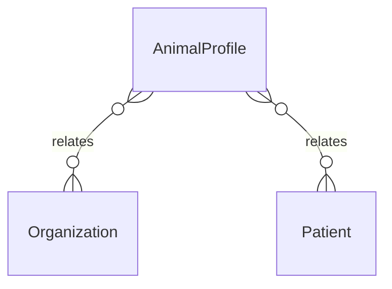

# `AnimalProfile` → `animal_profiles`

<!-- generated by .kb/generate.mjs — do not edit by hand -->

Declared at `packages/db/prisma/schema/clinical.prisma:456`.

| property | value |
| --- | --- |
| table | `animal_profiles` |
| tenant-scoped | yes — has `organizationId` |
| RLS | **MISSING — this is a tenant-isolation defect** |
| columns | 10 |
| relations | 2 |

## Columns

| column | type | definition |
| --- | --- | --- |
| `id` | `String` | `id String @id @default(uuid()) @db.Uuid` |
| `organizationId` | `String` | `organizationId String @map("organization_id") @db.Uuid` |
| `patientId` | `String` | `patientId String @map("patient_id") @db.Uuid` |
| `species` | `String?` | `species String? @db.VarChar(64)` |
| `breed` | `String?` | `breed String? @db.VarChar(128)` |
| `weightKg` | `Decimal?` | `weightKg Decimal? @map("weight_kg") @db.Decimal(8, 3)` |
| `guardianName` | `String?` | `guardianName String? @map("guardian_name") @db.VarChar(255)` |
| `guardianPhone` | `String?` | `guardianPhone String? @map("guardian_phone") @db.VarChar(20)` |
| `createdAt` | `DateTime` | `createdAt DateTime @default(now()) @map("created_at") @db.Timestamptz(6)` |
| `updatedAt` | `DateTime` | `updatedAt DateTime @updatedAt @map("updated_at") @db.Timestamptz(6)` |

## Relations

| field | target | definition |
| --- | --- | --- |
| `organization` | [`Organization`](Organization.md) | `organization Organization @relation(fields: [organizationId], references: [id], onDelete: Cascade)` |
| `patient` | [`Patient`](Patient.md) | `patient Patient @relation(fields: [organizationId, patientId], references: [organizationId, id], onDelete: Cascade)` |

## Indexes and constraints

- `@@unique([organizationId, patientId])`

## Neighbourhood

