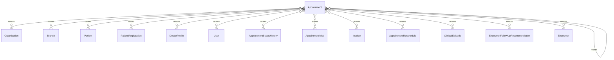

# `Appointment` → `appointments`

<!-- generated by .kb/generate.mjs — do not edit by hand -->

Declared at `packages/db/prisma/schema/scheduling.prisma:80`.

| property | value |
| --- | --- |
| table | `appointments` |
| tenant-scoped | yes — has `organizationId` |
| RLS | **MISSING — this is a tenant-isolation defect** |
| columns | 25 |
| relations | 17 |

## Columns

| column | type | definition |
| --- | --- | --- |
| `id` | `String` | `id String @id @default(uuid()) @db.Uuid` |
| `organizationId` | `String` | `organizationId String @map("organization_id") @db.Uuid` |
| `branchId` | `String` | `branchId String @map("branch_id") @db.Uuid` |
| `patientId` | `String` | `patientId String @map("patient_id") @db.Uuid` |
| `patientRegistrationId` | `String` | `patientRegistrationId String @map("patient_registration_id") @db.Uuid` |
| `doctorProfileId` | `String` | `doctorProfileId String @map("doctor_profile_id") @db.Uuid` |
| `appointmentNumber` | `String` | `appointmentNumber String @map("appointment_number") @db.VarChar(32)` |
| `scheduledStart` | `DateTime` | `scheduledStart DateTime @map("scheduled_start") @db.Timestamptz(6)` |
| `scheduledEnd` | `DateTime` | `scheduledEnd DateTime @map("scheduled_end") @db.Timestamptz(6)` |
| `visitType` | `AppointmentVisitType` | `visitType AppointmentVisitType @default(NEW) @map("visit_type")` |
| `source` | `AppointmentSource` | `source AppointmentSource @default(FRONT_DESK)` |
| `status` | `AppointmentStatus` | `status AppointmentStatus @default(BOOKED)` |
| `parentAppointmentId` | `String?` | `parentAppointmentId String? @map("parent_appointment_id") @db.Uuid` |
| `clinicalEpisodeId` | `String` | `clinicalEpisodeId String @map("clinical_episode_id") @db.Uuid` |
| `reason` | `String?` | `reason String? @db.Text` |
| `checkedInAt` | `DateTime?` | `checkedInAt DateTime? @map("checked_in_at") @db.Timestamptz(6)` |
| `startedAt` | `DateTime?` | `startedAt DateTime? @map("started_at") @db.Timestamptz(6)` |
| `completedAt` | `DateTime?` | `completedAt DateTime? @map("completed_at") @db.Timestamptz(6)` |
| `bookedBy` | `String?` | `bookedBy String? @map("booked_by") @db.Uuid` |
| `cancelledBy` | `String?` | `cancelledBy String? @map("cancelled_by") @db.Uuid` |
| `cancellationReason` | `String?` | `cancellationReason String? @map("cancellation_reason") @db.Text` |
| `bookedFee` | `Decimal?` | `bookedFee Decimal? @map("booked_fee") @db.Decimal(14, 2)` |
| `createdAt` | `DateTime` | `createdAt DateTime @default(now()) @map("created_at") @db.Timestamptz(6)` |
| `updatedAt` | `DateTime` | `updatedAt DateTime @updatedAt @map("updated_at") @db.Timestamptz(6)` |
| `deletedAt` | `DateTime?` | `deletedAt DateTime? @map("deleted_at") @db.Timestamptz(6)` |

## Relations

| field | target | definition |
| --- | --- | --- |
| `organization` | [`Organization`](Organization.md) | `organization Organization @relation(fields: [organizationId], references: [id], onDelete: Cascade)` |
| `branch` | [`Branch`](Branch.md) | `branch Branch @relation(fields: [organizationId, branchId], references: [organizationId, id], onDelete: Cascade)` |
| `patient` | [`Patient`](Patient.md) | `patient Patient @relation(fields: [organizationId, patientId], references: [organizationId, id], onDelete: Cascade)` |
| `registration` | [`PatientRegistration`](PatientRegistration.md) | `registration PatientRegistration @relation(fields: [organizationId, patientRegistrationId], references: [organizationId, id], onDelete: Cascade)` |
| `doctorProfile` | [`DoctorProfile`](DoctorProfile.md) | `doctorProfile DoctorProfile @relation(fields: [organizationId, doctorProfileId], references: [organizationId, id], onDelete: Restrict)` |
| `booker` | [`User`](User.md) | `booker User? @relation("AppointmentBookedBy", fields: [bookedBy], references: [id], onDelete: SetNull)` |
| `canceller` | [`User`](User.md) | `canceller User? @relation("AppointmentCancelledBy", fields: [cancelledBy], references: [id], onDelete: SetNull)` |
| `statusHistory` | [`AppointmentStatusHistory`](AppointmentStatusHistory.md) | `statusHistory AppointmentStatusHistory[]` |
| `vitals` | [`AppointmentVital`](AppointmentVital.md) | `vitals AppointmentVital[]` |
| `invoices` | [`Invoice`](Invoice.md) | `invoices Invoice[]` |
| `reschedules` | [`AppointmentReschedule`](AppointmentReschedule.md) | `reschedules AppointmentReschedule[]` |
| `parent` | [`Appointment`](Appointment.md) | `parent Appointment? @relation("AppointmentFollowUp", fields: [organizationId, parentAppointmentId], references: [organizationId, id], onDelete: Restrict, onUpdate: NoAction)` |
| `followUps` | [`Appointment`](Appointment.md) | `followUps Appointment[] @relation("AppointmentFollowUp")` |
| `clinicalEpisode` | [`ClinicalEpisode`](ClinicalEpisode.md) | `clinicalEpisode ClinicalEpisode @relation(fields: [organizationId, clinicalEpisodeId], references: [organizationId, id], onDelete: Restrict)` |
| `recommendationsMade` | [`EncounterFollowUpRecommendation`](EncounterFollowUpRecommendation.md) | `recommendationsMade EncounterFollowUpRecommendation[] @relation("RecommendationSource")` |
| `recommendationsFulfilled` | [`EncounterFollowUpRecommendation`](EncounterFollowUpRecommendation.md) | `recommendationsFulfilled EncounterFollowUpRecommendation[] @relation("RecommendationFulfilment")` |
| `encounters` | [`Encounter`](Encounter.md) | `encounters Encounter[]` |

## Indexes and constraints

- `@@unique([organizationId, branchId, appointmentNumber])`
- `@@unique([organizationId, id])`
- `@@index([organizationId, branchId, scheduledStart])`
- `@@index([organizationId, doctorProfileId, scheduledStart])`
- `@@index([organizationId, patientId, scheduledStart])`
- `@@index([organizationId, parentAppointmentId])`
- `@@index([organizationId, clinicalEpisodeId, scheduledStart])`

## Neighbourhood

