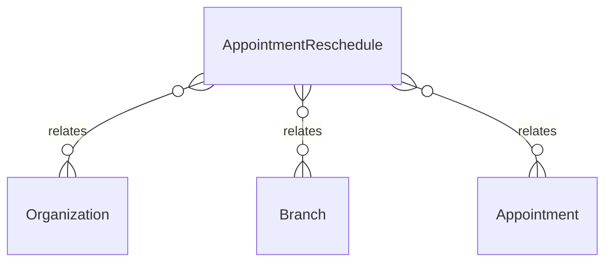

# `AppointmentReschedule` → `appointment_reschedules`

<!-- generated by .kb/generate.mjs — do not edit by hand -->

Declared at `packages/db/prisma/schema/scheduling.prisma:245`.

| property | value |
| --- | --- |
| table | `appointment_reschedules` |
| tenant-scoped | yes — has `organizationId` |
| RLS | **MISSING — this is a tenant-isolation defect** |
| columns | 13 |
| relations | 3 |

## Columns

| column | type | definition |
| --- | --- | --- |
| `id` | `String` | `id String @id @default(uuid()) @db.Uuid` |
| `organizationId` | `String` | `organizationId String @map("organization_id") @db.Uuid` |
| `branchId` | `String` | `branchId String @map("branch_id") @db.Uuid` |
| `appointmentId` | `String` | `appointmentId String @map("appointment_id") @db.Uuid` |
| `fromStart` | `DateTime` | `fromStart DateTime @map("from_start") @db.Timestamptz(6)` |
| `toStart` | `DateTime` | `toStart DateTime @map("to_start") @db.Timestamptz(6)` |
| `fromDoctorProfileId` | `String` | `fromDoctorProfileId String @map("from_doctor_profile_id") @db.Uuid` |
| `toDoctorProfileId` | `String` | `toDoctorProfileId String @map("to_doctor_profile_id") @db.Uuid` |
| `initiatedBy` | `RescheduleInitiator` | `initiatedBy RescheduleInitiator @map("initiated_by")` |
| `reason` | `String?` | `reason String? @db.Text` |
| `chargeAmount` | `Decimal` | `chargeAmount Decimal @default(0) @map("charge_amount") @db.Decimal(14, 2)` |
| `createdAt` | `DateTime` | `createdAt DateTime @default(now()) @map("created_at") @db.Timestamptz(6)` |
| `createdBy` | `String?` | `createdBy String? @map("created_by") @db.Uuid` |

## Relations

| field | target | definition |
| --- | --- | --- |
| `organization` | [`Organization`](Organization.md) | `organization Organization @relation(fields: [organizationId], references: [id], onDelete: Cascade)` |
| `branch` | [`Branch`](Branch.md) | `branch Branch @relation(fields: [organizationId, branchId], references: [organizationId, id], onDelete: Cascade)` |
| `appointment` | [`Appointment`](Appointment.md) | `appointment Appointment @relation(fields: [organizationId, appointmentId], references: [organizationId, id], onDelete: Cascade)` |

## Indexes and constraints

- `@@index([organizationId, appointmentId, createdAt])`

## Neighbourhood

