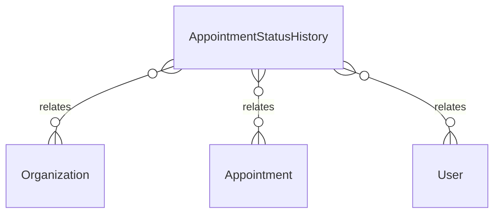

# `AppointmentStatusHistory` → `appointment_status_history`

<!-- generated by .kb/generate.mjs — do not edit by hand -->

Declared at `packages/db/prisma/schema.prisma:2271`.

| property | value |
| --- | --- |
| table | `appointment_status_history` |
| tenant-scoped | yes — has `organizationId` |
| RLS | `explicit` policy |
| columns | 8 |
| relations | 3 |

## Columns

| column | type | definition |
| --- | --- | --- |
| `id` | `String` | `id String @id @default(uuid()) @db.Uuid` |
| `organizationId` | `String` | `organizationId String @map("organization_id") @db.Uuid` |
| `appointmentId` | `String` | `appointmentId String @map("appointment_id") @db.Uuid` |
| `fromStatus` | `AppointmentStatus?` | `fromStatus AppointmentStatus? @map("from_status")` |
| `toStatus` | `AppointmentStatus` | `toStatus AppointmentStatus @map("to_status")` |
| `changedBy` | `String?` | `changedBy String? @map("changed_by") @db.Uuid` |
| `note` | `String?` | `note String? @db.Text` |
| `changedAt` | `DateTime` | `changedAt DateTime @default(now()) @map("changed_at") @db.Timestamptz(6)` |

## Relations

| field | target | definition |
| --- | --- | --- |
| `organization` | [`Organization`](Organization.md) | `organization Organization @relation(fields: [organizationId], references: [id], onDelete: Cascade)` |
| `appointment` | [`Appointment`](Appointment.md) | `appointment Appointment @relation(fields: [organizationId, appointmentId], references: [organizationId, id], onDelete: Cascade)` |
| `changer` | [`User`](User.md) | `changer User? @relation("AppointmentStatusChangedBy", fields: [changedBy], references: [id], onDelete: SetNull)` |

## Indexes and constraints

- `@@index([organizationId, appointmentId, changedAt])`

## Neighbourhood

