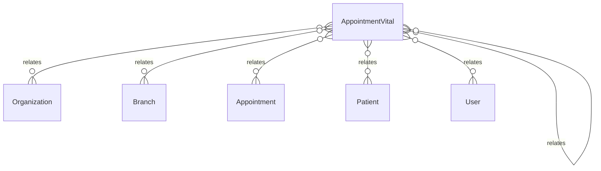

# `AppointmentVital` → `appointment_vitals`

<!-- generated by .kb/generate.mjs — do not edit by hand -->

Declared at `packages/db/prisma/schema/scheduling.prisma:295`.

| property | value |
| --- | --- |
| table | `appointment_vitals` |
| tenant-scoped | yes — has `organizationId` |
| RLS | **MISSING — this is a tenant-isolation defect** |
| columns | 23 |
| relations | 8 |

## Columns

| column | type | definition |
| --- | --- | --- |
| `id` | `String` | `id String @id @default(uuid()) @db.Uuid` |
| `organizationId` | `String` | `organizationId String @map("organization_id") @db.Uuid` |
| `branchId` | `String` | `branchId String @map("branch_id") @db.Uuid` |
| `appointmentId` | `String` | `appointmentId String @map("appointment_id") @db.Uuid` |
| `patientId` | `String` | `patientId String @map("patient_id") @db.Uuid` |
| `heightCm` | `Decimal?` | `heightCm Decimal? @map("height_cm") @db.Decimal(5, 1)` |
| `weightKg` | `Decimal?` | `weightKg Decimal? @map("weight_kg") @db.Decimal(5, 1)` |
| `temperatureC` | `Decimal?` | `temperatureC Decimal? @map("temperature_c") @db.Decimal(4, 2)` |
| `pulseBpm` | `Int?` | `pulseBpm Int? @map("pulse_bpm") @db.SmallInt` |
| `respiratoryRateBpm` | `Int?` | `respiratoryRateBpm Int? @map("respiratory_rate_bpm") @db.SmallInt` |
| `systolicMmHg` | `Int?` | `systolicMmHg Int? @map("systolic_mm_hg") @db.SmallInt` |
| `diastolicMmHg` | `Int?` | `diastolicMmHg Int? @map("diastolic_mm_hg") @db.SmallInt` |
| `spo2Percent` | `Int?` | `spo2Percent Int? @map("spo2_percent") @db.SmallInt` |
| `bloodGlucoseMgDl` | `Decimal?` | `bloodGlucoseMgDl Decimal? @map("blood_glucose_mg_dl") @db.Decimal(5, 1)` |
| `notes` | `String?` | `notes String? @db.Text` |
| `recordedAt` | `DateTime` | `recordedAt DateTime @default(now()) @map("recorded_at") @db.Timestamptz(6)` |
| `recordedBy` | `String?` | `recordedBy String? @map("recorded_by") @db.Uuid` |
| `revisionOfId` | `String?` | `revisionOfId String? @map("revision_of_id") @db.Uuid` |
| `supersededAt` | `DateTime?` | `supersededAt DateTime? @map("superseded_at") @db.Timestamptz(6)` |
| `supersededBy` | `String?` | `supersededBy String? @map("superseded_by") @db.Uuid` |
| `createdAt` | `DateTime` | `createdAt DateTime @default(now()) @map("created_at") @db.Timestamptz(6)` |
| `updatedAt` | `DateTime` | `updatedAt DateTime @updatedAt @map("updated_at") @db.Timestamptz(6)` |
| `deletedAt` | `DateTime?` | `deletedAt DateTime? @map("deleted_at") @db.Timestamptz(6)` |

## Relations

| field | target | definition |
| --- | --- | --- |
| `organization` | [`Organization`](Organization.md) | `organization Organization @relation(fields: [organizationId], references: [id], onDelete: Cascade)` |
| `branch` | [`Branch`](Branch.md) | `branch Branch @relation(fields: [organizationId, branchId], references: [organizationId, id], onDelete: Cascade)` |
| `appointment` | [`Appointment`](Appointment.md) | `appointment Appointment @relation(fields: [organizationId, appointmentId], references: [organizationId, id], onDelete: Cascade)` |
| `patient` | [`Patient`](Patient.md) | `patient Patient @relation(fields: [organizationId, patientId], references: [organizationId, id], onDelete: Cascade)` |
| `recorder` | [`User`](User.md) | `recorder User? @relation("VitalRecordedBy", fields: [recordedBy], references: [id], onDelete: SetNull)` |
| `amender` | [`User`](User.md) | `amender User? @relation("VitalSupersededBy", fields: [supersededBy], references: [id], onDelete: SetNull)` |
| `revisionOf` | [`AppointmentVital`](AppointmentVital.md) | `revisionOf AppointmentVital? @relation("VitalRevisions", fields: [organizationId, revisionOfId], references: [organizationId, id], onDelete: Cascade)` |
| `revisions` | [`AppointmentVital`](AppointmentVital.md) | `revisions AppointmentVital[] @relation("VitalRevisions")` |

## Indexes and constraints

- `@@unique([organizationId, id])`
- `@@index([organizationId, appointmentId, recordedAt])`
- `@@index([organizationId, patientId, recordedAt])`
- `@@index([organizationId, revisionOfId, supersededAt])`

## Neighbourhood

