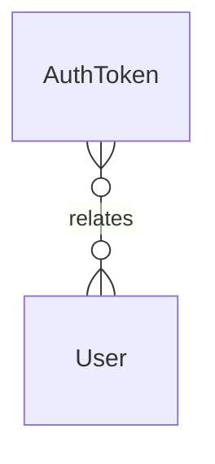

# `AuthToken` → `auth_tokens`

<!-- generated by .kb/generate.mjs — do not edit by hand -->

Declared at `packages/db/prisma/schema/identity.prisma:230`.

| property | value |
| --- | --- |
| table | `auth_tokens` |
| tenant-scoped | no |
| RLS | exempt — OTP verification happens pre-context |
| columns | 9 |
| relations | 1 |

## Columns

| column | type | definition |
| --- | --- | --- |
| `id` | `String` | `id String @id @default(uuid()) @db.Uuid` |
| `userId` | `String?` | `userId String? @map("user_id") @db.Uuid` |
| `purpose` | `AuthTokenPurpose` | `purpose AuthTokenPurpose` |
| `identifier` | `String` | `identifier String @db.VarChar(255)` |
| `codeHash` | `String` | `codeHash String @map("code_hash") @db.VarChar(255)` |
| `attempts` | `Int` | `attempts Int @default(0) @db.SmallInt` |
| `expiresAt` | `DateTime` | `expiresAt DateTime @map("expires_at") @db.Timestamptz(6)` |
| `consumedAt` | `DateTime?` | `consumedAt DateTime? @map("consumed_at") @db.Timestamptz(6)` |
| `createdAt` | `DateTime` | `createdAt DateTime @default(now()) @map("created_at") @db.Timestamptz(6)` |

## Relations

| field | target | definition |
| --- | --- | --- |
| `user` | [`User`](User.md) | `user User? @relation(fields: [userId], references: [id], onDelete: Cascade)` |

## Indexes and constraints

- `@@index([identifier, purpose])`
- `@@index([expiresAt])`

## Neighbourhood

