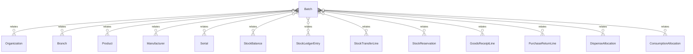

# `Batch` → `batches`

<!-- generated by .kb/generate.mjs — do not edit by hand -->

Declared at `packages/db/prisma/schema/inventory.prisma:403`.

| property | value |
| --- | --- |
| table | `batches` |
| tenant-scoped | yes — has `organizationId` |
| RLS | `visible` policy |
| columns | 20 |
| relations | 14 |

## Columns

| column | type | definition |
| --- | --- | --- |
| `id` | `String` | `id String @id @default(uuid()) @db.Uuid` |
| `organizationId` | `String` | `organizationId String @map("organization_id") @db.Uuid` |
| `branchId` | `String` | `branchId String @map("branch_id") @db.Uuid` |
| `productId` | `String` | `productId String @map("product_id") @db.Uuid` |
| `lotNumber` | `String` | `lotNumber String @map("lot_number") @db.VarChar(128)` |
| `manufacturedOn` | `DateTime?` | `manufacturedOn DateTime? @map("manufactured_on") @db.Date` |
| `expiresOn` | `DateTime?` | `expiresOn DateTime? @map("expires_on") @db.Date` |
| `retestOn` | `DateTime?` | `retestOn DateTime? @map("retest_on") @db.Date` |
| `manufacturerId` | `String?` | `manufacturerId String? @map("manufacturer_id") @db.Uuid` |
| `unitCostBase` | `BigInt?` | `unitCostBase BigInt? @map("unit_cost_base") @db.BigInt` |
| `currency` | `String?` | `currency String? @db.Char(3)` |
| `status` | `BatchStatus` | `status BatchStatus @default(ACTIVE)` |
| `quarantinedAt` | `DateTime?` | `quarantinedAt DateTime? @map("quarantined_at") @db.Timestamptz(6)` |
| `quarantineReason` | `String?` | `quarantineReason String? @map("quarantine_reason") @db.Text` |
| `recalledAt` | `DateTime?` | `recalledAt DateTime? @map("recalled_at") @db.Timestamptz(6)` |
| `recallReference` | `String?` | `recallReference String? @map("recall_reference") @db.VarChar(128)` |
| `receivedAt` | `DateTime` | `receivedAt DateTime @default(now()) @map("received_at") @db.Timestamptz(6)` |
| `notes` | `String?` | `notes String? @db.Text` |
| `createdAt` | `DateTime` | `createdAt DateTime @default(now()) @map("created_at") @db.Timestamptz(6)` |
| `updatedAt` | `DateTime` | `updatedAt DateTime @updatedAt @map("updated_at") @db.Timestamptz(6)` |

## Relations

| field | target | definition |
| --- | --- | --- |
| `organization` | [`Organization`](Organization.md) | `organization Organization @relation(fields: [organizationId], references: [id], onDelete: Cascade)` |
| `branch` | [`Branch`](Branch.md) | `branch Branch @relation(fields: [organizationId, branchId], references: [organizationId, id], onDelete: Cascade)` |
| `product` | [`Product`](Product.md) | `product Product @relation(fields: [productId], references: [id], onDelete: Restrict)` |
| `manufacturer` | [`Manufacturer`](Manufacturer.md) | `manufacturer Manufacturer? @relation(fields: [manufacturerId], references: [id], onDelete: Restrict)` |
| `serials` | [`Serial`](Serial.md) | `serials Serial[]` |
| `balances` | [`StockBalance`](StockBalance.md) | `balances StockBalance[]` |
| `movements` | [`StockLedgerEntry`](StockLedgerEntry.md) | `movements StockLedgerEntry[]` |
| `transferLinesSent` | [`StockTransferLine`](StockTransferLine.md) | `transferLinesSent StockTransferLine[] @relation("TransferLineSourceBatch")` |
| `transferLinesReceived` | [`StockTransferLine`](StockTransferLine.md) | `transferLinesReceived StockTransferLine[] @relation("TransferLineDestinationBatch")` |
| `reservations` | [`StockReservation`](StockReservation.md) | `reservations StockReservation[]` |
| `goodsReceiptLines` | [`GoodsReceiptLine`](GoodsReceiptLine.md) | `goodsReceiptLines GoodsReceiptLine[] @relation("GoodsReceiptLineBatch")` |
| `purchaseReturnLines` | [`PurchaseReturnLine`](PurchaseReturnLine.md) | `purchaseReturnLines PurchaseReturnLine[] @relation("PurchaseReturnLineBatch")` |
| `dispenseAllocations` | [`DispenseAllocation`](DispenseAllocation.md) | `dispenseAllocations DispenseAllocation[] @relation("DispenseAllocationBatch")` |
| `consumptionAllocations` | [`ConsumptionAllocation`](ConsumptionAllocation.md) | `consumptionAllocations ConsumptionAllocation[] @relation("ConsumptionAllocationBatch")` |

## Indexes and constraints

- `@@unique([organizationId, branchId, productId, lotNumber])`
- `@@unique([organizationId, id])`
- `@@unique([organizationId, branchId, id])`
- `@@index([organizationId, branchId, productId, expiresOn])`
- `@@index([organizationId, branchId, expiresOn])`
- `@@index([organizationId, productId])`

## Neighbourhood

