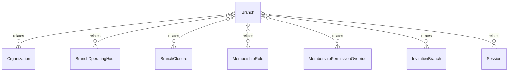

# `Branch` → `branches`

<!-- generated by .kb/generate.mjs — do not edit by hand -->

Declared at `packages/db/prisma/schema.prisma:214`.

| property | value |
| --- | --- |
| table | `branches` |
| tenant-scoped | yes — has `organizationId` |
| RLS | `org` policy |
| columns | 19 |
| relations | 7 |

## Columns

| column | type | definition |
| --- | --- | --- |
| `id` | `String` | `id String @id @default(uuid()) @db.Uuid` |
| `organizationId` | `String` | `organizationId String @map("organization_id") @db.Uuid` |
| `code` | `String` | `code String @db.VarChar(32)` |
| `name` | `String` | `name String @db.VarChar(255)` |
| `branchType` | `BranchType` | `branchType BranchType @default(CLINIC) @map("branch_type")` |
| `timezone` | `String` | `timezone String @default("Asia/Kolkata") @db.VarChar(64)` |
| `phone` | `String?` | `phone String? @db.VarChar(20)` |
| `email` | `String?` | `email String? @db.VarChar(255)` |
| `addressLine1` | `String?` | `addressLine1 String? @map("address_line1") @db.VarChar(255)` |
| `addressLine2` | `String?` | `addressLine2 String? @map("address_line2") @db.VarChar(255)` |
| `city` | `String?` | `city String? @db.VarChar(100)` |
| `state` | `String?` | `state String? @db.VarChar(100)` |
| `pincode` | `String?` | `pincode String? @db.VarChar(10)` |
| `gstNumber` | `String?` | `gstNumber String? @map("gst_number") @db.VarChar(20)` |
| `isPrimary` | `Boolean` | `isPrimary Boolean @default(false) @map("is_primary")` |
| `status` | `BranchStatus` | `status BranchStatus @default(ACTIVE)` |
| `createdAt` | `DateTime` | `createdAt DateTime @default(now()) @map("created_at") @db.Timestamptz(6)` |
| `updatedAt` | `DateTime` | `updatedAt DateTime @updatedAt @map("updated_at") @db.Timestamptz(6)` |
| `deletedAt` | `DateTime?` | `deletedAt DateTime? @map("deleted_at") @db.Timestamptz(6)` |

## Relations

| field | target | definition |
| --- | --- | --- |
| `organization` | [`Organization`](Organization.md) | `organization Organization @relation(fields: [organizationId], references: [id], onDelete: Cascade)` |
| `operatingHours` | [`BranchOperatingHour`](BranchOperatingHour.md) | `operatingHours BranchOperatingHour[]` |
| `closures` | [`BranchClosure`](BranchClosure.md) | `closures BranchClosure[]` |
| `membershipRoles` | [`MembershipRole`](MembershipRole.md) | `membershipRoles MembershipRole[]` |
| `membershipOverrides` | [`MembershipPermissionOverride`](MembershipPermissionOverride.md) | `membershipOverrides MembershipPermissionOverride[]` |
| `invitationBranches` | [`InvitationBranch`](InvitationBranch.md) | `invitationBranches InvitationBranch[]` |
| `sessions` | [`Session`](Session.md) | `sessions Session[]` |

## Indexes and constraints

- `@@unique([organizationId, code])`
- `@@unique([organizationId, id])`
- `@@index([organizationId, status])`

## Neighbourhood

