# `Branch` → `branches`

<!-- generated by .kb/generate.mjs — do not edit by hand -->

Declared at `packages/db/prisma/schema/tenancy.prisma:280`.

| property | value |
| --- | --- |
| table | `branches` |
| tenant-scoped | yes — has `organizationId` |
| RLS | `org` policy |
| columns | 21 |
| relations | 64 |

## Columns

| column | type | definition |
| --- | --- | --- |
| `id` | `String` | `id String @id @default(uuid()) @db.Uuid` |
| `organizationId` | `String` | `organizationId String @map("organization_id") @db.Uuid` |
| `code` | `String` | `code String @db.VarChar(32)` |
| `name` | `String` | `name String @db.VarChar(255)` |
| `branchType` | `BranchType` | `branchType BranchType @default(CLINIC) @map("branch_type")` |
| `timezone` | `String` | `timezone String @default("Asia/Kolkata") @db.VarChar(64)` |
| `phone` | `String?` | `phone String? @db.VarChar(20)` |
| `email` | `String?` | `email String? @db.VarChar(255)` |
| `addressLine1` | `String?` | `addressLine1 String? @map("address_line1") @db.VarChar(255)` |
| `addressLine2` | `String?` | `addressLine2 String? @map("address_line2") @db.VarChar(255)` |
| `city` | `String?` | `city String? @db.VarChar(100)` |
| `state` | `String?` | `state String? @db.VarChar(100)` |
| `pincode` | `String?` | `pincode String? @db.VarChar(10)` |
| `countryCode` | `String` | `countryCode String @default("IN") @map("country_code") @db.Char(2)` |
| `regionCode` | `String?` | `regionCode String? @map("region_code") @db.VarChar(10)` |
| `taxId` | `String?` | `taxId String? @map("tax_id") @db.VarChar(32)` |
| `isPrimary` | `Boolean` | `isPrimary Boolean @default(false) @map("is_primary")` |
| `status` | `BranchStatus` | `status BranchStatus @default(ACTIVE)` |
| `createdAt` | `DateTime` | `createdAt DateTime @default(now()) @map("created_at") @db.Timestamptz(6)` |
| `updatedAt` | `DateTime` | `updatedAt DateTime @updatedAt @map("updated_at") @db.Timestamptz(6)` |
| `deletedAt` | `DateTime?` | `deletedAt DateTime? @map("deleted_at") @db.Timestamptz(6)` |

## Relations

| field | target | definition |
| --- | --- | --- |
| `organization` | [`Organization`](Organization.md) | `organization Organization @relation(fields: [organizationId], references: [id], onDelete: Cascade)` |
| `operatingHours` | [`BranchOperatingHour`](BranchOperatingHour.md) | `operatingHours BranchOperatingHour[]` |
| `closures` | [`BranchClosure`](BranchClosure.md) | `closures BranchClosure[]` |
| `membershipRoles` | [`MembershipRole`](MembershipRole.md) | `membershipRoles MembershipRole[]` |
| `membershipOverrides` | [`MembershipPermissionOverride`](MembershipPermissionOverride.md) | `membershipOverrides MembershipPermissionOverride[]` |
| `invitationBranches` | [`InvitationBranch`](InvitationBranch.md) | `invitationBranches InvitationBranch[]` |
| `sessions` | [`Session`](Session.md) | `sessions Session[]` |
| `lastForMemberships` | [`Membership`](Membership.md) | `lastForMemberships Membership[] @relation("MembershipLastBranch")` |
| `doctorSettings` | [`DoctorBranchSetting`](DoctorBranchSetting.md) | `doctorSettings DoctorBranchSetting[]` |
| `doctorSchedules` | [`DoctorSchedule`](DoctorSchedule.md) | `doctorSchedules DoctorSchedule[]` |
| `doctorExceptions` | [`DoctorScheduleException`](DoctorScheduleException.md) | `doctorExceptions DoctorScheduleException[]` |
| `patientRegistrations` | [`PatientRegistration`](PatientRegistration.md) | `patientRegistrations PatientRegistration[]` |
| `appointments` | [`Appointment`](Appointment.md) | `appointments Appointment[]` |
| `appointmentVitals` | [`AppointmentVital`](AppointmentVital.md) | `appointmentVitals AppointmentVital[]` |
| `appointmentReschedules` | [`AppointmentReschedule`](AppointmentReschedule.md) | `appointmentReschedules AppointmentReschedule[]` |
| `feeScheduleEntries` | [`FeeScheduleEntry`](FeeScheduleEntry.md) | `feeScheduleEntries FeeScheduleEntry[]` |
| `invoices` | [`Invoice`](Invoice.md) | `invoices Invoice[]` |
| `invoiceItems` | [`InvoiceItem`](InvoiceItem.md) | `invoiceItems InvoiceItem[]` |
| `invoiceTaxes` | [`InvoiceTax`](InvoiceTax.md) | `invoiceTaxes InvoiceTax[]` |
| `invoiceDocuments` | [`InvoiceDocument`](InvoiceDocument.md) | `invoiceDocuments InvoiceDocument[]` |
| `taxRegistrationCoverage` | [`IssuerTaxRegistrationBranch`](IssuerTaxRegistrationBranch.md) | `taxRegistrationCoverage IssuerTaxRegistrationBranch[]` |
| `inventoryLocations` | [`InventoryLocation`](InventoryLocation.md) | `inventoryLocations InventoryLocation[]` |
| `storageAreas` | [`StorageArea`](StorageArea.md) | `storageAreas StorageArea[]` |
| `storageBins` | [`StorageBin`](StorageBin.md) | `storageBins StorageBin[]` |
| `batches` | [`Batch`](Batch.md) | `batches Batch[]` |
| `serials` | [`Serial`](Serial.md) | `serials Serial[]` |
| `stockLedgerEntries` | [`StockLedgerEntry`](StockLedgerEntry.md) | `stockLedgerEntries StockLedgerEntry[]` |
| `stockBalances` | [`StockBalance`](StockBalance.md) | `stockBalances StockBalance[]` |
| `transfersOut` | [`StockTransfer`](StockTransfer.md) | `transfersOut StockTransfer[] @relation("TransferFromBranch")` |
| `transfersIn` | [`StockTransfer`](StockTransfer.md) | `transfersIn StockTransfer[] @relation("TransferToBranch")` |
| `stockReservations` | [`StockReservation`](StockReservation.md) | `stockReservations StockReservation[]` |
| `purchaseRequisitions` | [`PurchaseRequisition`](PurchaseRequisition.md) | `purchaseRequisitions PurchaseRequisition[]` |
| `purchaseRequisitionLines` | [`PurchaseRequisitionLine`](PurchaseRequisitionLine.md) | `purchaseRequisitionLines PurchaseRequisitionLine[]` |
| `purchaseOrders` | [`PurchaseOrder`](PurchaseOrder.md) | `purchaseOrders PurchaseOrder[]` |
| `purchaseOrderLines` | [`PurchaseOrderLine`](PurchaseOrderLine.md) | `purchaseOrderLines PurchaseOrderLine[]` |
| `goodsReceipts` | [`GoodsReceipt`](GoodsReceipt.md) | `goodsReceipts GoodsReceipt[]` |
| `goodsReceiptLines` | [`GoodsReceiptLine`](GoodsReceiptLine.md) | `goodsReceiptLines GoodsReceiptLine[]` |
| `purchaseReturns` | [`PurchaseReturn`](PurchaseReturn.md) | `purchaseReturns PurchaseReturn[]` |
| `purchaseReturnLines` | [`PurchaseReturnLine`](PurchaseReturnLine.md) | `purchaseReturnLines PurchaseReturnLine[]` |
| `productCostAverages` | [`ProductCostAverage`](ProductCostAverage.md) | `productCostAverages ProductCostAverage[]` |
| `prescriptionFulfilments` | [`PrescriptionFulfilment`](PrescriptionFulfilment.md) | `prescriptionFulfilments PrescriptionFulfilment[]` |
| `dispenses` | [`Dispense`](Dispense.md) | `dispenses Dispense[]` |
| `dispenseLines` | [`DispenseLine`](DispenseLine.md) | `dispenseLines DispenseLine[]` |
| `dispenseAllocations` | [`DispenseAllocation`](DispenseAllocation.md) | `dispenseAllocations DispenseAllocation[]` |
| `dispenseReturns` | [`DispenseReturn`](DispenseReturn.md) | `dispenseReturns DispenseReturn[]` |
| `dispenseReturnLines` | [`DispenseReturnLine`](DispenseReturnLine.md) | `dispenseReturnLines DispenseReturnLine[]` |
| `regulatoryDecisions` | [`RegulatoryDecision`](RegulatoryDecision.md) | `regulatoryDecisions RegulatoryDecision[]` |
| `productPrices` | [`ProductPrice`](ProductPrice.md) | `productPrices ProductPrice[]` |
| `chargeRequests` | [`ChargeRequest`](ChargeRequest.md) | `chargeRequests ChargeRequest[]` |
| `clinicalConsumptions` | [`ClinicalConsumption`](ClinicalConsumption.md) | `clinicalConsumptions ClinicalConsumption[]` |
| `consumptionLines` | [`ConsumptionLine`](ConsumptionLine.md) | `consumptionLines ConsumptionLine[]` |
| `consumptionAllocations` | [`ConsumptionAllocation`](ConsumptionAllocation.md) | `consumptionAllocations ConsumptionAllocation[]` |
| `followUpRecommendations` | [`EncounterFollowUpRecommendation`](EncounterFollowUpRecommendation.md) | `followUpRecommendations EncounterFollowUpRecommendation[]` |
| `encounters` | [`Encounter`](Encounter.md) | `encounters Encounter[]` |
| `encounterSections` | [`EncounterSection`](EncounterSection.md) | `encounterSections EncounterSection[]` |
| `encounterSymptoms` | [`EncounterSymptom`](EncounterSymptom.md) | `encounterSymptoms EncounterSymptom[]` |
| `encounterDiagnoses` | [`EncounterDiagnosis`](EncounterDiagnosis.md) | `encounterDiagnoses EncounterDiagnosis[]` |
| `encounterProcedures` | [`EncounterProcedure`](EncounterProcedure.md) | `encounterProcedures EncounterProcedure[]` |
| `encounterPrescriptions` | [`EncounterPrescription`](EncounterPrescription.md) | `encounterPrescriptions EncounterPrescription[]` |
| `encounterInvestigations` | [`EncounterInvestigation`](EncounterInvestigation.md) | `encounterInvestigations EncounterInvestigation[]` |
| `encounterAdvice` | [`EncounterAdvice`](EncounterAdvice.md) | `encounterAdvice EncounterAdvice[]` |
| `encounterReferrals` | [`EncounterReferral`](EncounterReferral.md) | `encounterReferrals EncounterReferral[]` |
| `encounterAttachments` | [`EncounterAttachment`](EncounterAttachment.md) | `encounterAttachments EncounterAttachment[]` |
| `clinicalFindings` | [`ClinicalFinding`](ClinicalFinding.md) | `clinicalFindings ClinicalFinding[]` |

## Indexes and constraints

- `@@unique([organizationId, code])`
- `@@unique([organizationId, id])`
- `@@index([organizationId, status])`

## Neighbourhood

```mermaid
erDiagram
    Branch }o--o{ Organization : relates
    Branch }o--o{ BranchOperatingHour : relates
    Branch }o--o{ BranchClosure : relates
    Branch }o--o{ MembershipRole : relates
    Branch }o--o{ MembershipPermissionOverride : relates
    Branch }o--o{ InvitationBranch : relates
    Branch }o--o{ Session : relates
    Branch }o--o{ Membership : relates
    Branch }o--o{ DoctorBranchSetting : relates
    Branch }o--o{ DoctorSchedule : relates
    Branch }o--o{ DoctorScheduleException : relates
    Branch }o--o{ PatientRegistration : relates
    Branch }o--o{ Appointment : relates
    Branch }o--o{ AppointmentVital : relates
    Branch }o--o{ AppointmentReschedule : relates
    Branch }o--o{ FeeScheduleEntry : relates
    Branch }o--o{ Invoice : relates
    Branch }o--o{ InvoiceItem : relates
    Branch }o--o{ InvoiceTax : relates
    Branch }o--o{ InvoiceDocument : relates
    Branch }o--o{ IssuerTaxRegistrationBranch : relates
    Branch }o--o{ InventoryLocation : relates
    Branch }o--o{ StorageArea : relates
    Branch }o--o{ StorageBin : relates
    Branch }o--o{ Batch : relates
    Branch }o--o{ Serial : relates
    Branch }o--o{ StockLedgerEntry : relates
    Branch }o--o{ StockBalance : relates
    Branch }o--o{ StockTransfer : relates
    Branch }o--o{ StockReservation : relates
    Branch }o--o{ PurchaseRequisition : relates
    Branch }o--o{ PurchaseRequisitionLine : relates
    Branch }o--o{ PurchaseOrder : relates
    Branch }o--o{ PurchaseOrderLine : relates
    Branch }o--o{ GoodsReceipt : relates
    Branch }o--o{ GoodsReceiptLine : relates
    Branch }o--o{ PurchaseReturn : relates
    Branch }o--o{ PurchaseReturnLine : relates
    Branch }o--o{ ProductCostAverage : relates
    Branch }o--o{ PrescriptionFulfilment : relates
    Branch }o--o{ Dispense : relates
    Branch }o--o{ DispenseLine : relates
    Branch }o--o{ DispenseAllocation : relates
    Branch }o--o{ DispenseReturn : relates
    Branch }o--o{ DispenseReturnLine : relates
    Branch }o--o{ RegulatoryDecision : relates
    Branch }o--o{ ProductPrice : relates
    Branch }o--o{ ChargeRequest : relates
    Branch }o--o{ ClinicalConsumption : relates
    Branch }o--o{ ConsumptionLine : relates
    Branch }o--o{ ConsumptionAllocation : relates
    Branch }o--o{ EncounterFollowUpRecommendation : relates
    Branch }o--o{ Encounter : relates
    Branch }o--o{ EncounterSection : relates
    Branch }o--o{ EncounterSymptom : relates
    Branch }o--o{ EncounterDiagnosis : relates
    Branch }o--o{ EncounterProcedure : relates
    Branch }o--o{ EncounterPrescription : relates
    Branch }o--o{ EncounterInvestigation : relates
    Branch }o--o{ EncounterAdvice : relates
    Branch }o--o{ EncounterReferral : relates
    Branch }o--o{ EncounterAttachment : relates
    Branch }o--o{ ClinicalFinding : relates
```

