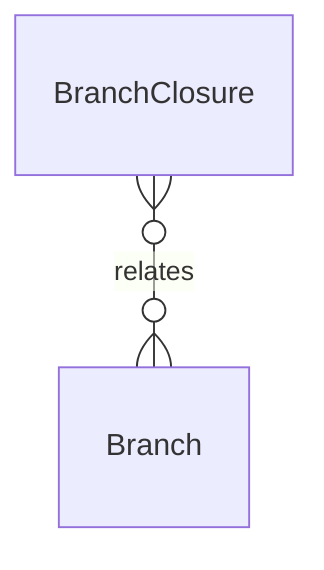

# `BranchClosure` → `branch_closures`

<!-- generated by .kb/generate.mjs — do not edit by hand -->

Declared at `packages/db/prisma/schema/tenancy.prisma:361`.

| property | value |
| --- | --- |
| table | `branch_closures` |
| tenant-scoped | no |
| RLS | `parent` policy |
| columns | 4 |
| relations | 1 |

## Columns

| column | type | definition |
| --- | --- | --- |
| `id` | `String` | `id String @id @default(uuid()) @db.Uuid` |
| `branchId` | `String` | `branchId String @map("branch_id") @db.Uuid` |
| `closureDate` | `DateTime` | `closureDate DateTime @map("closure_date") @db.Date` |
| `reason` | `String?` | `reason String? @db.VarChar(255)` |

## Relations

| field | target | definition |
| --- | --- | --- |
| `branch` | [`Branch`](Branch.md) | `branch Branch @relation(fields: [branchId], references: [id], onDelete: Cascade)` |

## Indexes and constraints

- `@@unique([branchId, closureDate])`

## Neighbourhood

