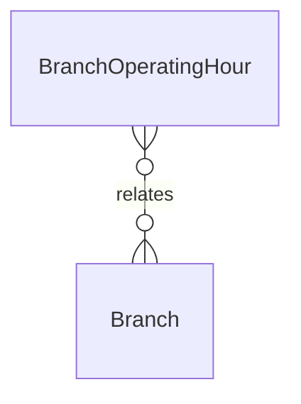

# `BranchOperatingHour` → `branch_operating_hours`

<!-- generated by .kb/generate.mjs — do not edit by hand -->

Declared at `packages/db/prisma/schema/tenancy.prisma:281`.

| property | value |
| --- | --- |
| table | `branch_operating_hours` |
| tenant-scoped | no |
| RLS | `parent` policy |
| columns | 7 |
| relations | 1 |

## Columns

| column | type | definition |
| --- | --- | --- |
| `id` | `String` | `id String @id @default(uuid()) @db.Uuid` |
| `branchId` | `String` | `branchId String @map("branch_id") @db.Uuid` |
| `dayOfWeek` | `Int` | `dayOfWeek Int @map("day_of_week") @db.SmallInt` |
| `opensAt` | `DateTime` | `opensAt DateTime @map("opens_at") @db.Time(0)` |
| `closesAt` | `DateTime` | `closesAt DateTime @map("closes_at") @db.Time(0)` |
| `isClosed` | `Boolean` | `isClosed Boolean @default(false) @map("is_closed")` |
| `slotMinutes` | `Int` | `slotMinutes Int @default(15) @map("slot_minutes") @db.SmallInt` |

## Relations

| field | target | definition |
| --- | --- | --- |
| `branch` | [`Branch`](Branch.md) | `branch Branch @relation(fields: [branchId], references: [id], onDelete: Cascade)` |

## Indexes and constraints

- `@@unique([branchId, dayOfWeek])`

## Neighbourhood

