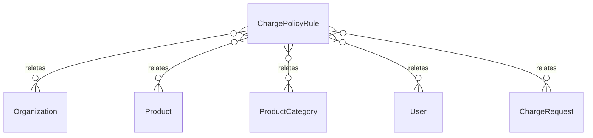

# `ChargePolicyRule` → `charge_policy_rules`

<!-- generated by .kb/generate.mjs — do not edit by hand -->

Declared at `packages/db/prisma/schema/charging.prisma:146`.

| property | value |
| --- | --- |
| table | `charge_policy_rules` |
| tenant-scoped | yes — has `organizationId` |
| RLS | **MISSING — this is a tenant-isolation defect** |
| columns | 11 |
| relations | 5 |

## Columns

| column | type | definition |
| --- | --- | --- |
| `id` | `String` | `id String @id @default(uuid()) @db.Uuid` |
| `organizationId` | `String` | `organizationId String @map("organization_id") @db.Uuid` |
| `productId` | `String?` | `productId String? @map("product_id") @db.Uuid` |
| `productCategoryId` | `String?` | `productCategoryId String? @map("product_category_id") @db.Uuid` |
| `productType` | `ProductType?` | `productType ProductType? @map("product_type")` |
| `policy` | `ChargePolicy` | `policy ChargePolicy` |
| `note` | `String?` | `note String? @db.Text` |
| `createdAt` | `DateTime` | `createdAt DateTime @default(now()) @map("created_at") @db.Timestamptz(6)` |
| `updatedAt` | `DateTime` | `updatedAt DateTime @updatedAt @map("updated_at") @db.Timestamptz(6)` |
| `updatedBy` | `String?` | `updatedBy String? @map("updated_by") @db.Uuid` |
| `deletedAt` | `DateTime?` | `deletedAt DateTime? @map("deleted_at") @db.Timestamptz(6)` |

## Relations

| field | target | definition |
| --- | --- | --- |
| `organization` | [`Organization`](Organization.md) | `organization Organization @relation(fields: [organizationId], references: [id], onDelete: Cascade)` |
| `product` | [`Product`](Product.md) | `product Product? @relation("ChargePolicyRuleProduct", fields: [productId], references: [id], onDelete: Restrict)` |
| `productCategory` | [`ProductCategory`](ProductCategory.md) | `productCategory ProductCategory? @relation("ChargePolicyRuleCategory", fields: [productCategoryId], references: [id], onDelete: Restrict)` |
| `updater` | [`User`](User.md) | `updater User? @relation("ChargePolicyRuleUpdatedBy", fields: [updatedBy], references: [id], onDelete: SetNull)` |
| `chargeRequests` | [`ChargeRequest`](ChargeRequest.md) | `chargeRequests ChargeRequest[]` |

## Indexes and constraints

- `@@unique([organizationId, productId, productCategoryId, productType])`
- `@@unique([organizationId, id])`
- `@@index([organizationId, productId])`
- `@@index([organizationId, productCategoryId])`
- `@@index([organizationId, productType])`

## Neighbourhood

