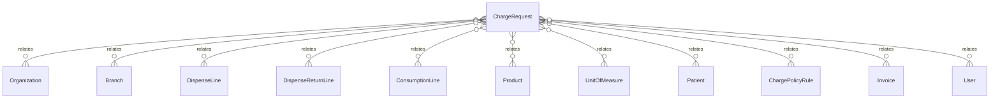

# `ChargeRequest` → `charge_requests`

<!-- generated by .kb/generate.mjs — do not edit by hand -->

Declared at `packages/db/prisma/schema/charging.prisma:275`.

| property | value |
| --- | --- |
| table | `charge_requests` |
| tenant-scoped | yes — has `organizationId` |
| RLS | `branch` policy |
| columns | 29 |
| relations | 11 |

## Columns

| column | type | definition |
| --- | --- | --- |
| `id` | `String` | `id String @id @default(uuid()) @db.Uuid` |
| `organizationId` | `String` | `organizationId String @map("organization_id") @db.Uuid` |
| `branchId` | `String` | `branchId String @map("branch_id") @db.Uuid` |
| `sourceType` | `InvoiceSourceType` | `sourceType InvoiceSourceType @map("source_type")` |
| `kind` | `ChargeRequestKind` | `kind ChargeRequestKind @default(SUPPLY)` |
| `status` | `ChargeRequestStatus` | `status ChargeRequestStatus @default(PENDING)` |
| `dispenseLineId` | `String?` | `dispenseLineId String? @map("dispense_line_id") @db.Uuid` |
| `dispenseReturnLineId` | `String?` | `dispenseReturnLineId String? @map("dispense_return_line_id") @db.Uuid` |
| `consumptionLineId` | `String?` | `consumptionLineId String? @map("consumption_line_id") @db.Uuid` |
| `productId` | `String` | `productId String @map("product_id") @db.Uuid` |
| `patientId` | `String?` | `patientId String? @map("patient_id") @db.Uuid` |
| `occurredAt` | `DateTime` | `occurredAt DateTime @map("occurred_at") @db.Timestamptz(6)` |
| `quantityBase` | `Decimal` | `quantityBase Decimal @map("quantity_base") @db.Decimal(18, 6)` |
| `quantity` | `Decimal` | `quantity Decimal @db.Decimal(14, 3)` |
| `unitId` | `String` | `unitId String @map("unit_id") @db.Uuid` |
| `policy` | `ChargePolicy` | `policy ChargePolicy` |
| `policyScope` | `ChargePolicyScope` | `policyScope ChargePolicyScope @map("policy_scope")` |
| `policyRuleId` | `String?` | `policyRuleId String? @map("policy_rule_id") @db.Uuid` |
| `description` | `String` | `description String @db.VarChar(255)` |
| `unitPrice` | `Decimal?` | `unitPrice Decimal? @map("unit_price") @db.Decimal(14, 2)` |
| `currency` | `String` | `currency String @default("INR") @db.Char(3)` |
| `taxCategory` | `String?` | `taxCategory String? @map("tax_category") @db.VarChar(64)` |
| `itemCode` | `String?` | `itemCode String? @map("item_code") @db.VarChar(32)` |
| `invoiceId` | `String?` | `invoiceId String? @map("invoice_id") @db.Uuid` |
| `suppressedReason` | `String?` | `suppressedReason String? @map("suppressed_reason") @db.Text` |
| `decidedById` | `String?` | `decidedById String? @map("decided_by_id") @db.Uuid` |
| `decidedAt` | `DateTime?` | `decidedAt DateTime? @map("decided_at") @db.Timestamptz(6)` |
| `createdAt` | `DateTime` | `createdAt DateTime @default(now()) @map("created_at") @db.Timestamptz(6)` |
| `updatedAt` | `DateTime` | `updatedAt DateTime @updatedAt @map("updated_at") @db.Timestamptz(6)` |

## Relations

| field | target | definition |
| --- | --- | --- |
| `organization` | [`Organization`](Organization.md) | `organization Organization @relation(fields: [organizationId], references: [id], onDelete: Cascade)` |
| `branch` | [`Branch`](Branch.md) | `branch Branch @relation(fields: [organizationId, branchId], references: [organizationId, id], onDelete: Cascade)` |
| `dispenseLine` | [`DispenseLine`](DispenseLine.md) | `dispenseLine DispenseLine? @relation(fields: [organizationId, dispenseLineId], references: [organizationId, id], onDelete: Cascade)` |
| `dispenseReturnLine` | [`DispenseReturnLine`](DispenseReturnLine.md) | `dispenseReturnLine DispenseReturnLine? @relation(fields: [organizationId, dispenseReturnLineId], references: [organizationId, id], onDelete: Cascade)` |
| `consumptionLine` | [`ConsumptionLine`](ConsumptionLine.md) | `consumptionLine ConsumptionLine? @relation(fields: [organizationId, consumptionLineId], references: [organizationId, id], onDelete: Cascade)` |
| `product` | [`Product`](Product.md) | `product Product @relation("ChargeRequestProduct", fields: [productId], references: [id], onDelete: Restrict)` |
| `unit` | [`UnitOfMeasure`](UnitOfMeasure.md) | `unit UnitOfMeasure @relation("ChargeRequestUnit", fields: [unitId], references: [id], onDelete: Restrict)` |
| `patient` | [`Patient`](Patient.md) | `patient Patient? @relation(fields: [organizationId, patientId], references: [organizationId, id], onDelete: Restrict)` |
| `policyRule` | [`ChargePolicyRule`](ChargePolicyRule.md) | `policyRule ChargePolicyRule? @relation(fields: [organizationId, policyRuleId], references: [organizationId, id], onDelete: Restrict, onUpdate: NoAction)` |
| `invoice` | [`Invoice`](Invoice.md) | `invoice Invoice? @relation(fields: [organizationId, invoiceId], references: [organizationId, id], onDelete: Restrict)` |
| `decidedBy` | [`User`](User.md) | `decidedBy User? @relation("ChargeRequestDecidedBy", fields: [decidedById], references: [id], onDelete: SetNull)` |

## Indexes and constraints

- `@@unique([organizationId, id])`
- `@@index([organizationId, dispenseLineId])`
- `@@index([organizationId, dispenseReturnLineId])`
- `@@index([organizationId, consumptionLineId])`
- `@@index([organizationId, branchId, status, occurredAt])`
- `@@index([organizationId, patientId, occurredAt])`
- `@@index([organizationId, invoiceId])`

## Neighbourhood

