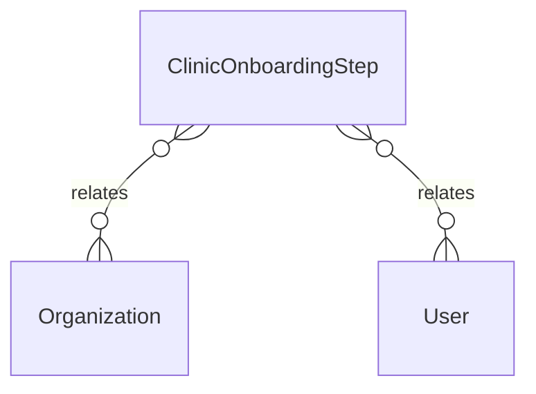

# `ClinicOnboardingStep` → `clinic_onboarding_steps`

<!-- generated by .kb/generate.mjs — do not edit by hand -->

Declared at `packages/db/prisma/schema/onboarding.prisma:248`.

| property | value |
| --- | --- |
| table | `clinic_onboarding_steps` |
| tenant-scoped | yes — has `organizationId` |
| RLS | `org` policy |
| columns | 7 |
| relations | 2 |

## Columns

| column | type | definition |
| --- | --- | --- |
| `id` | `String` | `id String @id @default(uuid()) @db.Uuid` |
| `organizationId` | `String` | `organizationId String @map("organization_id") @db.Uuid` |
| `step` | `OnboardingStep` | `step OnboardingStep` |
| `completedAt` | `DateTime?` | `completedAt DateTime? @map("completed_at") @db.Timestamptz(6)` |
| `completedByUserId` | `String?` | `completedByUserId String? @map("completed_by_user_id") @db.Uuid` |
| `createdAt` | `DateTime` | `createdAt DateTime @default(now()) @map("created_at") @db.Timestamptz(6)` |
| `updatedAt` | `DateTime` | `updatedAt DateTime @updatedAt @map("updated_at") @db.Timestamptz(6)` |

## Relations

| field | target | definition |
| --- | --- | --- |
| `organization` | [`Organization`](Organization.md) | `organization Organization @relation(fields: [organizationId], references: [id], onDelete: Cascade)` |
| `completedBy` | [`User`](User.md) | `completedBy User? @relation("ClinicOnboardingStepCompletedBy", fields: [completedByUserId], references: [id], onDelete: SetNull)` |

## Indexes and constraints

- `@@unique([organizationId, step])`

## Neighbourhood

