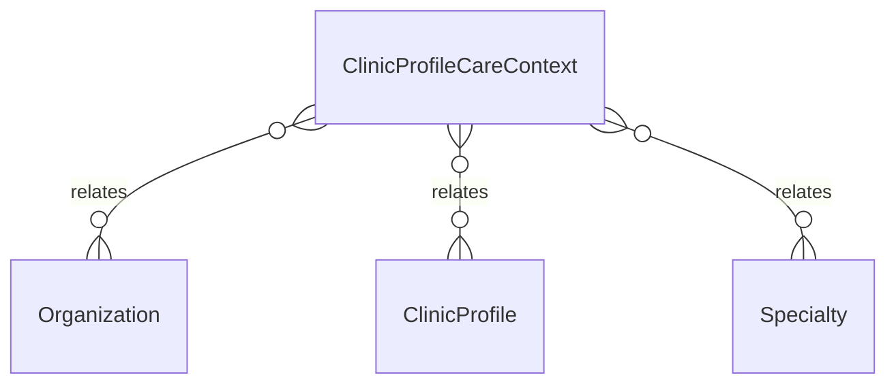

# `ClinicProfileCareContext` → `clinic_profile_care_contexts`

<!-- generated by .kb/generate.mjs — do not edit by hand -->

Declared at `packages/db/prisma/schema/onboarding.prisma:170`.

| property | value |
| --- | --- |
| table | `clinic_profile_care_contexts` |
| tenant-scoped | yes — has `organizationId` |
| RLS | `org` policy |
| columns | 6 |
| relations | 3 |

## Columns

| column | type | definition |
| --- | --- | --- |
| `id` | `String` | `id String @id @default(uuid()) @db.Uuid` |
| `organizationId` | `String` | `organizationId String @map("organization_id") @db.Uuid` |
| `profileId` | `String` | `profileId String @map("profile_id") @db.Uuid` |
| `branchId` | `String?` | `branchId String? @map("branch_id") @db.Uuid` |
| `specialtyId` | `String` | `specialtyId String @map("specialty_id") @db.Uuid` |
| `createdAt` | `DateTime` | `createdAt DateTime @default(now()) @map("created_at") @db.Timestamptz(6)` |

## Relations

| field | target | definition |
| --- | --- | --- |
| `organization` | [`Organization`](Organization.md) | `organization Organization @relation(fields: [organizationId], references: [id], onDelete: Cascade)` |
| `profile` | [`ClinicProfile`](ClinicProfile.md) | `profile ClinicProfile @relation(fields: [organizationId, profileId], references: [organizationId, id], onDelete: Cascade)` |
| `specialty` | [`Specialty`](Specialty.md) | `specialty Specialty @relation(fields: [specialtyId], references: [id], onDelete: Restrict)` |

## Indexes and constraints

- `@@unique([organizationId, profileId, specialtyId])`
- `@@index([organizationId, profileId])`

## Neighbourhood

