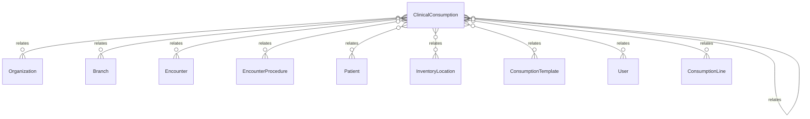

# `ClinicalConsumption` → `clinical_consumptions`

<!-- generated by .kb/generate.mjs — do not edit by hand -->

Declared at `packages/db/prisma/schema/consumption.prisma:251`.

| property | value |
| --- | --- |
| table | `clinical_consumptions` |
| tenant-scoped | yes — has `organizationId` |
| RLS | `org` policy |
| columns | 19 |
| relations | 12 |

## Columns

| column | type | definition |
| --- | --- | --- |
| `id` | `String` | `id String @id @default(uuid()) @db.Uuid` |
| `organizationId` | `String` | `organizationId String @map("organization_id") @db.Uuid` |
| `branchId` | `String` | `branchId String @map("branch_id") @db.Uuid` |
| `kind` | `ClinicalConsumptionKind` | `kind ClinicalConsumptionKind @default(CONSUMPTION)` |
| `anchorKind` | `ConsumptionAnchorKind` | `anchorKind ConsumptionAnchorKind @map("anchor_kind")` |
| `encounterId` | `String` | `encounterId String @map("encounter_id") @db.Uuid` |
| `encounterProcedureId` | `String?` | `encounterProcedureId String? @map("encounter_procedure_id") @db.Uuid` |
| `patientId` | `String` | `patientId String @map("patient_id") @db.Uuid` |
| `locationId` | `String` | `locationId String @map("location_id") @db.Uuid` |
| `templateId` | `String?` | `templateId String? @map("template_id") @db.Uuid` |
| `recordedById` | `String` | `recordedById String @map("recorded_by_id") @db.Uuid` |
| `occurredAt` | `DateTime` | `occurredAt DateTime @default(now()) @map("occurred_at") @db.Timestamptz(6)` |
| `correctsConsumptionId` | `String?` | `correctsConsumptionId String? @map("corrects_consumption_id") @db.Uuid` |
| `correctionReason` | `String?` | `correctionReason String? @map("correction_reason") @db.Text` |
| `notes` | `String?` | `notes String? @db.Text` |
| `amendedById` | `String?` | `amendedById String? @map("amended_by_id") @db.Uuid` |
| `amendedAt` | `DateTime?` | `amendedAt DateTime? @map("amended_at") @db.Timestamptz(6)` |
| `createdAt` | `DateTime` | `createdAt DateTime @default(now()) @map("created_at") @db.Timestamptz(6)` |
| `updatedAt` | `DateTime` | `updatedAt DateTime @updatedAt @map("updated_at") @db.Timestamptz(6)` |

## Relations

| field | target | definition |
| --- | --- | --- |
| `organization` | [`Organization`](Organization.md) | `organization Organization @relation(fields: [organizationId], references: [id], onDelete: Cascade)` |
| `branch` | [`Branch`](Branch.md) | `branch Branch @relation(fields: [organizationId, branchId], references: [organizationId, id], onDelete: Cascade)` |
| `encounter` | [`Encounter`](Encounter.md) | `encounter Encounter @relation(fields: [organizationId, encounterId], references: [organizationId, id], onDelete: Restrict)` |
| `procedure` | [`EncounterProcedure`](EncounterProcedure.md) | `procedure EncounterProcedure? @relation(fields: [organizationId, encounterProcedureId], references: [organizationId, id], onDelete: Restrict)` |
| `patient` | [`Patient`](Patient.md) | `patient Patient @relation(fields: [organizationId, patientId], references: [organizationId, id], onDelete: Restrict)` |
| `location` | [`InventoryLocation`](InventoryLocation.md) | `location InventoryLocation @relation("ConsumptionLocation", fields: [organizationId, branchId, locationId], references: [organizationId, branchId, id], onDelete: Restrict)` |
| `template` | [`ConsumptionTemplate`](ConsumptionTemplate.md) | `template ConsumptionTemplate? @relation(fields: [organizationId, templateId], references: [organizationId, id], onDelete: Restrict)` |
| `recordedBy` | [`User`](User.md) | `recordedBy User @relation("ConsumptionRecordedBy", fields: [recordedById], references: [id], onDelete: Restrict)` |
| `amendedBy` | [`User`](User.md) | `amendedBy User? @relation("ConsumptionAmendedBy", fields: [amendedById], references: [id], onDelete: Restrict)` |
| `corrects` | [`ClinicalConsumption`](ClinicalConsumption.md) | `corrects ClinicalConsumption? @relation("ConsumptionCorrects", fields: [organizationId, correctsConsumptionId], references: [organizationId, id], onDelete: Restrict, onUpdate: NoAction)` |
| `correctedBy` | [`ClinicalConsumption`](ClinicalConsumption.md) | `correctedBy ClinicalConsumption[] @relation("ConsumptionCorrects")` |
| `lines` | [`ConsumptionLine`](ConsumptionLine.md) | `lines ConsumptionLine[]` |

## Indexes and constraints

- `@@unique([organizationId, id])`
- `@@unique([organizationId, branchId, id])`
- `@@index([organizationId, encounterId])`
- `@@index([organizationId, encounterProcedureId])`
- `@@index([organizationId, patientId, occurredAt(sort: Desc)])`
- `@@index([organizationId, branchId, occurredAt(sort: Desc)])`
- `@@index([organizationId, correctsConsumptionId])`

## Neighbourhood

