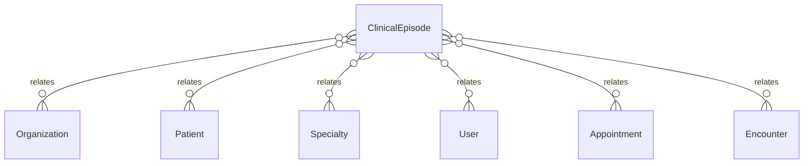

# `ClinicalEpisode` → `clinical_episodes`

<!-- generated by .kb/generate.mjs — do not edit by hand -->

Declared at `packages/db/prisma/schema/clinical.prisma:384`.

| property | value |
| --- | --- |
| table | `clinical_episodes` |
| tenant-scoped | yes — has `organizationId` |
| RLS | **MISSING — this is a tenant-isolation defect** |
| columns | 16 |
| relations | 7 |

## Columns

| column | type | definition |
| --- | --- | --- |
| `id` | `String` | `id String @id @default(uuid()) @db.Uuid` |
| `organizationId` | `String` | `organizationId String @map("organization_id") @db.Uuid` |
| `patientId` | `String` | `patientId String @map("patient_id") @db.Uuid` |
| `code` | `String` | `code String @db.VarChar(32)` |
| `title` | `String?` | `title String? @db.VarChar(255)` |
| `primarySpecialtyId` | `String?` | `primarySpecialtyId String? @map("primary_specialty_id") @db.Uuid` |
| `status` | `ClinicalEpisodeStatus` | `status ClinicalEpisodeStatus @default(OPEN)` |
| `openedOn` | `DateTime` | `openedOn DateTime @map("opened_on") @db.Date` |
| `closedOn` | `DateTime?` | `closedOn DateTime? @map("closed_on") @db.Date` |
| `closureReason` | `String?` | `closureReason String? @map("closure_reason") @db.Text` |
| `notes` | `String?` | `notes String? @db.Text` |
| `openedBy` | `String?` | `openedBy String? @map("opened_by") @db.Uuid` |
| `closedBy` | `String?` | `closedBy String? @map("closed_by") @db.Uuid` |
| `createdAt` | `DateTime` | `createdAt DateTime @default(now()) @map("created_at") @db.Timestamptz(6)` |
| `updatedAt` | `DateTime` | `updatedAt DateTime @updatedAt @map("updated_at") @db.Timestamptz(6)` |
| `deletedAt` | `DateTime?` | `deletedAt DateTime? @map("deleted_at") @db.Timestamptz(6)` |

## Relations

| field | target | definition |
| --- | --- | --- |
| `organization` | [`Organization`](Organization.md) | `organization Organization @relation(fields: [organizationId], references: [id], onDelete: Cascade)` |
| `patient` | [`Patient`](Patient.md) | `patient Patient @relation(fields: [organizationId, patientId], references: [organizationId, id], onDelete: Cascade)` |
| `primarySpecialty` | [`Specialty`](Specialty.md) | `primarySpecialty Specialty? @relation(fields: [primarySpecialtyId], references: [id], onDelete: Restrict)` |
| `opener` | [`User`](User.md) | `opener User? @relation("EpisodeOpenedBy", fields: [openedBy], references: [id], onDelete: SetNull)` |
| `closer` | [`User`](User.md) | `closer User? @relation("EpisodeClosedBy", fields: [closedBy], references: [id], onDelete: SetNull)` |
| `appointments` | [`Appointment`](Appointment.md) | `appointments Appointment[]` |
| `encounters` | [`Encounter`](Encounter.md) | `encounters Encounter[]` |

## Indexes and constraints

- `@@unique([organizationId, code])`
- `@@unique([organizationId, id])`
- `@@index([organizationId, patientId, openedOn])`
- `@@index([organizationId, status])`

## Neighbourhood

