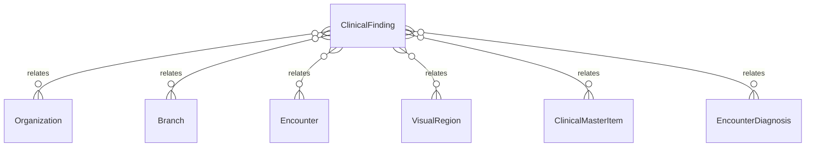

# `ClinicalFinding` → `clinical_findings`

<!-- generated by .kb/generate.mjs — do not edit by hand -->

Declared at `packages/db/prisma/schema/clinical.prisma:1882`.

| property | value |
| --- | --- |
| table | `clinical_findings` |
| tenant-scoped | yes — has `organizationId` |
| RLS | `branch` policy |
| columns | 14 |
| relations | 6 |

## Columns

| column | type | definition |
| --- | --- | --- |
| `id` | `String` | `id String @id @default(uuid()) @db.Uuid` |
| `organizationId` | `String` | `organizationId String @map("organization_id") @db.Uuid` |
| `branchId` | `String` | `branchId String @map("branch_id") @db.Uuid` |
| `encounterId` | `String` | `encounterId String @map("encounter_id") @db.Uuid` |
| `sectionKey` | `String` | `sectionKey String @map("section_key") @db.VarChar(64)` |
| `visualRegionId` | `String` | `visualRegionId String @map("visual_region_id") @db.Uuid` |
| `findingItemId` | `String` | `findingItemId String @map("finding_item_id") @db.Uuid` |
| `diagnosisId` | `String?` | `diagnosisId String? @map("diagnosis_id") @db.Uuid` |
| `severity` | `ClinicalSeverity?` | `severity ClinicalSeverity?` |
| `notes` | `String?` | `notes String? @db.Text` |
| `metadata` | `Json?` | `metadata Json? @db.JsonB` |
| `displayOrder` | `Int` | `displayOrder Int @default(0) @map("display_order")` |
| `createdAt` | `DateTime` | `createdAt DateTime @default(now()) @map("created_at") @db.Timestamptz(6)` |
| `updatedAt` | `DateTime` | `updatedAt DateTime @updatedAt @map("updated_at") @db.Timestamptz(6)` |

## Relations

| field | target | definition |
| --- | --- | --- |
| `organization` | [`Organization`](Organization.md) | `organization Organization @relation(fields: [organizationId], references: [id], onDelete: Cascade)` |
| `branch` | [`Branch`](Branch.md) | `branch Branch @relation(fields: [organizationId, branchId], references: [organizationId, id], onDelete: Cascade)` |
| `encounter` | [`Encounter`](Encounter.md) | `encounter Encounter @relation(fields: [organizationId, encounterId], references: [organizationId, id], onDelete: Cascade)` |
| `region` | [`VisualRegion`](VisualRegion.md) | `region VisualRegion @relation(fields: [visualRegionId], references: [id], onDelete: Restrict)` |
| `item` | [`ClinicalMasterItem`](ClinicalMasterItem.md) | `item ClinicalMasterItem @relation("FindingItem", fields: [findingItemId], references: [id], onDelete: Restrict)` |
| `diagnosis` | [`EncounterDiagnosis`](EncounterDiagnosis.md) | `diagnosis EncounterDiagnosis? @relation(fields: [organizationId, diagnosisId], references: [organizationId, id], onDelete: Restrict, onUpdate: NoAction)` |

## Indexes and constraints

- `@@unique([organizationId, encounterId, sectionKey, visualRegionId, findingItemId])`
- `@@index([organizationId, encounterId, displayOrder])`
- `@@index([organizationId, visualRegionId])`

## Neighbourhood

