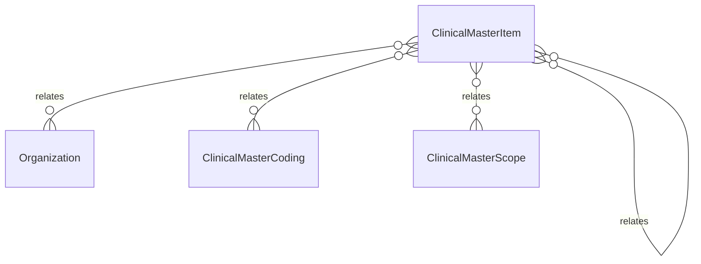

# `ClinicalMasterItem` → `clinical_master_items`

<!-- generated by .kb/generate.mjs — do not edit by hand -->

Declared at `packages/db/prisma/schema/clinical.prisma:131`.

| property | value |
| --- | --- |
| table | `clinical_master_items` |
| tenant-scoped | yes — has `organizationId` |
| RLS | **MISSING — this is a tenant-isolation defect** |
| columns | 13 |
| relations | 5 |

## Columns

| column | type | definition |
| --- | --- | --- |
| `id` | `String` | `id String @id @default(uuid()) @db.Uuid` |
| `organizationId` | `String?` | `organizationId String? @map("organization_id") @db.Uuid` |
| `kind` | `ClinicalMasterKind` | `kind ClinicalMasterKind` |
| `parentId` | `String?` | `parentId String? @map("parent_id") @db.Uuid` |
| `code` | `String` | `code String @db.VarChar(64)` |
| `name` | `String` | `name String @db.VarChar(255)` |
| `description` | `String?` | `description String? @db.Text` |
| `displayOrder` | `Int` | `displayOrder Int @default(0) @map("display_order")` |
| `metadata` | `Json?` | `metadata Json? @db.JsonB` |
| `isActive` | `Boolean` | `isActive Boolean @default(true) @map("is_active")` |
| `createdAt` | `DateTime` | `createdAt DateTime @default(now()) @map("created_at") @db.Timestamptz(6)` |
| `updatedAt` | `DateTime` | `updatedAt DateTime @updatedAt @map("updated_at") @db.Timestamptz(6)` |
| `deletedAt` | `DateTime?` | `deletedAt DateTime? @map("deleted_at") @db.Timestamptz(6)` |

## Relations

| field | target | definition |
| --- | --- | --- |
| `organization` | [`Organization`](Organization.md) | `organization Organization? @relation(fields: [organizationId], references: [id], onDelete: Cascade)` |
| `parent` | [`ClinicalMasterItem`](ClinicalMasterItem.md) | `parent ClinicalMasterItem? @relation("ClinicalMasterParent", fields: [parentId], references: [id], onDelete: Restrict)` |
| `children` | [`ClinicalMasterItem`](ClinicalMasterItem.md) | `children ClinicalMasterItem[] @relation("ClinicalMasterParent")` |
| `codings` | [`ClinicalMasterCoding`](ClinicalMasterCoding.md) | `codings ClinicalMasterCoding[]` |
| `scopes` | [`ClinicalMasterScope`](ClinicalMasterScope.md) | `scopes ClinicalMasterScope[]` |

## Indexes and constraints

- `@@unique([organizationId, kind, code])`
- `@@unique([organizationId, id])`
- `@@index([organizationId, kind, isActive])`
- `@@index([parentId])`

## Neighbourhood

