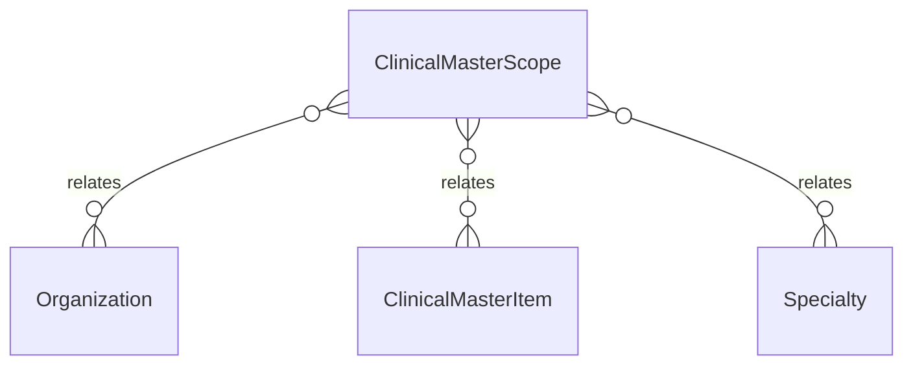

# `ClinicalMasterScope` → `clinical_master_scopes`

<!-- generated by .kb/generate.mjs — do not edit by hand -->

Declared at `packages/db/prisma/schema/clinical.prisma:297`.

| property | value |
| --- | --- |
| table | `clinical_master_scopes` |
| tenant-scoped | yes — has `organizationId` |
| RLS | **MISSING — this is a tenant-isolation defect** |
| columns | 6 |
| relations | 3 |

## Columns

| column | type | definition |
| --- | --- | --- |
| `id` | `String` | `id String @id @default(uuid()) @db.Uuid` |
| `organizationId` | `String?` | `organizationId String? @map("organization_id") @db.Uuid` |
| `itemId` | `String` | `itemId String @map("item_id") @db.Uuid` |
| `specialtyId` | `String` | `specialtyId String @map("specialty_id") @db.Uuid` |
| `relevance` | `Int` | `relevance Int @default(0) @db.SmallInt` |
| `createdAt` | `DateTime` | `createdAt DateTime @default(now()) @map("created_at") @db.Timestamptz(6)` |

## Relations

| field | target | definition |
| --- | --- | --- |
| `organization` | [`Organization`](Organization.md) | `organization Organization? @relation(fields: [organizationId], references: [id], onDelete: Cascade)` |
| `item` | [`ClinicalMasterItem`](ClinicalMasterItem.md) | `item ClinicalMasterItem? @relation(fields: [organizationId, itemId], references: [organizationId, id], onDelete: Cascade)` |
| `specialty` | [`Specialty`](Specialty.md) | `specialty Specialty @relation(fields: [specialtyId], references: [id], onDelete: Restrict)` |

## Indexes and constraints

- `@@unique([organizationId, itemId, specialtyId])`
- `@@index([organizationId, specialtyId])`

## Neighbourhood

