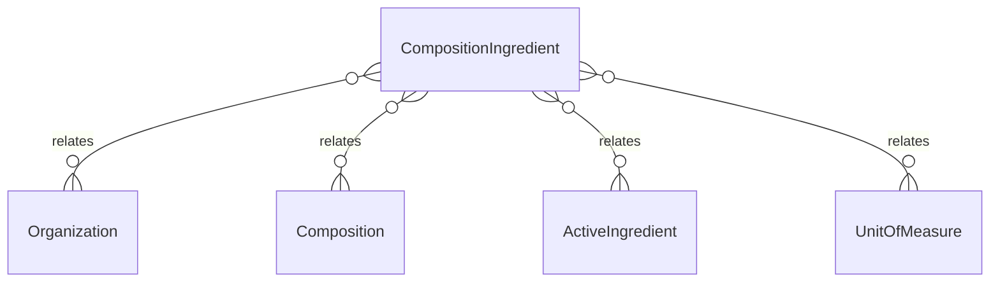

# `CompositionIngredient` → `composition_ingredients`

<!-- generated by .kb/generate.mjs — do not edit by hand -->

Declared at `packages/db/prisma/schema/products.prisma:525`.

| property | value |
| --- | --- |
| table | `composition_ingredients` |
| tenant-scoped | yes — has `organizationId` |
| RLS | `visible` policy |
| columns | 10 |
| relations | 4 |

## Columns

| column | type | definition |
| --- | --- | --- |
| `id` | `String` | `id String @id @default(uuid()) @db.Uuid` |
| `organizationId` | `String?` | `organizationId String? @map("organization_id") @db.Uuid` |
| `compositionId` | `String` | `compositionId String @map("composition_id") @db.Uuid` |
| `ingredientId` | `String` | `ingredientId String @map("ingredient_id") @db.Uuid` |
| `strength` | `Decimal` | `strength Decimal @db.Decimal(14, 6)` |
| `strengthUnitId` | `String` | `strengthUnitId String @map("strength_unit_id") @db.Uuid` |
| `perQuantity` | `Decimal?` | `perQuantity Decimal? @map("per_quantity") @db.Decimal(14, 6)` |
| `displayOrder` | `Int` | `displayOrder Int @default(0) @map("display_order")` |
| `createdAt` | `DateTime` | `createdAt DateTime @default(now()) @map("created_at") @db.Timestamptz(6)` |
| `updatedAt` | `DateTime` | `updatedAt DateTime @updatedAt @map("updated_at") @db.Timestamptz(6)` |

## Relations

| field | target | definition |
| --- | --- | --- |
| `organization` | [`Organization`](Organization.md) | `organization Organization? @relation(fields: [organizationId], references: [id], onDelete: Cascade)` |
| `composition` | [`Composition`](Composition.md) | `composition Composition? @relation(fields: [organizationId, compositionId], references: [organizationId, id], onDelete: Cascade)` |
| `ingredient` | [`ActiveIngredient`](ActiveIngredient.md) | `ingredient ActiveIngredient @relation(fields: [ingredientId], references: [id], onDelete: Restrict)` |
| `strengthUnit` | [`UnitOfMeasure`](UnitOfMeasure.md) | `strengthUnit UnitOfMeasure @relation("IngredientStrengthUnit", fields: [strengthUnitId], references: [id], onDelete: Restrict)` |

## Indexes and constraints

- `@@unique([organizationId, compositionId, ingredientId])`
- `@@index([organizationId, ingredientId])`

## Neighbourhood

