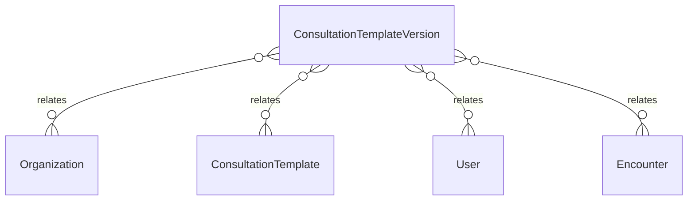

# `ConsultationTemplateVersion` → `consultation_template_versions`

<!-- generated by .kb/generate.mjs — do not edit by hand -->

Declared at `packages/db/prisma/schema/clinical.prisma:719`.

| property | value |
| --- | --- |
| table | `consultation_template_versions` |
| tenant-scoped | yes — has `organizationId` |
| RLS | **MISSING — this is a tenant-isolation defect** |
| columns | 11 |
| relations | 4 |

## Columns

| column | type | definition |
| --- | --- | --- |
| `id` | `String` | `id String @id @default(uuid()) @db.Uuid` |
| `organizationId` | `String?` | `organizationId String? @map("organization_id") @db.Uuid` |
| `templateId` | `String` | `templateId String @map("template_id") @db.Uuid` |
| `version` | `Int` | `version Int` |
| `definition` | `Json` | `definition Json @db.JsonB` |
| `status` | `ConsultationTemplateStatus` | `status ConsultationTemplateStatus @default(DRAFT)` |
| `publishedAt` | `DateTime?` | `publishedAt DateTime? @map("published_at") @db.Timestamptz(6)` |
| `publishedBy` | `String?` | `publishedBy String? @map("published_by") @db.Uuid` |
| `retiredAt` | `DateTime?` | `retiredAt DateTime? @map("retired_at") @db.Timestamptz(6)` |
| `createdAt` | `DateTime` | `createdAt DateTime @default(now()) @map("created_at") @db.Timestamptz(6)` |
| `updatedAt` | `DateTime` | `updatedAt DateTime @updatedAt @map("updated_at") @db.Timestamptz(6)` |

## Relations

| field | target | definition |
| --- | --- | --- |
| `organization` | [`Organization`](Organization.md) | `organization Organization? @relation(fields: [organizationId], references: [id], onDelete: Cascade)` |
| `template` | [`ConsultationTemplate`](ConsultationTemplate.md) | `template ConsultationTemplate? @relation(fields: [organizationId, templateId], references: [organizationId, id], onDelete: Cascade)` |
| `publisher` | [`User`](User.md) | `publisher User? @relation("TemplateVersionPublishedBy", fields: [publishedBy], references: [id], onDelete: SetNull)` |
| `encounters` | [`Encounter`](Encounter.md) | `encounters Encounter[]` |

## Indexes and constraints

- `@@unique([organizationId, templateId, version])`
- `@@unique([organizationId, id])`
- `@@index([organizationId, templateId, status])`

## Neighbourhood

