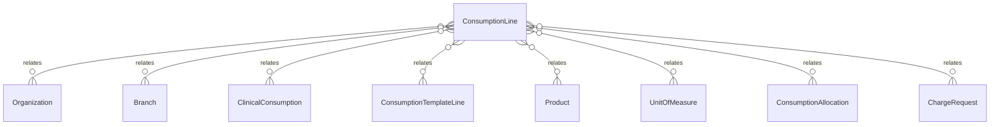

# `ConsumptionLine` → `consumption_lines`

<!-- generated by .kb/generate.mjs — do not edit by hand -->

Declared at `packages/db/prisma/schema/consumption.prisma:351`.

| property | value |
| --- | --- |
| table | `consumption_lines` |
| tenant-scoped | yes — has `organizationId` |
| RLS | `org` policy |
| columns | 15 |
| relations | 8 |

## Columns

| column | type | definition |
| --- | --- | --- |
| `id` | `String` | `id String @id @default(uuid()) @db.Uuid` |
| `organizationId` | `String` | `organizationId String @map("organization_id") @db.Uuid` |
| `branchId` | `String` | `branchId String @map("branch_id") @db.Uuid` |
| `consumptionId` | `String` | `consumptionId String @map("consumption_id") @db.Uuid` |
| `lineNumber` | `Int` | `lineNumber Int @map("line_number") @db.SmallInt` |
| `templateLineId` | `String?` | `templateLineId String? @map("template_line_id") @db.Uuid` |
| `productId` | `String` | `productId String @map("product_id") @db.Uuid` |
| `expectedQuantityBase` | `Decimal` | `expectedQuantityBase Decimal @map("expected_quantity_base") @db.Decimal(18, 6)` |
| `quantityEntered` | `Decimal` | `quantityEntered Decimal @map("quantity_entered") @db.Decimal(18, 6)` |
| `unitId` | `String` | `unitId String @map("unit_id") @db.Uuid` |
| `quantityBase` | `Decimal` | `quantityBase Decimal @map("quantity_base") @db.Decimal(18, 6)` |
| `isOverride` | `Boolean` | `isOverride Boolean @default(false) @map("is_override")` |
| `overrideReason` | `String?` | `overrideReason String? @map("override_reason") @db.Text` |
| `createdAt` | `DateTime` | `createdAt DateTime @default(now()) @map("created_at") @db.Timestamptz(6)` |
| `updatedAt` | `DateTime` | `updatedAt DateTime @updatedAt @map("updated_at") @db.Timestamptz(6)` |

## Relations

| field | target | definition |
| --- | --- | --- |
| `organization` | [`Organization`](Organization.md) | `organization Organization @relation(fields: [organizationId], references: [id], onDelete: Cascade)` |
| `branch` | [`Branch`](Branch.md) | `branch Branch @relation(fields: [organizationId, branchId], references: [organizationId, id], onDelete: Cascade)` |
| `consumption` | [`ClinicalConsumption`](ClinicalConsumption.md) | `consumption ClinicalConsumption @relation(fields: [organizationId, consumptionId], references: [organizationId, id], onDelete: Cascade)` |
| `templateLine` | [`ConsumptionTemplateLine`](ConsumptionTemplateLine.md) | `templateLine ConsumptionTemplateLine? @relation(fields: [organizationId, templateLineId], references: [organizationId, id], onDelete: Restrict)` |
| `product` | [`Product`](Product.md) | `product Product @relation("ConsumptionLineProduct", fields: [productId], references: [id], onDelete: Restrict)` |
| `unit` | [`UnitOfMeasure`](UnitOfMeasure.md) | `unit UnitOfMeasure @relation("ConsumptionLineUnit", fields: [unitId], references: [id], onDelete: Restrict)` |
| `allocations` | [`ConsumptionAllocation`](ConsumptionAllocation.md) | `allocations ConsumptionAllocation[]` |
| `chargeRequests` | [`ChargeRequest`](ChargeRequest.md) | `chargeRequests ChargeRequest[]` |

## Indexes and constraints

- `@@unique([organizationId, consumptionId, lineNumber])`
- `@@unique([organizationId, id])`
- `@@unique([organizationId, branchId, id])`
- `@@index([organizationId, productId])`
- `@@index([organizationId, templateLineId])`

## Neighbourhood

