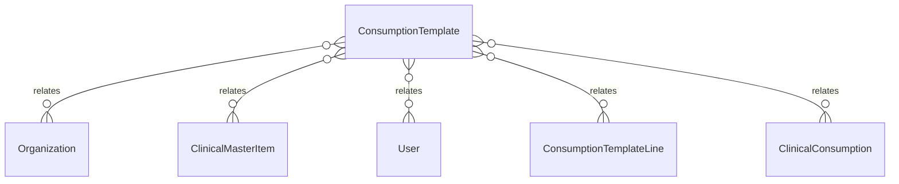

# `ConsumptionTemplate` → `consumption_templates`

<!-- generated by .kb/generate.mjs — do not edit by hand -->

Declared at `packages/db/prisma/schema/consumption.prisma:124`.

| property | value |
| --- | --- |
| table | `consumption_templates` |
| tenant-scoped | yes — has `organizationId` |
| RLS | `org` policy |
| columns | 13 |
| relations | 5 |

## Columns

| column | type | definition |
| --- | --- | --- |
| `id` | `String` | `id String @id @default(uuid()) @db.Uuid` |
| `organizationId` | `String` | `organizationId String @map("organization_id") @db.Uuid` |
| `itemId` | `String` | `itemId String @map("item_id") @db.Uuid` |
| `name` | `String` | `name String @db.VarChar(255)` |
| `version` | `Int` | `version Int @default(1)` |
| `status` | `ConsumptionTemplateStatus` | `status ConsumptionTemplateStatus @default(DRAFT)` |
| `effectiveFrom` | `DateTime` | `effectiveFrom DateTime @map("effective_from") @db.Date` |
| `effectiveTo` | `DateTime?` | `effectiveTo DateTime? @map("effective_to") @db.Date` |
| `notes` | `String?` | `notes String? @db.Text` |
| `createdAt` | `DateTime` | `createdAt DateTime @default(now()) @map("created_at") @db.Timestamptz(6)` |
| `updatedAt` | `DateTime` | `updatedAt DateTime @updatedAt @map("updated_at") @db.Timestamptz(6)` |
| `updatedBy` | `String?` | `updatedBy String? @map("updated_by") @db.Uuid` |
| `deletedAt` | `DateTime?` | `deletedAt DateTime? @map("deleted_at") @db.Timestamptz(6)` |

## Relations

| field | target | definition |
| --- | --- | --- |
| `organization` | [`Organization`](Organization.md) | `organization Organization @relation(fields: [organizationId], references: [id], onDelete: Cascade)` |
| `item` | [`ClinicalMasterItem`](ClinicalMasterItem.md) | `item ClinicalMasterItem @relation("ConsumptionTemplateItem", fields: [itemId], references: [id], onDelete: Restrict)` |
| `updater` | [`User`](User.md) | `updater User? @relation("ConsumptionTemplateUpdatedBy", fields: [updatedBy], references: [id], onDelete: SetNull)` |
| `lines` | [`ConsumptionTemplateLine`](ConsumptionTemplateLine.md) | `lines ConsumptionTemplateLine[]` |
| `consumptions` | [`ClinicalConsumption`](ClinicalConsumption.md) | `consumptions ClinicalConsumption[]` |

## Indexes and constraints

- `@@unique([organizationId, itemId, version])`
- `@@unique([organizationId, id])`
- `@@index([organizationId, itemId, effectiveFrom])`
- `@@index([organizationId, status])`

## Neighbourhood

