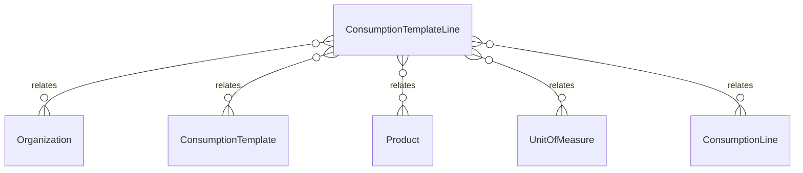

# `ConsumptionTemplateLine` → `consumption_template_lines`

<!-- generated by .kb/generate.mjs — do not edit by hand -->

Declared at `packages/db/prisma/schema/consumption.prisma:189`.

| property | value |
| --- | --- |
| table | `consumption_template_lines` |
| tenant-scoped | yes — has `organizationId` |
| RLS | `org` policy |
| columns | 11 |
| relations | 5 |

## Columns

| column | type | definition |
| --- | --- | --- |
| `id` | `String` | `id String @id @default(uuid()) @db.Uuid` |
| `organizationId` | `String` | `organizationId String @map("organization_id") @db.Uuid` |
| `templateId` | `String` | `templateId String @map("template_id") @db.Uuid` |
| `productId` | `String` | `productId String @map("product_id") @db.Uuid` |
| `quantity` | `Decimal` | `quantity Decimal @db.Decimal(18, 6)` |
| `unitId` | `String` | `unitId String @map("unit_id") @db.Uuid` |
| `isOptional` | `Boolean` | `isOptional Boolean @default(false) @map("is_optional")` |
| `displayOrder` | `Int` | `displayOrder Int @default(0) @map("display_order")` |
| `note` | `String?` | `note String? @db.Text` |
| `createdAt` | `DateTime` | `createdAt DateTime @default(now()) @map("created_at") @db.Timestamptz(6)` |
| `updatedAt` | `DateTime` | `updatedAt DateTime @updatedAt @map("updated_at") @db.Timestamptz(6)` |

## Relations

| field | target | definition |
| --- | --- | --- |
| `organization` | [`Organization`](Organization.md) | `organization Organization @relation(fields: [organizationId], references: [id], onDelete: Cascade)` |
| `template` | [`ConsumptionTemplate`](ConsumptionTemplate.md) | `template ConsumptionTemplate @relation(fields: [organizationId, templateId], references: [organizationId, id], onDelete: Cascade)` |
| `product` | [`Product`](Product.md) | `product Product @relation("ConsumptionTemplateLineProduct", fields: [productId], references: [id], onDelete: Restrict)` |
| `unit` | [`UnitOfMeasure`](UnitOfMeasure.md) | `unit UnitOfMeasure @relation("ConsumptionTemplateLineUnit", fields: [unitId], references: [id], onDelete: Restrict)` |
| `consumptionLines` | [`ConsumptionLine`](ConsumptionLine.md) | `consumptionLines ConsumptionLine[]` |

## Indexes and constraints

- `@@unique([organizationId, templateId, productId])`
- `@@unique([organizationId, id])`
- `@@index([organizationId, templateId, displayOrder])`
- `@@index([organizationId, productId])`

## Neighbourhood

