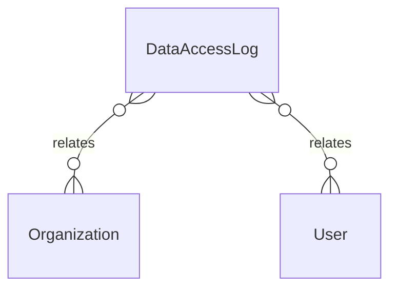

# `DataAccessLog` → `data_access_logs`

<!-- generated by .kb/generate.mjs — do not edit by hand -->

Declared at `packages/db/prisma/schema/settings-files-audit.prisma:312`.

| property | value |
| --- | --- |
| table | `data_access_logs` |
| tenant-scoped | yes — has `organizationId` |
| RLS | `org` policy |
| columns | 15 |
| relations | 2 |

## Columns

| column | type | definition |
| --- | --- | --- |
| `id` | `String` | `id String @id @default(uuid()) @db.Uuid` |
| `organizationId` | `String` | `organizationId String @map("organization_id") @db.Uuid` |
| `branchId` | `String?` | `branchId String? @map("branch_id") @db.Uuid` |
| `actorUserId` | `String?` | `actorUserId String? @map("actor_user_id") @db.Uuid` |
| `impersonatedByUserId` | `String?` | `impersonatedByUserId String? @map("impersonated_by_user_id") @db.Uuid` |
| `patientId` | `String?` | `patientId String? @map("patient_id") @db.Uuid` |
| `accessType` | `DataAccessType` | `accessType DataAccessType @map("access_type")` |
| `resource` | `DataAccessResource` | `resource DataAccessResource` |
| `resourceId` | `String?` | `resourceId String? @map("resource_id") @db.Uuid` |
| `resultCount` | `Int` | `resultCount Int @default(1) @map("result_count")` |
| `queryHash` | `String?` | `queryHash String? @map("query_hash") @db.Char(64)` |
| `route` | `String?` | `route String? @db.VarChar(128)` |
| `ipAddress` | `String?` | `ipAddress String? @map("ip_address") @db.Inet` |
| `userAgent` | `String?` | `userAgent String? @map("user_agent") @db.VarChar(512)` |
| `occurredAt` | `DateTime` | `occurredAt DateTime @default(now()) @map("occurred_at") @db.Timestamptz(6)` |

## Relations

| field | target | definition |
| --- | --- | --- |
| `organization` | [`Organization`](Organization.md) | `organization Organization @relation(fields: [organizationId], references: [id], onDelete: Cascade)` |
| `actor` | [`User`](User.md) | `actor User? @relation(fields: [actorUserId], references: [id], onDelete: SetNull)` |

## Indexes and constraints

- `@@index([organizationId, patientId, occurredAt])`
- `@@index([organizationId, actorUserId, occurredAt])`

## Neighbourhood

