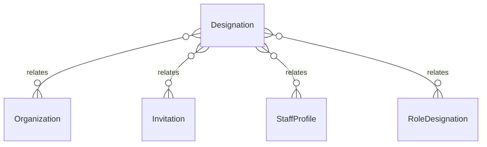

# `Designation` → `designations`

<!-- generated by .kb/generate.mjs — do not edit by hand -->

Declared at `packages/db/prisma/schema.prisma:1538`.

| property | value |
| --- | --- |
| table | `designations` |
| tenant-scoped | yes — has `organizationId` |
| RLS | `platform_extensible` policy |
| columns | 8 |
| relations | 4 |

## Columns

| column | type | definition |
| --- | --- | --- |
| `id` | `String` | `id String @id @default(uuid()) @db.Uuid` |
| `organizationId` | `String?` | `organizationId String? @map("organization_id") @db.Uuid` |
| `code` | `String` | `code String @db.VarChar(64)` |
| `name` | `String` | `name String @db.VarChar(128)` |
| `isActive` | `Boolean` | `isActive Boolean @default(true) @map("is_active")` |
| `createdAt` | `DateTime` | `createdAt DateTime @default(now()) @map("created_at") @db.Timestamptz(6)` |
| `updatedAt` | `DateTime` | `updatedAt DateTime @updatedAt @map("updated_at") @db.Timestamptz(6)` |
| `deletedAt` | `DateTime?` | `deletedAt DateTime? @map("deleted_at") @db.Timestamptz(6)` |

## Relations

| field | target | definition |
| --- | --- | --- |
| `organization` | [`Organization`](Organization.md) | `organization Organization? @relation(fields: [organizationId], references: [id], onDelete: Cascade)` |
| `invitations` | [`Invitation`](Invitation.md) | `invitations Invitation[]` |
| `staffProfiles` | [`StaffProfile`](StaffProfile.md) | `staffProfiles StaffProfile[]` |
| `roles` | [`RoleDesignation`](RoleDesignation.md) | `roles RoleDesignation[]` |

## Indexes and constraints

- `@@unique([organizationId, code])`
- `@@index([organizationId, isActive])`

## Neighbourhood

