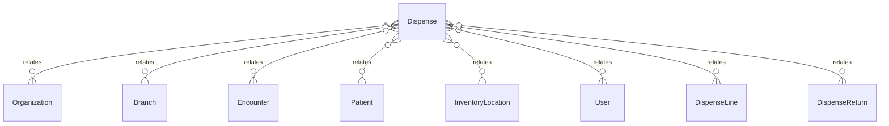

# `Dispense` → `dispenses`

<!-- generated by .kb/generate.mjs — do not edit by hand -->

Declared at `packages/db/prisma/schema/pharmacy.prisma:155`.

| property | value |
| --- | --- |
| table | `dispenses` |
| tenant-scoped | yes — has `organizationId` |
| RLS | `org` policy |
| columns | 14 |
| relations | 8 |

## Columns

| column | type | definition |
| --- | --- | --- |
| `id` | `String` | `id String @id @default(uuid()) @db.Uuid` |
| `organizationId` | `String` | `organizationId String @map("organization_id") @db.Uuid` |
| `branchId` | `String` | `branchId String @map("branch_id") @db.Uuid` |
| `dispenseNumber` | `String` | `dispenseNumber String @map("dispense_number") @db.VarChar(64)` |
| `kind` | `DispenseKind` | `kind DispenseKind` |
| `status` | `DispenseStatus` | `status DispenseStatus @default(DISPENSED)` |
| `encounterId` | `String?` | `encounterId String? @map("encounter_id") @db.Uuid` |
| `patientId` | `String?` | `patientId String? @map("patient_id") @db.Uuid` |
| `locationId` | `String` | `locationId String @map("location_id") @db.Uuid` |
| `dispensedById` | `String` | `dispensedById String @map("dispensed_by_id") @db.Uuid` |
| `dispensedAt` | `DateTime` | `dispensedAt DateTime @default(now()) @map("dispensed_at") @db.Timestamptz(6)` |
| `notes` | `String?` | `notes String? @db.Text` |
| `createdAt` | `DateTime` | `createdAt DateTime @default(now()) @map("created_at") @db.Timestamptz(6)` |
| `updatedAt` | `DateTime` | `updatedAt DateTime @updatedAt @map("updated_at") @db.Timestamptz(6)` |

## Relations

| field | target | definition |
| --- | --- | --- |
| `organization` | [`Organization`](Organization.md) | `organization Organization @relation(fields: [organizationId], references: [id], onDelete: Cascade)` |
| `branch` | [`Branch`](Branch.md) | `branch Branch @relation(fields: [organizationId, branchId], references: [organizationId, id], onDelete: Cascade)` |
| `encounter` | [`Encounter`](Encounter.md) | `encounter Encounter? @relation(fields: [organizationId, encounterId], references: [organizationId, id], onDelete: Restrict)` |
| `patient` | [`Patient`](Patient.md) | `patient Patient? @relation(fields: [organizationId, patientId], references: [organizationId, id], onDelete: Restrict)` |
| `location` | [`InventoryLocation`](InventoryLocation.md) | `location InventoryLocation @relation("DispenseLocation", fields: [organizationId, branchId, locationId], references: [organizationId, branchId, id], onDelete: Restrict)` |
| `dispensedBy` | [`User`](User.md) | `dispensedBy User @relation("DispenseDispensedBy", fields: [dispensedById], references: [id], onDelete: Restrict)` |
| `lines` | [`DispenseLine`](DispenseLine.md) | `lines DispenseLine[]` |
| `returns` | [`DispenseReturn`](DispenseReturn.md) | `returns DispenseReturn[]` |

## Indexes and constraints

- `@@unique([organizationId, dispenseNumber])`
- `@@unique([organizationId, id])`
- `@@unique([organizationId, branchId, id])`
- `@@index([organizationId, branchId, dispensedAt(sort: Desc)])`
- `@@index([organizationId, encounterId])`
- `@@index([organizationId, patientId, dispensedAt(sort: Desc)])`

## Neighbourhood

