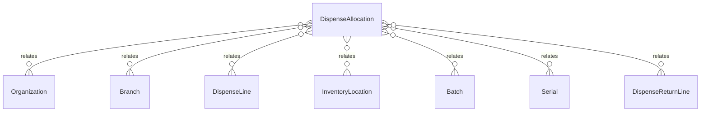

# `DispenseAllocation` → `dispense_allocations`

<!-- generated by .kb/generate.mjs — do not edit by hand -->

Declared at `packages/db/prisma/schema/pharmacy.prisma:308`.

| property | value |
| --- | --- |
| table | `dispense_allocations` |
| tenant-scoped | yes — has `organizationId` |
| RLS | `org` policy |
| columns | 11 |
| relations | 7 |

## Columns

| column | type | definition |
| --- | --- | --- |
| `id` | `String` | `id String @id @default(uuid()) @db.Uuid` |
| `organizationId` | `String` | `organizationId String @map("organization_id") @db.Uuid` |
| `branchId` | `String` | `branchId String @map("branch_id") @db.Uuid` |
| `dispenseLineId` | `String` | `dispenseLineId String @map("dispense_line_id") @db.Uuid` |
| `locationId` | `String` | `locationId String @map("location_id") @db.Uuid` |
| `batchId` | `String?` | `batchId String? @map("batch_id") @db.Uuid` |
| `serialId` | `String?` | `serialId String? @map("serial_id") @db.Uuid` |
| `quantityBase` | `Decimal` | `quantityBase Decimal @map("quantity_base") @db.Decimal(18, 6)` |
| `isOverride` | `Boolean` | `isOverride Boolean @default(false) @map("is_override")` |
| `overrideReason` | `String?` | `overrideReason String? @map("override_reason") @db.Text` |
| `createdAt` | `DateTime` | `createdAt DateTime @default(now()) @map("created_at") @db.Timestamptz(6)` |

## Relations

| field | target | definition |
| --- | --- | --- |
| `organization` | [`Organization`](Organization.md) | `organization Organization @relation(fields: [organizationId], references: [id], onDelete: Cascade)` |
| `branch` | [`Branch`](Branch.md) | `branch Branch @relation(fields: [organizationId, branchId], references: [organizationId, id], onDelete: Cascade)` |
| `dispenseLine` | [`DispenseLine`](DispenseLine.md) | `dispenseLine DispenseLine @relation(fields: [organizationId, dispenseLineId], references: [organizationId, id], onDelete: Cascade)` |
| `location` | [`InventoryLocation`](InventoryLocation.md) | `location InventoryLocation @relation("DispenseAllocationLocation", fields: [organizationId, branchId, locationId], references: [organizationId, branchId, id], onDelete: Restrict)` |
| `batch` | [`Batch`](Batch.md) | `batch Batch? @relation("DispenseAllocationBatch", fields: [organizationId, branchId, batchId], references: [organizationId, branchId, id], onDelete: Restrict)` |
| `serial` | [`Serial`](Serial.md) | `serial Serial? @relation("DispenseAllocationSerial", fields: [organizationId, branchId, serialId], references: [organizationId, branchId, id], onDelete: Restrict)` |
| `returnLines` | [`DispenseReturnLine`](DispenseReturnLine.md) | `returnLines DispenseReturnLine[]` |

## Indexes and constraints

- `@@unique([organizationId, id])`
- `@@unique([organizationId, branchId, id])`
- `@@index([organizationId, dispenseLineId])`
- `@@index([organizationId, batchId])`
- `@@index([organizationId, serialId])`

## Neighbourhood

