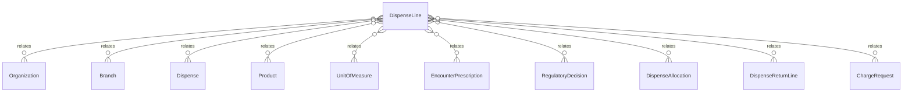

# `DispenseLine` → `dispense_lines`

<!-- generated by .kb/generate.mjs — do not edit by hand -->

Declared at `packages/db/prisma/schema/pharmacy.prisma:214`.

| property | value |
| --- | --- |
| table | `dispense_lines` |
| tenant-scoped | yes — has `organizationId` |
| RLS | `org` policy |
| columns | 17 |
| relations | 11 |

## Columns

| column | type | definition |
| --- | --- | --- |
| `id` | `String` | `id String @id @default(uuid()) @db.Uuid` |
| `organizationId` | `String` | `organizationId String @map("organization_id") @db.Uuid` |
| `branchId` | `String` | `branchId String @map("branch_id") @db.Uuid` |
| `dispenseId` | `String` | `dispenseId String @map("dispense_id") @db.Uuid` |
| `lineNumber` | `Int` | `lineNumber Int @map("line_number") @db.SmallInt` |
| `encounterPrescriptionId` | `String?` | `encounterPrescriptionId String? @map("encounter_prescription_id") @db.Uuid` |
| `productId` | `String` | `productId String @map("product_id") @db.Uuid` |
| `substitutedForProductId` | `String?` | `substitutedForProductId String? @map("substituted_for_product_id") @db.Uuid` |
| `substitutionReason` | `String?` | `substitutionReason String? @map("substitution_reason") @db.Text` |
| `quantityEntered` | `Decimal` | `quantityEntered Decimal @map("quantity_entered") @db.Decimal(18, 6)` |
| `unitId` | `String` | `unitId String @map("unit_id") @db.Uuid` |
| `quantityBase` | `Decimal` | `quantityBase Decimal @map("quantity_base") @db.Decimal(18, 6)` |
| `returnedQuantityBase` | `Decimal` | `returnedQuantityBase Decimal @default(0) @map("returned_quantity_base") @db.Decimal(18, 6)` |
| `regulatoryDecisionId` | `String` | `regulatoryDecisionId String @map("regulatory_decision_id") @db.Uuid` |
| `labelInstructions` | `String?` | `labelInstructions String? @map("label_instructions") @db.Text` |
| `createdAt` | `DateTime` | `createdAt DateTime @default(now()) @map("created_at") @db.Timestamptz(6)` |
| `updatedAt` | `DateTime` | `updatedAt DateTime @updatedAt @map("updated_at") @db.Timestamptz(6)` |

## Relations

| field | target | definition |
| --- | --- | --- |
| `organization` | [`Organization`](Organization.md) | `organization Organization @relation(fields: [organizationId], references: [id], onDelete: Cascade)` |
| `branch` | [`Branch`](Branch.md) | `branch Branch @relation(fields: [organizationId, branchId], references: [organizationId, id], onDelete: Cascade)` |
| `dispense` | [`Dispense`](Dispense.md) | `dispense Dispense @relation(fields: [organizationId, dispenseId], references: [organizationId, id], onDelete: Cascade)` |
| `product` | [`Product`](Product.md) | `product Product @relation("DispenseLineProduct", fields: [productId], references: [id], onDelete: Restrict)` |
| `substitutedForProduct` | [`Product`](Product.md) | `substitutedForProduct Product? @relation("DispenseLineSubstitutedFor", fields: [substitutedForProductId], references: [id], onDelete: Restrict)` |
| `unit` | [`UnitOfMeasure`](UnitOfMeasure.md) | `unit UnitOfMeasure @relation("DispenseLineUnit", fields: [unitId], references: [id], onDelete: Restrict)` |
| `encounterPrescription` | [`EncounterPrescription`](EncounterPrescription.md) | `encounterPrescription EncounterPrescription? @relation(fields: [organizationId, encounterPrescriptionId], references: [organizationId, id], onDelete: Restrict)` |
| `regulatoryDecision` | [`RegulatoryDecision`](RegulatoryDecision.md) | `regulatoryDecision RegulatoryDecision @relation(fields: [organizationId, regulatoryDecisionId], references: [organizationId, id], onDelete: Restrict)` |
| `allocations` | [`DispenseAllocation`](DispenseAllocation.md) | `allocations DispenseAllocation[]` |
| `returnLines` | [`DispenseReturnLine`](DispenseReturnLine.md) | `returnLines DispenseReturnLine[]` |
| `chargeRequests` | [`ChargeRequest`](ChargeRequest.md) | `chargeRequests ChargeRequest[]` |

## Indexes and constraints

- `@@unique([organizationId, dispenseId, lineNumber])`
- `@@unique([organizationId, id])`
- `@@unique([organizationId, branchId, id])`
- `@@index([organizationId, dispenseId])`
- `@@index([organizationId, productId])`
- `@@index([organizationId, encounterPrescriptionId])`

## Neighbourhood

