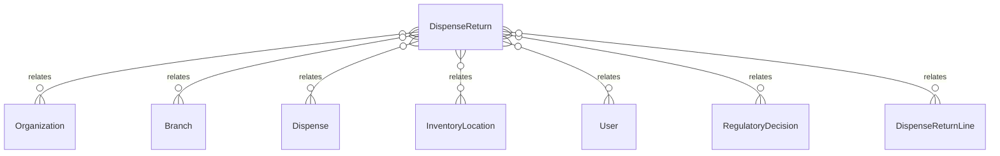

# `DispenseReturn` → `dispense_returns`

<!-- generated by .kb/generate.mjs — do not edit by hand -->

Declared at `packages/db/prisma/schema/pharmacy.prisma:375`.

| property | value |
| --- | --- |
| table | `dispense_returns` |
| tenant-scoped | yes — has `organizationId` |
| RLS | `org` policy |
| columns | 12 |
| relations | 7 |

## Columns

| column | type | definition |
| --- | --- | --- |
| `id` | `String` | `id String @id @default(uuid()) @db.Uuid` |
| `organizationId` | `String` | `organizationId String @map("organization_id") @db.Uuid` |
| `branchId` | `String` | `branchId String @map("branch_id") @db.Uuid` |
| `dispenseId` | `String` | `dispenseId String @map("dispense_id") @db.Uuid` |
| `disposition` | `DispenseReturnDisposition` | `disposition DispenseReturnDisposition @default(QUARANTINED)` |
| `locationId` | `String` | `locationId String @map("location_id") @db.Uuid` |
| `reason` | `String` | `reason String @db.Text` |
| `returnedAt` | `DateTime` | `returnedAt DateTime @default(now()) @map("returned_at") @db.Timestamptz(6)` |
| `receivedById` | `String` | `receivedById String @map("received_by_id") @db.Uuid` |
| `regulatoryDecisionId` | `String?` | `regulatoryDecisionId String? @map("regulatory_decision_id") @db.Uuid` |
| `createdAt` | `DateTime` | `createdAt DateTime @default(now()) @map("created_at") @db.Timestamptz(6)` |
| `updatedAt` | `DateTime` | `updatedAt DateTime @updatedAt @map("updated_at") @db.Timestamptz(6)` |

## Relations

| field | target | definition |
| --- | --- | --- |
| `organization` | [`Organization`](Organization.md) | `organization Organization @relation(fields: [organizationId], references: [id], onDelete: Cascade)` |
| `branch` | [`Branch`](Branch.md) | `branch Branch @relation(fields: [organizationId, branchId], references: [organizationId, id], onDelete: Cascade)` |
| `dispense` | [`Dispense`](Dispense.md) | `dispense Dispense @relation(fields: [organizationId, dispenseId], references: [organizationId, id], onDelete: Restrict)` |
| `location` | [`InventoryLocation`](InventoryLocation.md) | `location InventoryLocation @relation("DispenseReturnLocation", fields: [organizationId, branchId, locationId], references: [organizationId, branchId, id], onDelete: Restrict)` |
| `receivedBy` | [`User`](User.md) | `receivedBy User @relation("DispenseReturnReceivedBy", fields: [receivedById], references: [id], onDelete: Restrict)` |
| `regulatoryDecision` | [`RegulatoryDecision`](RegulatoryDecision.md) | `regulatoryDecision RegulatoryDecision? @relation(fields: [organizationId, regulatoryDecisionId], references: [organizationId, id], onDelete: Restrict)` |
| `lines` | [`DispenseReturnLine`](DispenseReturnLine.md) | `lines DispenseReturnLine[]` |

## Indexes and constraints

- `@@unique([organizationId, id])`
- `@@unique([organizationId, branchId, id])`
- `@@index([organizationId, dispenseId])`
- `@@index([organizationId, branchId, returnedAt(sort: Desc)])`

## Neighbourhood

