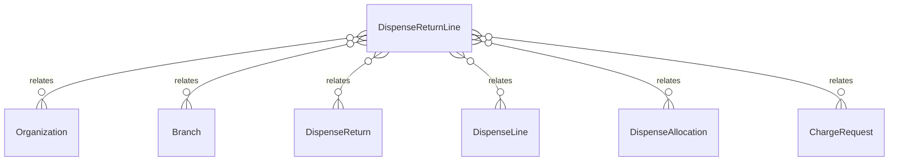

# `DispenseReturnLine` → `dispense_return_lines`

<!-- generated by .kb/generate.mjs — do not edit by hand -->

Declared at `packages/db/prisma/schema/pharmacy.prisma:420`.

| property | value |
| --- | --- |
| table | `dispense_return_lines` |
| tenant-scoped | yes — has `organizationId` |
| RLS | `org` policy |
| columns | 8 |
| relations | 6 |

## Columns

| column | type | definition |
| --- | --- | --- |
| `id` | `String` | `id String @id @default(uuid()) @db.Uuid` |
| `organizationId` | `String` | `organizationId String @map("organization_id") @db.Uuid` |
| `branchId` | `String` | `branchId String @map("branch_id") @db.Uuid` |
| `dispenseReturnId` | `String` | `dispenseReturnId String @map("dispense_return_id") @db.Uuid` |
| `dispenseLineId` | `String` | `dispenseLineId String @map("dispense_line_id") @db.Uuid` |
| `dispenseAllocationId` | `String?` | `dispenseAllocationId String? @map("dispense_allocation_id") @db.Uuid` |
| `quantityBase` | `Decimal` | `quantityBase Decimal @map("quantity_base") @db.Decimal(18, 6)` |
| `createdAt` | `DateTime` | `createdAt DateTime @default(now()) @map("created_at") @db.Timestamptz(6)` |

## Relations

| field | target | definition |
| --- | --- | --- |
| `organization` | [`Organization`](Organization.md) | `organization Organization @relation(fields: [organizationId], references: [id], onDelete: Cascade)` |
| `branch` | [`Branch`](Branch.md) | `branch Branch @relation(fields: [organizationId, branchId], references: [organizationId, id], onDelete: Cascade)` |
| `dispenseReturn` | [`DispenseReturn`](DispenseReturn.md) | `dispenseReturn DispenseReturn @relation(fields: [organizationId, dispenseReturnId], references: [organizationId, id], onDelete: Cascade)` |
| `dispenseLine` | [`DispenseLine`](DispenseLine.md) | `dispenseLine DispenseLine @relation(fields: [organizationId, dispenseLineId], references: [organizationId, id], onDelete: Restrict)` |
| `dispenseAllocation` | [`DispenseAllocation`](DispenseAllocation.md) | `dispenseAllocation DispenseAllocation? @relation(fields: [organizationId, dispenseAllocationId], references: [organizationId, id], onDelete: Restrict)` |
| `chargeRequests` | [`ChargeRequest`](ChargeRequest.md) | `chargeRequests ChargeRequest[]` |

## Indexes and constraints

- `@@unique([organizationId, id])`
- `@@index([organizationId, dispenseReturnId])`
- `@@index([organizationId, dispenseLineId])`

## Neighbourhood

