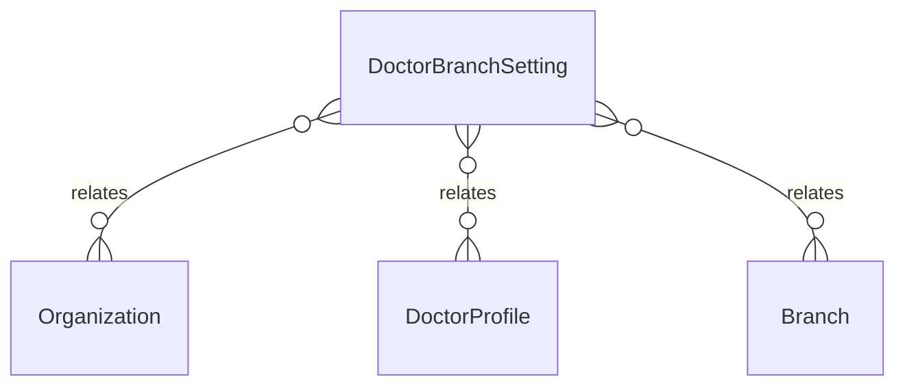

# `DoctorBranchSetting` → `doctor_branch_settings`

<!-- generated by .kb/generate.mjs — do not edit by hand -->

Declared at `packages/db/prisma/schema.prisma:1852`.

| property | value |
| --- | --- |
| table | `doctor_branch_settings` |
| tenant-scoped | yes — has `organizationId` |
| RLS | `org` policy |
| columns | 10 |
| relations | 3 |

## Columns

| column | type | definition |
| --- | --- | --- |
| `id` | `String` | `id String @id @default(uuid()) @db.Uuid` |
| `organizationId` | `String` | `organizationId String @map("organization_id") @db.Uuid` |
| `doctorProfileId` | `String` | `doctorProfileId String @map("doctor_profile_id") @db.Uuid` |
| `branchId` | `String` | `branchId String @map("branch_id") @db.Uuid` |
| `consultationFee` | `Decimal?` | `consultationFee Decimal? @map("consultation_fee") @db.Decimal(14, 2)` |
| `followUpFee` | `Decimal?` | `followUpFee Decimal? @map("follow_up_fee") @db.Decimal(14, 2)` |
| `followUpFreeDays` | `Int?` | `followUpFreeDays Int? @map("follow_up_free_days") @db.SmallInt` |
| `isActive` | `Boolean` | `isActive Boolean @default(true) @map("is_active")` |
| `createdAt` | `DateTime` | `createdAt DateTime @default(now()) @map("created_at") @db.Timestamptz(6)` |
| `updatedAt` | `DateTime` | `updatedAt DateTime @updatedAt @map("updated_at") @db.Timestamptz(6)` |

## Relations

| field | target | definition |
| --- | --- | --- |
| `organization` | [`Organization`](Organization.md) | `organization Organization @relation(fields: [organizationId], references: [id], onDelete: Cascade)` |
| `doctorProfile` | [`DoctorProfile`](DoctorProfile.md) | `doctorProfile DoctorProfile @relation(fields: [doctorProfileId], references: [id], onDelete: Cascade)` |
| `branch` | [`Branch`](Branch.md) | `branch Branch @relation(fields: [branchId], references: [id], onDelete: Cascade)` |

## Indexes and constraints

- `@@unique([organizationId, doctorProfileId, branchId])`
- `@@index([organizationId, branchId, isActive])`

## Neighbourhood

