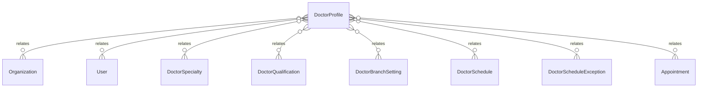

# `DoctorProfile` → `doctor_profiles`

<!-- generated by .kb/generate.mjs — do not edit by hand -->

Declared at `packages/db/prisma/schema.prisma:1674`.

| property | value |
| --- | --- |
| table | `doctor_profiles` |
| tenant-scoped | yes — has `organizationId` |
| RLS | `org` policy |
| columns | 13 |
| relations | 8 |

## Columns

| column | type | definition |
| --- | --- | --- |
| `id` | `String` | `id String @id @default(uuid()) @db.Uuid` |
| `organizationId` | `String` | `organizationId String @map("organization_id") @db.Uuid` |
| `userId` | `String` | `userId String @map("user_id") @db.Uuid` |
| `registrationNumber` | `String?` | `registrationNumber String? @map("registration_number") @db.VarChar(64)` |
| `registrationCouncil` | `String?` | `registrationCouncil String? @map("registration_council") @db.VarChar(255)` |
| `registrationValidTill` | `DateTime?` | `registrationValidTill DateTime? @map("registration_valid_till") @db.Date` |
| `experienceYears` | `Int?` | `experienceYears Int? @map("experience_years") @db.SmallInt` |
| `bio` | `String?` | `bio String? @db.Text` |
| `signatureFileId` | `String?` | `signatureFileId String? @map("signature_file_id") @db.Uuid` |
| `status` | `DoctorStatus` | `status DoctorStatus @default(ACTIVE)` |
| `createdAt` | `DateTime` | `createdAt DateTime @default(now()) @map("created_at") @db.Timestamptz(6)` |
| `updatedAt` | `DateTime` | `updatedAt DateTime @updatedAt @map("updated_at") @db.Timestamptz(6)` |
| `deletedAt` | `DateTime?` | `deletedAt DateTime? @map("deleted_at") @db.Timestamptz(6)` |

## Relations

| field | target | definition |
| --- | --- | --- |
| `organization` | [`Organization`](Organization.md) | `organization Organization @relation(fields: [organizationId], references: [id], onDelete: Cascade)` |
| `user` | [`User`](User.md) | `user User @relation(fields: [userId], references: [id], onDelete: Cascade)` |
| `specialties` | [`DoctorSpecialty`](DoctorSpecialty.md) | `specialties DoctorSpecialty[]` |
| `qualifications` | [`DoctorQualification`](DoctorQualification.md) | `qualifications DoctorQualification[]` |
| `branchSettings` | [`DoctorBranchSetting`](DoctorBranchSetting.md) | `branchSettings DoctorBranchSetting[]` |
| `schedules` | [`DoctorSchedule`](DoctorSchedule.md) | `schedules DoctorSchedule[]` |
| `exceptions` | [`DoctorScheduleException`](DoctorScheduleException.md) | `exceptions DoctorScheduleException[]` |
| `appointments` | [`Appointment`](Appointment.md) | `appointments Appointment[]` |

## Indexes and constraints

- `@@unique([organizationId, userId])`
- `@@unique([organizationId, id])`
- `@@unique([organizationId, registrationNumber])`
- `@@index([organizationId, status])`

## Neighbourhood

