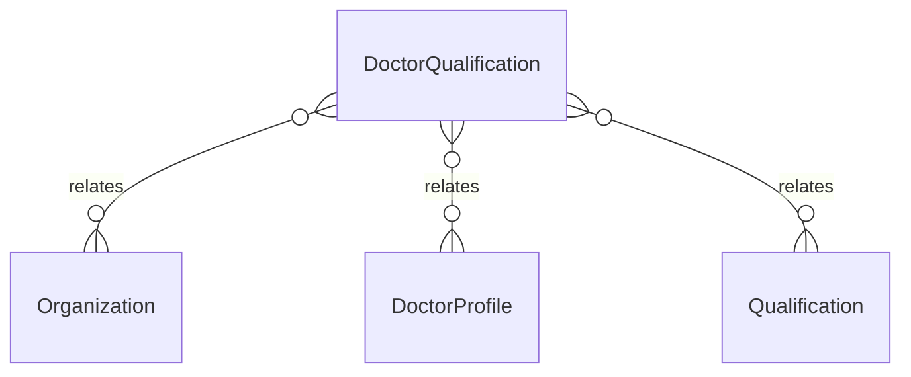

# `DoctorQualification` → `doctor_qualifications`

<!-- generated by .kb/generate.mjs — do not edit by hand -->

Declared at `packages/db/prisma/schema/doctors.prisma:314`.

| property | value |
| --- | --- |
| table | `doctor_qualifications` |
| tenant-scoped | yes — has `organizationId` |
| RLS | `org` policy |
| columns | 7 |
| relations | 3 |

## Columns

| column | type | definition |
| --- | --- | --- |
| `id` | `String` | `id String @id @default(uuid()) @db.Uuid` |
| `organizationId` | `String` | `organizationId String @map("organization_id") @db.Uuid` |
| `doctorProfileId` | `String` | `doctorProfileId String @map("doctor_profile_id") @db.Uuid` |
| `qualificationId` | `String` | `qualificationId String @map("qualification_id") @db.Uuid` |
| `institute` | `String?` | `institute String? @db.VarChar(255)` |
| `yearOfCompletion` | `Int?` | `yearOfCompletion Int? @map("year_of_completion") @db.SmallInt` |
| `createdAt` | `DateTime` | `createdAt DateTime @default(now()) @map("created_at") @db.Timestamptz(6)` |

## Relations

| field | target | definition |
| --- | --- | --- |
| `organization` | [`Organization`](Organization.md) | `organization Organization @relation(fields: [organizationId], references: [id], onDelete: Cascade)` |
| `doctorProfile` | [`DoctorProfile`](DoctorProfile.md) | `doctorProfile DoctorProfile @relation(fields: [doctorProfileId], references: [id], onDelete: Cascade)` |
| `qualification` | [`Qualification`](Qualification.md) | `qualification Qualification @relation(fields: [qualificationId], references: [id], onDelete: Restrict)` |

## Indexes and constraints

- `@@unique([organizationId, doctorProfileId, qualificationId, institute])`

## Neighbourhood

