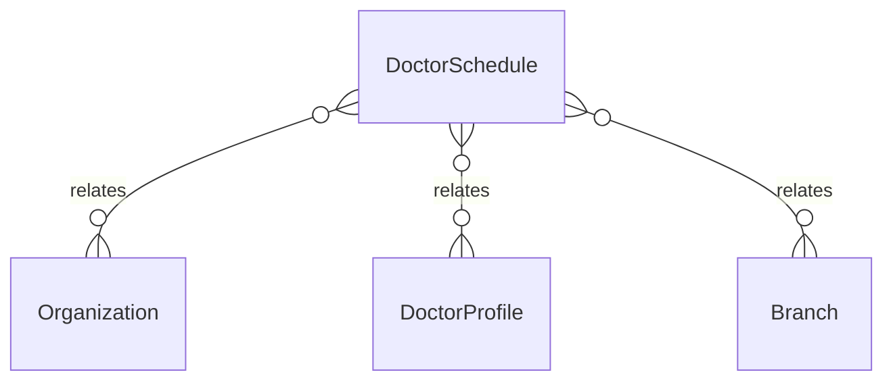

# `DoctorSchedule` → `doctor_schedules`

<!-- generated by .kb/generate.mjs — do not edit by hand -->

Declared at `packages/db/prisma/schema/doctors.prisma:493`.

| property | value |
| --- | --- |
| table | `doctor_schedules` |
| tenant-scoped | yes — has `organizationId` |
| RLS | `branch` policy |
| columns | 14 |
| relations | 3 |

## Columns

| column | type | definition |
| --- | --- | --- |
| `id` | `String` | `id String @id @default(uuid()) @db.Uuid` |
| `organizationId` | `String` | `organizationId String @map("organization_id") @db.Uuid` |
| `doctorProfileId` | `String` | `doctorProfileId String @map("doctor_profile_id") @db.Uuid` |
| `branchId` | `String` | `branchId String @map("branch_id") @db.Uuid` |
| `dayOfWeek` | `Int` | `dayOfWeek Int @map("day_of_week") @db.SmallInt` |
| `startTime` | `DateTime` | `startTime DateTime @map("start_time") @db.Time(0)` |
| `endTime` | `DateTime` | `endTime DateTime @map("end_time") @db.Time(0)` |
| `slotMinutes` | `Int?` | `slotMinutes Int? @map("slot_minutes") @db.SmallInt` |
| `maxPatients` | `Int?` | `maxPatients Int? @map("max_patients") @db.SmallInt` |
| `validFrom` | `DateTime` | `validFrom DateTime @map("valid_from") @db.Date` |
| `validTo` | `DateTime?` | `validTo DateTime? @map("valid_to") @db.Date` |
| `isActive` | `Boolean` | `isActive Boolean @default(true) @map("is_active")` |
| `createdAt` | `DateTime` | `createdAt DateTime @default(now()) @map("created_at") @db.Timestamptz(6)` |
| `updatedAt` | `DateTime` | `updatedAt DateTime @updatedAt @map("updated_at") @db.Timestamptz(6)` |

## Relations

| field | target | definition |
| --- | --- | --- |
| `organization` | [`Organization`](Organization.md) | `organization Organization @relation(fields: [organizationId], references: [id], onDelete: Cascade)` |
| `doctorProfile` | [`DoctorProfile`](DoctorProfile.md) | `doctorProfile DoctorProfile @relation(fields: [doctorProfileId], references: [id], onDelete: Cascade)` |
| `branch` | [`Branch`](Branch.md) | `branch Branch @relation(fields: [branchId], references: [id], onDelete: Cascade)` |

## Indexes and constraints

- `@@index([organizationId, branchId, dayOfWeek])`
- `@@index([doctorProfileId, dayOfWeek])`

## Neighbourhood

