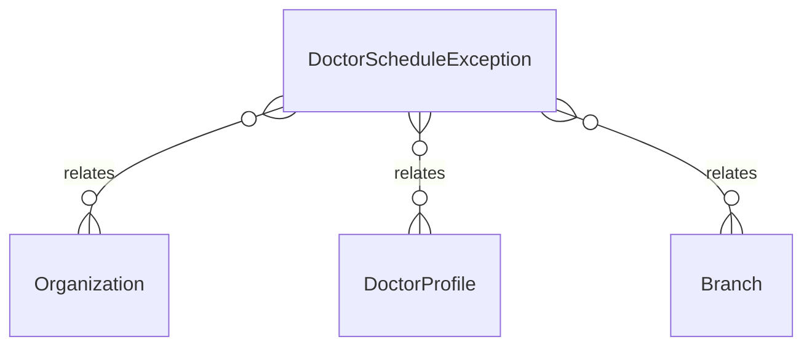

# `DoctorScheduleException` → `doctor_schedule_exceptions`

<!-- generated by .kb/generate.mjs — do not edit by hand -->

Declared at `packages/db/prisma/schema/doctors.prisma:535`.

| property | value |
| --- | --- |
| table | `doctor_schedule_exceptions` |
| tenant-scoped | yes — has `organizationId` |
| RLS | **MISSING — this is a tenant-isolation defect** |
| columns | 14 |
| relations | 3 |

## Columns

| column | type | definition |
| --- | --- | --- |
| `id` | `String` | `id String @id @default(uuid()) @db.Uuid` |
| `organizationId` | `String` | `organizationId String @map("organization_id") @db.Uuid` |
| `doctorProfileId` | `String` | `doctorProfileId String @map("doctor_profile_id") @db.Uuid` |
| `branchId` | `String?` | `branchId String? @map("branch_id") @db.Uuid` |
| `exceptionType` | `ScheduleExceptionType` | `exceptionType ScheduleExceptionType @map("exception_type")` |
| `startsAt` | `DateTime` | `startsAt DateTime @map("starts_at") @db.Timestamptz(6)` |
| `endsAt` | `DateTime` | `endsAt DateTime @map("ends_at") @db.Timestamptz(6)` |
| `reason` | `String?` | `reason String? @db.VarChar(255)` |
| `status` | `ScheduleExceptionStatus` | `status ScheduleExceptionStatus @default(REQUESTED)` |
| `requestedBy` | `String?` | `requestedBy String? @map("requested_by") @db.Uuid` |
| `decidedBy` | `String?` | `decidedBy String? @map("decided_by") @db.Uuid` |
| `decidedAt` | `DateTime?` | `decidedAt DateTime? @map("decided_at") @db.Timestamptz(6)` |
| `createdAt` | `DateTime` | `createdAt DateTime @default(now()) @map("created_at") @db.Timestamptz(6)` |
| `updatedAt` | `DateTime` | `updatedAt DateTime @updatedAt @map("updated_at") @db.Timestamptz(6)` |

## Relations

| field | target | definition |
| --- | --- | --- |
| `organization` | [`Organization`](Organization.md) | `organization Organization @relation(fields: [organizationId], references: [id], onDelete: Cascade)` |
| `doctorProfile` | [`DoctorProfile`](DoctorProfile.md) | `doctorProfile DoctorProfile @relation(fields: [doctorProfileId], references: [id], onDelete: Cascade)` |
| `branch` | [`Branch`](Branch.md) | `branch Branch? @relation(fields: [branchId], references: [id], onDelete: Cascade)` |

## Indexes and constraints

- `@@index([organizationId, doctorProfileId, startsAt])`
- `@@index([organizationId, status, startsAt])`

## Neighbourhood

